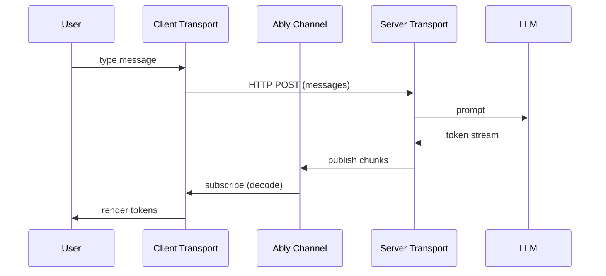

# Ably AI Transport SDK

A durable transport layer between AI agents and users. Streams AI responses over [Ably](https://ably.com/) channels - responses resume after disconnections, conversations persist across page reloads and devices, with support for cancellation, branching conversations, and multi-user sync.

`@ably/ai-transport` ships as a single package with four entry points: core primitives, React hooks, Vercel AI SDK integration, and Vercel + React hooks.

> **Status:** Pre-release (`0.x`). The API is evolving. Feedback and contributions are welcome.

## The problem

Most AI frameworks stream tokens over HTTP response bodies or SSE. That works until it doesn't: connections drop through corporate proxies, responses vanish on page refresh, and sessions are stuck on a single device or tab. Once an agent starts a long-running task, the user has no way to interrupt it, check if it's still running, or continue the conversation from another device. If a human needs to take over from the agent, the session context is lost.

Ably AI Transport replaces the HTTP stream with an Ably channel. The server publishes tokens to the channel as they arrive from the LLM; the response accumulates on the channel and persists, so partial responses survive disconnection. Any client can subscribe to the same channel from any device. Cancel signals, turn lifecycle events, and conversation history all flow through the channel rather than depending on a single HTTP connection.

It is not an agent framework or orchestration layer - it works alongside tools like the Vercel AI SDK, Temporal, and AG-UI.



## What this gives you

- **Resumable streaming** - If a connection drops mid-response, client reconnects and picks up where it left off. The response persists on the channel, so nothing is lost.
- **Session continuity across surfaces** - The session belongs to the channel, not the connection. A user can change tab or device and pick up at the same point.
- **Multi-client sync** - Multiple users, agents, or operators subscribe to the same channel. Human-AI handover is a channel operation, not a session migration.
- **Cancellation** - Cancel signals travel over the Ably channel, not the HTTP connection, and the server turn's `abortSignal` fires automatically.
- **Interruption** - Users send new messages while the AI is still responding, with composable primitives for cancel-and-resend or queue-until-complete.
- **Concurrent turns** - Multiple request-response cycles run in parallel on the same channel. Each turn has its own stream and abort signal.
- **History** - The Ably channel is the conversation record. Clients hydrate from channel history on load - no separate database query needed.
- **Branching** - Regenerate or edit messages to fork the conversation. The SDK tracks parent/child relationships and exposes a navigable tree.
- **Framework-agnostic** - A codec interface decouples transport from the AI framework. Ships with a Vercel AI SDK codec; bring your own for any other stack.

### When you need this

- AI products where connection reliability and session durability are non-negotiable
- Multi-surface experiences where a user needs to see the session in multiple tabs or devices
- Collaborative AI where multiple users or agents interact in the same conversation
- Customer support products where AI conversations are handed to human agents

---

## Getting started

### Installation

```sh
npm install @ably/ai-transport ably
```

For Vercel AI SDK projects, also install the `ai` package:

```sh
npm install @ably/ai-transport ably ai
```

### Supported platforms

| Platform      | Support                                            |
| ------------- | -------------------------------------------------- |
| Node.js       | 20+                                                |
| Browsers      | All major browsers (Chrome, Firefox, Edge, Safari) |
| TypeScript    | Written in TypeScript, ships with types            |
| React         | 18+ and 19+ via dedicated hooks                    |
| Vercel AI SDK | v6 via dedicated codec and transport adapters      |

---

## Usage with Vercel AI SDK

AI Transport is complementary to the Vercel AI SDK, not a replacement. The Vercel AI SDK handles model calls, message formatting, and React hooks. AI Transport replaces the transport layer underneath, so tokens stream over Ably instead of an HTTP response body. You keep `useChat`, `streamText`, and everything else you're used to.

### Server - Next.js API route

```typescript
import { after } from 'next/server';
import { streamText, convertToModelMessages } from 'ai';
import type { UIMessage } from 'ai';
import { anthropic } from '@ai-sdk/anthropic';
import Ably from 'ably';
import { createServerTransport } from '@ably/ai-transport/vercel';
import type { MessageWithHeaders } from '@ably/ai-transport';

interface ChatRequestBody {
  turnId: string;
  clientId: string;
  messages: MessageWithHeaders<UIMessage>[];
  history?: MessageWithHeaders<UIMessage>[];
  id: string;
  forkOf?: string;
  parent?: string | null;
}

const ably = new Ably.Realtime({ key: process.env.ABLY_API_KEY });

export async function POST(req: Request) {
  const { messages, history, id, turnId, clientId, forkOf, parent } = (await req.json()) as ChatRequestBody;

  const channel = ably.channels.get(id);
  const transport = createServerTransport({ channel });
  const turn = transport.newTurn({ turnId, clientId, parent, forkOf });

  await turn.start();

  if (messages.length > 0) {
    await turn.addMessages(messages, { clientId });
  }

  const historyMsgs = (history ?? []).map((h) => h.message);
  const newMsgs = messages.map((m) => m.message);

  const result = streamText({
    model: anthropic('claude-sonnet-4-20250514'),
    system: 'You are a helpful assistant.',
    messages: await convertToModelMessages([...historyMsgs, ...newMsgs]),
    abortSignal: turn.abortSignal,
  });

  // Stream the response over Ably in the background
  after(async () => {
    const { reason } = await turn.streamResponse(result.toUIMessageStream());
    await turn.end(reason);
    transport.close();
  });

  return new Response(null, { status: 200 });
}
```

### Client - React with `useChat`

```tsx
'use client';

import { useChat } from '@ai-sdk/react';
import { useChannel } from 'ably/react';
import { useClientTransport, useActiveTurns, useHistory } from '@ably/ai-transport/react';
import { useChatTransport, useMessageSync } from '@ably/ai-transport/vercel/react';
import { UIMessageCodec } from '@ably/ai-transport/vercel';

function Chat({ chatId, clientId }: { chatId: string; clientId?: string }) {
  const { channel } = useChannel({ channelName: chatId });

  const transport = useClientTransport({ channel, codec: UIMessageCodec, clientId });
  const chatTransport = useChatTransport(transport);

  const { messages, setMessages, sendMessage, stop } = useChat({
    id: chatId,
    transport: chatTransport,
  });

  useMessageSync(transport, setMessages);

  const activeTurns = useActiveTurns(transport);
  const history = useHistory(transport, { limit: 30 });

  return (
    <div>
      {messages.map((msg) => (
        <div key={msg.id}>{msg.parts.map((part, i) => (part.type === 'text' ? <p key={i}>{part.text}</p> : null))}</div>
      ))}
      <form
        onSubmit={(e) => {
          e.preventDefault();
          sendMessage({ text: 'Hello' });
        }}
      >
        {activeTurns.size > 0 ? (
          <button
            type="button"
            onClick={stop}
          >
            Stop
          </button>
        ) : (
          <button type="submit">Send</button>
        )}
      </form>
    </div>
  );
}
```

### Authentication

The Ably client authenticates via token auth. Create an endpoint that issues token requests:

```typescript
// app/api/auth/ably-token/route.ts
import Ably from 'ably';

const ably = new Ably.Rest({ key: process.env.ABLY_API_KEY });

export async function GET(req: Request) {
  const { searchParams } = new URL(req.url);
  const clientId = searchParams.get('clientId') ?? 'anonymous';
  const token = await ably.auth.createTokenRequest({ clientId });
  return Response.json(token);
}
```

```typescript
// Client-side Ably setup
const ably = new Ably.Realtime({
  authCallback: async (_params, callback) => {
    const response = await fetch('/api/auth/ably-token');
    const token = await response.json();
    callback(null, token);
  },
});
```

---

## Core usage with a custom codec

The core entry point is framework-agnostic. Bring your own `Codec` to map between your AI framework's event/message types and the Ably wire format.

### Client

```typescript
import { createClientTransport } from '@ably/ai-transport';
import { myCodec } from './my-codec';

const transport = createClientTransport({
  channel, // Ably RealtimeChannel
  codec: myCodec,
  clientId: 'user-123',
  api: '/api/chat',
});

const turn = await transport.send(messages);

// Read the stream
const reader = turn.stream.getReader();
while (true) {
  const { done, value } = await reader.read();
  if (done) break;
  console.log(value); // Your codec's event type
}
```

### Server

```typescript
import { createServerTransport } from '@ably/ai-transport';
import { myCodec } from './my-codec';

const transport = createServerTransport({ channel, codec: myCodec });
const turn = transport.newTurn({ turnId, clientId, parent, forkOf });

await turn.start();
await turn.addMessages(messages, { clientId });

const { reason } = await turn.streamResponse(aiStream);
await turn.end(reason);
transport.close();
```

---

## Package exports

| Export path                               | Purpose                                     | Peer dependencies     |
| ----------------------------------------- | ------------------------------------------- | --------------------- |
| `@ably/ai-transport`              | Core transport, codec interfaces, utilities | `ably`                |
| `@ably/ai-transport/react`        | React hooks for any codec                   | `ably`, `react`       |
| `@ably/ai-transport/vercel`       | Vercel AI SDK codec, transport factories    | `ably`, `ai`          |
| `@ably/ai-transport/vercel/react` | React hooks for Vercel's `useChat`          | `ably`, `ai`, `react` |

### React hooks

| Hook                  | Entry point     | Description                                         |
| --------------------- | --------------- | --------------------------------------------------- |
| `useClientTransport`  | `/react`        | Create and memoize a client transport instance      |
| `useMessages`         | `/react`        | Subscribe to decoded messages                       |
| `useSend`             | `/react`        | Stable send callback                                |
| `useRegenerate`       | `/react`        | Regenerate a message (fork the conversation)        |
| `useEdit`             | `/react`        | Edit a message and regenerate from that point       |
| `useActiveTurns`      | `/react`        | Track active turns by client ID                     |
| `useHistory`          | `/react`        | Paginate through conversation history               |
| `useConversationTree` | `/react`        | Navigate branches in a forked conversation          |
| `useAblyMessages`     | `/react`        | Access raw Ably messages                            |
| `useChatTransport`    | `/vercel/react` | Wrap transport for Vercel's `useChat`               |
| `useMessageSync`      | `/vercel/react` | Sync transport state with `useChat`'s `setMessages` |

---

## Key features

### Connection recovery

Two mechanisms cover different failure modes:

- **Network blips** - Ably's connection protocol automatically reconnects and delivers any messages published while the client was disconnected. No application code required.
- **Resumable streams** - A client that joins or rejoins a channel mid-response (after a page refresh, on a new device, or as a second participant) receives the in-progress stream immediately on subscribing. Load previous conversation history from the channel via `history()`, or from your own database.

### Cancellation

```typescript
// Client: cancel your own active turns
await transport.cancel();

// Cancel a specific turn
await transport.cancel({ turnId: 'turn-abc' });

// Server: the turn's abortSignal fires automatically
const result = streamText({
  model: anthropic('claude-sonnet-4-20250514'),
  messages,
  abortSignal: turn.abortSignal, // Aborted when client cancels
});
```

### Branching conversations

Regenerate or edit messages to create forks in the conversation tree. The SDK tracks parent/child relationships and exposes a navigable tree.

```typescript
// Regenerate the last assistant message
const turn = await transport.regenerate(assistantMessageId);

// Edit a user message and regenerate from that point
const turn = await transport.edit(userMessageId, [newMessage]);

// Navigate branches
const tree = transport.getTree();
const siblings = tree.getSiblings(messageId);
tree.select(messageId, 1); // Switch to second branch
```

### History and hydration

Load previous conversation state when a client joins or returns to a session.

```typescript
const page = await transport.history({ limit: 50 });
console.log(page.items); // Decoded messages

if (page.hasNext()) {
  const older = await page.next();
}
```

### Events

```typescript
transport.on('message', () => {
  console.log(transport.getMessages());
});

transport.on('turn', (event) => {
  console.log(event.turnId, event.type); // 'x-ably-turn-start' | 'x-ably-turn-end'
});

transport.on('error', (error) => {
  console.error(error.code, error.message);
});
```

---

## Documentation

Detailed documentation lives in the [`docs/`](./docs/) directory:

- **[Concepts](./docs/concepts/)** - [Transport architecture](./docs/concepts/transport.md), [Turns](./docs/concepts/turns.md)
- **[Get started](./docs/get-started/)** - [Vercel AI SDK with useChat](./docs/get-started/vercel-use-chat.md), [Vercel AI SDK with useClientTransport](./docs/get-started/vercel-use-client-transport.md)
- **[Frameworks](./docs/frameworks/)** - [Vercel AI SDK](./docs/frameworks/vercel-ai-sdk.md)
- **[Features](./docs/features/)** - [Streaming](./docs/features/streaming.md), [Cancellation](./docs/features/cancel.md), [Barge-in](./docs/features/barge-in.md), [Optimistic updates](./docs/features/optimistic-updates.md), [History](./docs/features/history.md), [Branching](./docs/features/branching.md), [Multi-client sync](./docs/features/multi-client.md), [Tool calls](./docs/features/tool-calls.md), [Concurrent turns](./docs/features/concurrent-turns.md)
- **[Reference](./docs/reference/)** - [React hooks](./docs/reference/react-hooks.md), [Error codes](./docs/reference/error-codes.md)
- **[Internals](./docs/internals/)** - Architecture details for contributors

---

## Demo apps

Working demo applications live in the [`demo/`](./demo/) directory:

- **[`demo/vercel/react/use-chat/`](./demo/vercel/react/use-chat/)** - Vercel AI SDK with `useChat` integration
- **[`demo/vercel/react/use-client-transport/`](./demo/vercel/react/use-client-transport/)** - Vercel AI SDK with direct `useClientTransport` hooks

---

## Development

```bash
npm install
npm run typecheck     # Type check
npm run lint          # Lint
npm test              # Unit tests (mocks only)
npm run test:integration  # Integration tests (needs ABLY_API_KEY)
npm run precommit     # format:check + lint + typecheck
```

### Project structure

```
src/
├── core/               # Generic transport and codec (no framework deps)
│   ├── codec/          # Codec interfaces and core encoder/decoder
│   └── transport/      # ClientTransport, ServerTransport, ConversationTree
├── react/              # React hooks for any codec
├── vercel/             # Vercel AI SDK codec and transport adapters
│   ├── codec/          # UIMessageCodec
│   ├── transport/      # Vercel-specific factories, ChatTransport
│   └── react/          # useChatTransport, useMessageSync
└── index.ts            # Core entry point
```

---

## Contributing

See [CONTRIBUTING.md](./CONTRIBUTING.md). [Open an issue](https://github.com/ably/ably-ai-transport-js/issues) to share feedback or request a feature.
