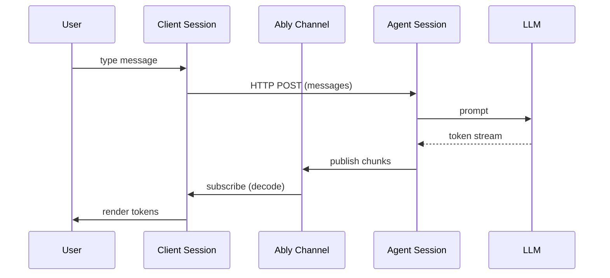

# Ably AI Transport SDK

A durable transport layer between AI agents and users. Streams AI responses over [Ably](https://ably.com/) channels - responses resume after disconnections, conversations persist across page reloads and devices, with support for cancellation, branching conversations, and multi-user sync.

> **Status:** Pre-release (`0.x`). The API is evolving. Feedback and contributions are welcome.

## The problem

Most AI frameworks stream tokens over HTTP response bodies or SSE. That works until it doesn't: connections drop through corporate proxies, responses vanish on page refresh, and sessions are stuck on a single device or tab. Once an agent starts a long-running task, the user has no way to interrupt it, check if it's still running, or continue the conversation from another device. If a human needs to take over from the agent, the session context is lost.

Ably AI Transport replaces the HTTP stream with an Ably channel. The server publishes tokens to the channel as they arrive from the LLM; the response accumulates on the channel and persists, so partial responses survive disconnection. Any client can subscribe to the same channel from any device. Cancel signals, run lifecycle events, and conversation history all flow through the channel rather than depending on a single HTTP connection.


```mermaid
sequenceDiagram
    participant U as User
    participant CS as Client Session
    participant AC as Ably Channel
    participant AS as Agent Session
    participant LLM

    U->>CS: type message
    CS->>AS: HTTP POST (messages)
    AS->>LLM: prompt
    LLM-->>AS: token stream
    AS->>AC: publish chunks
    AC->>CS: subscribe (decode)
    CS->>U: render tokens
```

Ably AI Transport SDK is not an agent framework or orchestration layer - it works alongside whatever agent framework/model provider you choose, through a pluggable codec architecture (Vercel AI SDK supported now, more frameworks and models coming soon). It can be used in a serverless architecture (e.g. Next.js), with a durable execution framework (e.g. Temporal, Vercel Workflow DevKit) or in a traditional client-server architecture.

## What this gives you

- **Resumable streaming** - If a connection drops mid-response, client reconnects and picks up where it left off. The response persists on the channel, so nothing is lost.
- **Session continuity across surfaces** - The session belongs to the channel, not the connection. A user can change tab or device and pick up at the same point.
- **Multi-client sync** - Multiple users, agents, or operators subscribe to the same channel. Human-AI handover is a channel operation, not a session migration.
- **Cancellation** - Cancel signals travel over the Ably channel, not the HTTP connection, and the server run's `abortSignal` fires automatically.
- **Interruption** - Users send new messages while the AI is still responding, with composable primitives for cancel-and-resend or queue-until-complete.
- **Concurrent runs** - Multiple request-response cycles run in parallel on the same channel. Each run has its own stream and abort signal.
- **History** - The Ably channel is the conversation record. Clients hydrate from channel history on load - no separate database query needed.
- **Branching** - Regenerate or edit messages to fork the conversation. The SDK tracks parent/child relationships and exposes a navigable tree.
- **Presence** - The session channel carries Ably Presence. `session.presence` exposes it directly, and ably-js's presence hooks work inside the React providers - see which clients are connected to a session.
- **LiveObjects** - The session channel can carry Ably LiveObjects: synchronized shared state (maps, counters) alongside the conversation. `session.object` exposes it directly - opt in with the LiveObjects plugin and `channelModes`.
- **Framework-agnostic** - A codec interface decouples transport from the AI framework. Ships with a Vercel AI SDK codec; bring your own for any other stack.

### When you need this

- AI products where connection reliability and session durability are non-negotiable
- Multi-surface experiences where a user needs to see the session in multiple tabs or devices
- Collaborative AI where multiple users or agents interact in the same conversation
- Customer support products where AI conversations are handed to human agents

---

## Getting started

### Installation

```sh
npm install @ably/ai-transport ably
```

For Vercel AI SDK projects, also install the `ai` package:

```sh
npm install @ably/ai-transport ably ai
```

### Supported platforms

| Platform      | Support                                            |
| ------------- | -------------------------------------------------- |
| Node.js       | 22+                                                |
| Browsers      | All major browsers (Chrome, Firefox, Edge, Safari) |
| TypeScript    | Written in TypeScript, ships with types            |
| React         | 18+ and 19+ via dedicated hooks                    |
| Vercel AI SDK | v6 via dedicated codec and transport adapters      |

---

## Usage with Vercel AI SDK

AI Transport is complementary to the Vercel AI SDK, not a replacement. The Vercel AI SDK handles model calls, message formatting, and React hooks. AI Transport replaces the transport layer underneath, so tokens stream over Ably instead of an HTTP response body. You keep `useChat`, `streamText`, and everything else you're used to.

### Server - Next.js API route

```typescript
import { after } from 'next/server';
import { streamText, convertToModelMessages } from 'ai';
import type { UIMessage } from 'ai';
import { anthropic } from '@ai-sdk/anthropic';
import Ably from 'ably';
import { createAgentSession } from '@ably/ai-transport/vercel';
import { Invocation, type InvocationData } from '@ably/ai-transport';
import type { UIMessageChunk } from 'ai';

const ably = new Ably.Realtime({ key: process.env.ABLY_API_KEY });

export async function POST(req: Request) {
  const data = (await req.json()) as InvocationData<UIMessageChunk, UIMessage>;
  const invocation = Invocation.fromJSON(data);

  const session = createAgentSession({ client: ably, channelName: invocation.sessionName });
  await session.connect();
  const run = session.createRun(invocation, { signal: req.signal });

  await run.start();
  // loadConversation() returns the full multi-turn conversation to feed the
  // model; run.messages is only this run's own turn (the unit to persist).
  const conversation = await run.loadConversation();

  const result = streamText({
    model: anthropic('claude-sonnet-4-6'),
    system: 'You are a helpful assistant.',
    messages: await convertToModelMessages(conversation),
    abortSignal: run.abortSignal,
  });

  // Stream the response over Ably in the background
  after(async () => {
    const { reason } = await run.pipe(result.toUIMessageStream());
    await run.end({ reason });
    session.close();
  });

  return new Response(null, { status: 200 });
}
```

### Client - React with `useChat`

```tsx
'use client';

import { useChat } from '@ai-sdk/react';
import { ChatTransportProvider, useChatTransport, useMessageSync, useView } from '@ably/ai-transport/vercel/react';

function ChatInner({ chatId }: { chatId: string }) {
  const { chatTransport } = useChatTransport();

  const { messages, setMessages, sendMessage, stop, status } = useChat({
    id: chatId,
    transport: chatTransport,
  });

  useMessageSync({ setMessages });

  const isStreaming = status === 'submitted' || status === 'streaming';
  useView({ limit: 30 });

  return (
    <div>
      {messages.map((msg) => (
        <div key={msg.id}>{msg.parts.map((part, i) => (part.type === 'text' ? <p key={i}>{part.text}</p> : null))}</div>
      ))}
      <form
        onSubmit={(e) => {
          e.preventDefault();
          sendMessage({ text: 'Hello' });
        }}
      >
        {isStreaming ? (
          <button
            type="button"
            onClick={stop}
          >
            Stop
          </button>
        ) : (
          <button type="submit">Send</button>
        )}
      </form>
    </div>
  );
}

function Chat({ chatId }: { chatId: string }) {
  return (
    <ChatTransportProvider channelName={chatId}>
      <ChatInner chatId={chatId} />
    </ChatTransportProvider>
  );
}
```

### Authentication

The Ably client authenticates via token auth. Create an endpoint that issues token requests:

```typescript
// app/api/auth/ably-token/route.ts
import Ably from 'ably';

const ably = new Ably.Rest({ key: process.env.ABLY_API_KEY });

export async function GET(req: Request) {
  const { searchParams } = new URL(req.url);
  const clientId = searchParams.get('clientId') ?? 'anonymous';
  const token = await ably.auth.createTokenRequest({ clientId });
  return Response.json(token);
}
```

```typescript
// Client-side Ably setup
const ably = new Ably.Realtime({
  authCallback: async (_params, callback) => {
    const response = await fetch('/api/auth/ably-token');
    const token = await response.json();
    callback(null, token);
  },
});
```

---

## Core usage with a custom codec

The core entry point is framework-agnostic. Bring your own `Codec` to map between your AI framework's event/message types and the Ably wire format.

### Client

```typescript
import { createClientSession } from '@ably/ai-transport';
import { myCodec } from './my-codec';

const session = createClientSession({
  client: ably, // Ably.Realtime
  channelName: 'ai:demo',
  codec: myCodec,
});
await session.connect();

const run = await session.view.send(messages);

// Read the stream
const reader = run.stream.getReader();
while (true) {
  const { done, value } = await reader.read();
  if (done) break;
  console.log(value); // Your codec's event type
}
```

### Agent (server-side)

```typescript
import { createAgentSession, Invocation } from '@ably/ai-transport';
import { myCodec } from './my-codec';

const session = createAgentSession({ client: ably, channelName: 'ai:demo', codec: myCodec });
await session.connect();
const run = session.createRun(invocation);

await run.start();
await run.loadConversation();

const { reason } = await run.pipe(aiStream);
await run.end({ reason });
session.close();
```

---

## Package exports

| Export path                       | Purpose                                     | Peer dependencies     |
| --------------------------------- | ------------------------------------------- | --------------------- |
| `@ably/ai-transport`              | Core transport, codec interfaces, utilities | `ably`                |
| `@ably/ai-transport/react`        | React hooks for any codec                   | `ably`, `react`       |
| `@ably/ai-transport/vercel`       | Vercel AI SDK codec, transport factories    | `ably`, `ai`          |
| `@ably/ai-transport/vercel/react` | React hooks for Vercel's `useChat`          | `ably`, `ai`, `react` |

### React hooks

| Hook               | Entry point     | Description                                       |
| ------------------ | --------------- | ------------------------------------------------- |
| `useClientSession` | `/react`        | Read a client session from the nearest provider   |
| `useView`          | `/react`        | Subscribe to messages with history loading        |
| `useTree`          | `/react`        | Navigate branches in a forked conversation        |
| `useAblyMessages`  | `/react`        | Access raw Ably messages                          |
| `useChatTransport` | `/vercel/react` | Wrap session for Vercel's `useChat`               |
| `useMessageSync`   | `/vercel/react` | Sync session state with `useChat`'s `setMessages` |

---

## Key features

### Connection recovery

Two mechanisms cover different failure modes:

- **Network blips** - Ably's connection protocol automatically reconnects and delivers any messages published while the client was disconnected. No application code required.
- **Resumable streams** - A client that joins or rejoins a channel mid-response (after a page refresh, on a new device, or as a second participant) receives the in-progress stream immediately on subscribing. Load previous conversation history from the channel via `view.loadOlder()`, or from your own database.

### Cancellation

```typescript
// Client: cancel a specific run by id
await session.cancel('run-abc');

// Or via the ActiveRun returned by send / regenerate / edit
const run = await view.send(codec.createUserMessage(userMsg));
await run.cancel();

// Agent: the run's abortSignal fires automatically
const result = streamText({
  model: anthropic('claude-sonnet-4-6'),
  messages,
  abortSignal: run.abortSignal, // Aborted when client cancels
});
```

### Branching conversations

Regenerate or edit messages to create forks in the conversation tree. The SDK tracks parent/child relationships and exposes a navigable tree.

```typescript
// Regenerate the last assistant message
const run = await session.view.regenerate(assistantMessageId);

// Edit a user message and regenerate from that point
const run = await session.view.edit(userMessageId, [newMessage]);

// Navigate branches
const tree = session.tree;
const siblings = tree.getSiblings(messageId);
session.view.select(messageId, 1); // Switch to second branch
```

### History and hydration

Load previous conversation state when a client joins or returns to a session.

```typescript
const view = session.view;
await view.loadOlder(50);
// view.getMessages() returns the flat message list loaded so far

// Load more older messages
await view.loadOlder(50);
```

### Events

```typescript
session.view.on('update', () => {
  console.log(session.view.getMessages());
});

session.tree.on('run', (event) => {
  console.log(event.runId, event.type); // 'ai-run-start' | 'ai-run-end'
});

session.on('error', (error) => {
  console.error(error.code, error.message);
});
```

---

## Documentation

Detailed documentation lives in the [`docs/`](./docs/) directory:

- **[Concepts](./docs/concepts/)** - [Sessions](./docs/concepts/sessions.md), [Runs](./docs/concepts/runs.md)
- **[Get started](./docs/get-started/)** - [Vercel AI SDK with useChat](./docs/get-started/vercel-use-chat.md), [Vercel AI SDK with useClientSession](./docs/get-started/vercel-use-client-session.md)
- **[Frameworks](./docs/frameworks/)** - [Vercel AI SDK](./docs/frameworks/vercel-ai-sdk.md)
- **[Features](./docs/features/)** - [Streaming](./docs/features/streaming.md), [Cancellation](./docs/features/cancel.md), [Interruption](./docs/features/interruption.md), [Optimistic updates](./docs/features/optimistic-updates.md), [History](./docs/features/history.md), [Branching](./docs/features/branching.md), [Multi-client sync](./docs/features/multi-client.md), [Concurrent runs](./docs/features/concurrent-runs.md), [Presence](./docs/features/presence.md), [LiveObjects](./docs/features/liveobjects.md)
- **[Reference](./docs/reference/)** - [React hooks](./docs/reference/react-hooks.md), [Error codes](./docs/reference/error-codes.md)
- **[Internals](./docs/internals/)** - Architecture details for contributors

---

## Demo apps

Working demo applications live in the [`demo/`](./demo/) directory:

- **[`demo/vercel/react/use-chat/`](./demo/vercel/react/use-chat/)** - Vercel AI SDK with `useChat` integration
- **[`demo/vercel/react/use-client-session/`](./demo/vercel/react/use-client-session/)** - Vercel AI SDK with direct `useClientSession` hooks

---

## Development

This repository uses [pnpm](https://pnpm.io/). Enable Corepack once (`corepack enable`) to pick up the pinned version automatically.

```bash
pnpm install
pnpm run build             # Build all entry points (ESM + UMD/CJS + .d.ts)
pnpm run typecheck         # Type check
pnpm run lint              # Lint
pnpm test                  # Unit tests (mocks only)
pnpm run test:integration  # Integration tests (needs ABLY_API_KEY)
pnpm run precommit         # format:check + lint + typecheck
```

### Project structure

```
src/
├── core/               # Generic transport and codec (no framework deps)
│   ├── codec/          # Codec interfaces and core encoder/decoder
│   └── transport/      # ClientSession, AgentSession, Tree
├── react/              # React hooks for any codec
├── vercel/             # Vercel AI SDK codec and transport adapters
│   ├── codec/          # UIMessageCodec
│   ├── transport/      # Vercel-specific factories, ChatTransport
│   └── react/          # useChatTransport, useMessageSync
└── index.ts            # Core entry point
```

---

## Contributing

See [CONTRIBUTING.md](./CONTRIBUTING.md). [Open an issue](https://github.com/ably/ably-ai-transport-js/issues) to share feedback or request a feature.
