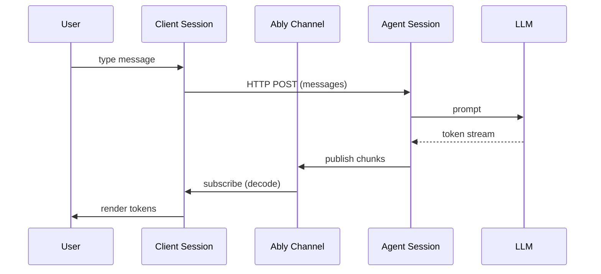

# Client session and agent session

AI Transport splits the real-time layer into two sessions: an **agent session** that publishes AI responses to an Ably channel, and a **client session** that subscribes to that channel and manages conversation state. The server never streams directly to the client over HTTP - Ably is the delivery mechanism.

## How data flows



1. The user sends a message. The client session fires an HTTP POST to your server endpoint with the message content, conversation history, and run metadata.
2. Your server endpoint creates a run on the agent session, calls the LLM, and pipes the response stream through the encoder to the Ably channel.
3. The client session receives messages from the channel subscription, decodes them through the codec, and updates the conversation state.

The HTTP POST is fire-and-forget from the client's perspective - the response stream is available immediately via the Ably channel subscription, not from the HTTP response body.

## Session lifecycle

Both `createAgentSession()` and `createClientSession()` return synchronously and do not touch the channel. Call `await session.connect()` to subscribe to the channel before any session method is used. `connect()` is idempotent - calling it twice returns the same in-flight promise and triggers a single subscribe.

Run lifecycle methods (`run.start`, `run.addMessages`, `run.addEvents`, `run.pipe`, `run.end`) and client write methods (`session.cancel`, `session.waitForRun`, `view.send`, etc.) throw `InvalidArgument` until `connect()` resolves. In React, `ClientSessionProvider` and `ChatTransportProvider` call `connect()` on mount, so consumers of `useClientSession`/`useChatTransport` don't need to call it explicitly.

## Agent session

The agent session manages **runs** - discrete request-response cycles on a shared channel. Each run has an explicit lifecycle:

```typescript
import Ably from 'ably';
import { streamText } from 'ai';
import { Invocation } from '@ably/ai-transport';
import { createAgentSession } from '@ably/ai-transport/vercel';

const session = createAgentSession({ client: ably, channelName });
await session.connect();

const run = session.createRun(Invocation.fromJSON({ runId, clientId }));
await run.start();

// Publish user messages to the channel so all clients see them and they persist in history
await run.addMessages(userMessages);

const result = streamText({ model, messages: history });
const { reason } = await run.pipe(result.toUIMessageStream());
await run.end(reason);

session.close();
```

The agent session also handles cancel routing - when a client publishes a cancel signal, the session matches it to the right run and fires the run's `AbortSignal`.

## Client session

The client session manages conversation state: the message list, conversation tree (for branching), active runs, and history. It subscribes to the Ably channel before attaching, so no messages are lost.

```typescript
import { createClientSession } from '@ably/ai-transport/vercel';

const session = createClientSession({ client: ably, channelName, clientId });
await session.connect();
const view = session.view;

// Send a message - returns immediately with a run handle
const run = await view.send(userMessage);

// Subscribe to accumulated messages - updates on every token
view.on('update', () => {
  const messages = view.getMessages();
  // the last assistant message grows as tokens stream in
});

// The run also exposes a ReadableStream<TEvent> for framework adapters
// (e.g. Vercel's useChat), but most apps use the view instead
```

In React, `ClientSessionProvider` creates the session and `useClientSession` reads it from context:

```typescript
import { ClientSessionProvider, useClientSession, useView } from '@ably/ai-transport/react';
import { UIMessageCodec } from '@ably/ai-transport/vercel';
import type * as AI from 'ai';

// In your layout or page component:
<ClientSessionProvider channelName="ai:demo" codec={UIMessageCodec} clientId={clientId} api="/api/chat">
  <Chat />
</ClientSessionProvider>

// Inside Chat:
const session = useClientSession<AI.UIMessageChunk, AI.UIMessage>();
const { nodes, send } = useView(session);
```

## The codec

The session is parameterized by a `Codec<TEvent, TMessage>` - an interface that translates between domain types and Ably messages. The codec provides:

- **Encoder**: converts domain events into Ably publish/append/update operations
- **Decoder**: converts Ably messages back into domain events
- **Accumulator**: builds complete domain messages from a stream of events
- **Terminal detection**: identifies events that end a stream (finish, error, abort)

The generic session layer knows nothing about specific frameworks. For the Vercel AI SDK, `UIMessageCodec` maps between `UIMessageChunk` events and `UIMessage` messages. The Vercel entry point (`@ably/ai-transport/vercel`) pre-binds this codec so you don't need to pass it explicitly.

For the internal implementation of each session, see [Client session](../internals/client-session.md) and [Agent session](../internals/agent-session.md). For the sub-components they compose, see [Transport components](../internals/transport-components.md). For the codec, encoder, and decoder internals, see [Codec interface](../internals/codec-interface.md), [Encoder](../internals/encoder.md), and [Decoder](../internals/decoder.md). For the wire format, see [Wire protocol](../internals/wire-protocol.md).

## Entry point decision

| You want to...                                   | Use this entry point                                                                         |
| ------------------------------------------------ | -------------------------------------------------------------------------------------------- |
| Build with Vercel AI SDK's `useChat()`           | `@ably/ai-transport/vercel/react` - gives you `useChatTransport()` + `useMessageSync()`      |
| Build with Vercel AI SDK using lower-level hooks | `@ably/ai-transport/react` + `@ably/ai-transport/vercel`                                     |
| Build a server endpoint with Vercel AI SDK       | `@ably/ai-transport/vercel` - gives you `createAgentSession()` pre-bound to `UIMessageCodec` |
| Implement a custom codec for another framework   | `@ably/ai-transport` - the generic core with `Codec<TEvent, TMessage>`                       |
