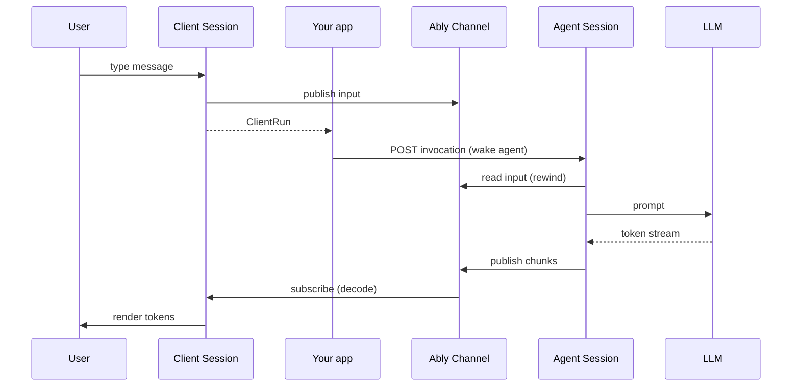

# Client session and agent session

AI Transport splits the real-time layer into two sessions: an **agent session** that publishes AI responses to an Ably channel, and a **client session** that subscribes to that channel and manages conversation state. The server never streams directly to the client over HTTP - Ably is the delivery mechanism.

## How data flows



1. The user sends a message. The client session publishes the input on the Ably channel — the durable record — and `send()` resolves with an `ClientRun`. The core never sends HTTP.
2. Your app wakes the agent by POSTing the run's invocation pointer (`run.toInvocation().toJSON()`) to your server endpoint. (With the Vercel `useChat` integration, the [chat transport](../internals/chat-transport.md) does this for you.)
3. Your endpoint creates a run on the agent session, which reads the input off the channel (via rewind), calls the LLM, and pipes the response stream through the encoder to the channel.
4. The client session receives messages from the channel subscription, decodes them through the codec, and updates the conversation state.

The invocation POST is a cheap, retryable pointer — it carries only the `inputEventId` and `sessionName`, not the conversation (which the agent reads from the channel) and not a `runId` (run identity lives on the channel). The agent mints the `invocationId` (one per request) and the `runId` for a fresh run — or reads a continuation's `runId` off the triggering input event — and returns them on the response. The streamed output is available immediately via the channel subscription, not from the HTTP response body.

## Session lifecycle

Both `createAgentSession()` and `createClientSession()` return synchronously and do not touch the channel. Call `await session.connect()` to subscribe to the channel before any session method is used. `connect()` is idempotent - calling it twice returns the same in-flight promise and triggers a single subscribe.

Run lifecycle methods (`run.start`, `run.pipe`, `run.suspend`, `run.end`) and client write methods (`session.cancel`, `view.send`, etc.) throw `InvalidArgument` until `connect()` resolves. In React, `ClientSessionProvider` and `ChatTransportProvider` call `connect()` on mount, so consumers of `useClientSession`/`useChatTransport` don't need to call it explicitly.

`session.close()` reverses `connect()`: it unsubscribes, tears down listeners, and **detaches the channel the session attached**. It does **not** close the Ably client you passed in - your app owns the client's lifecycle (the React `<AblyProvider>` client, or a per-request client in a serverless agent). Both sessions' `close()` return a promise, so a serverless agent can `await session.close()` for a graceful channel teardown before the function returns.

## Agent session

The agent session manages **runs** - discrete request-response cycles on a shared channel. Each run has an explicit lifecycle:

```typescript
import Ably from 'ably';
import { streamText } from 'ai';
import { Invocation, type InvocationData } from '@ably/ai-transport';
import { createAgentSession } from '@ably/ai-transport/vercel';

const session = createAgentSession({ client: ably, channelName });
await session.connect();

// The invocation pointer the client POSTed — `{ inputEventId, sessionName }`.
const invocationData = (await req.json()) as InvocationData;
const invocation = Invocation.fromJSON(invocationData);
const run = session.createRun(invocation);

// Read the conversation the client published to the channel (drain run.view, the
// one history driver); run.messages is only this turn. The drain also folds in
// the triggering input that start() waits for.
while (run.view.hasOlder()) await run.view.loadOlder();
const history = run.view.getMessages().map((m) => m.message);

// Publish ai-run-start once the trigger is located (the drain above brings it in).
await run.start();

const result = streamText({ model, messages: history });
const { reason } = await run.pipe(result.toUIMessageStream());
await run.end({ reason });

await session.close();
```

The agent session also handles cancel routing - when a client publishes a cancel signal, the session matches it to the right run and fires the run's `AbortSignal`.

The session channel is an ordinary Ably channel, so `session.presence` exposes its `Ably.RealtimePresence` directly - an agent can enter and leave presence to advertise that it is online without obtaining the channel separately. See [Presence](../features/presence.md). Likewise `session.object` exposes the channel's LiveObjects entry point - an agent can publish synchronized shared state (e.g. structured run progress) alongside the conversation. LiveObjects requires opt-in via the LiveObjects plugin and the `channelModes` option; see [LiveObjects](../features/liveobjects.md).

## Client session

The client session manages conversation state: the message list, conversation tree (for branching), active runs, and history. It subscribes to the Ably channel before attaching, so no messages are lost. It also exposes the channel's presence object as `session.presence`, so a client can observe which clients are connected (see [Presence](../features/presence.md)), and the channel's LiveObjects entry point as `session.object` for synchronized shared state alongside the conversation (opt-in - see [LiveObjects](../features/liveobjects.md)).

```typescript
import { createClientSession, UIMessageCodec } from '@ably/ai-transport/vercel';

const session = createClientSession({ client: ably, channelName });
await session.connect();
const view = session.view;

// Send a message - compose the user message into a codec input, then send().
// Publishes on the channel and returns immediately with a run handle.
const run = await view.send(UIMessageCodec.createUserMessage(userMessage));

// Wake the agent: POST the invocation pointer to your endpoint. The core
// transport never sends HTTP — the app owns this step.
await fetch('/api/chat', {
  method: 'POST',
  headers: { 'Content-Type': 'application/json' },
  body: JSON.stringify(run.toInvocation().toJSON()),
});

// Subscribe to accumulated messages - updates on every token
view.on('update', () => {
  const messages = view.getMessages();
  // the last assistant message grows as tokens stream in
});

// For raw per-event granularity, subscribe to the tree's `output` event
// (routed by inputCodecMessageId). Framework adapters like Vercel's useChat
// build a ReadableStream from it; most apps use the view instead.
```

The session's identity is taken from the Ably client — its `auth.clientId` is stamped on everything the session publishes so other clients can attribute messages. It comes from the client either via the Ably token (the usual path — the token endpoint embeds the `clientId`) or, for an API-key client, via `ClientOptions.clientId` when you construct `new Ably.Realtime(...)`. A client with no identity (anonymous, or a wildcard `*` token) publishes without one.

In React, `ClientSessionProvider` creates the session and `useClientSession` reads it from context (the app still POSTs the invocation itself, as above):

```typescript
import { ClientSessionProvider, useClientSession, useView } from '@ably/ai-transport/react';
import { UIMessageCodec } from '@ably/ai-transport/vercel';
import type { VercelInput, VercelProjection } from '@ably/ai-transport/vercel';
import type * as AI from 'ai';

// In your layout or page component:
<ClientSessionProvider channelName="ai:demo" codec={UIMessageCodec}>
  <Chat />
</ClientSessionProvider>

// Inside Chat:
const { session } = useClientSession<VercelInput, AI.UIMessageChunk, VercelProjection, AI.UIMessage>();
const { messages, send } = useView({ session });
```

## The codec

The session is parameterized by a `Codec<TInput, TOutput, TProjection, TMessage>` - an interface that translates between domain types and Ably messages. The codec provides:

- **Encoder** (`createEncoder`): converts domain events into Ably publish/append/update operations
- **Decoder** (`createDecoder`): converts Ably messages back into domain events
- **Reducer** (`init`/`fold`): folds decoded events into an opaque per-node `TProjection`
- **Message extraction** (`getMessages`): builds complete `TMessage`s from a projection

The generic session layer knows nothing about specific frameworks. For the Vercel AI SDK, `UIMessageCodec` maps between `UIMessageChunk` events and `UIMessage` messages. The Vercel entry point (`@ably/ai-transport/vercel`) pre-binds this codec so you don't need to pass it explicitly.

For the internal implementation of each session, see [Client session](../internals/client-session.md) and [Agent session](../internals/agent-session.md). For the sub-components they compose, see [Transport components](../internals/transport-components.md). For the codec, encoder, and decoder internals, see [Codec interface](../internals/codec-interface.md), [Encoder](../internals/encoder.md), and [Decoder](../internals/decoder.md). For the wire format, see [Wire protocol](../internals/wire-protocol.md).

## Entry point decision

| You want to...                                   | Use this entry point                                                                         |
| ------------------------------------------------ | -------------------------------------------------------------------------------------------- |
| Build with Vercel AI SDK's `useChat()`           | `@ably/ai-transport/vercel/react` - gives you `useChatTransport()` + `useMessageSync()`      |
| Build with Vercel AI SDK using lower-level hooks | `@ably/ai-transport/react` + `@ably/ai-transport/vercel`                                     |
| Build a server endpoint with Vercel AI SDK       | `@ably/ai-transport/vercel` - gives you `createAgentSession()` pre-bound to `UIMessageCodec` |
| Implement a custom codec for another framework   | `@ably/ai-transport` - the generic core with `Codec<TInput, TOutput, TProjection, TMessage>` |
