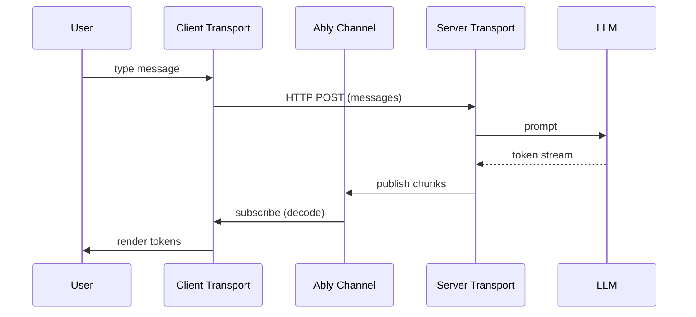

# Client and server transport

AI Transport splits the real-time layer into two transports: a **server transport** that publishes AI responses to an Ably channel, and a **client transport** that subscribes to that channel and manages conversation state. The server never streams directly to the client over HTTP - Ably is the delivery mechanism.

## How data flows



1. The user sends a message. The client transport fires an HTTP POST to your server endpoint with the message content, conversation history, and turn metadata.
2. Your server endpoint creates a turn on the server transport, calls the LLM, and pipes the response stream through the encoder to the Ably channel.
3. The client transport receives messages from the channel subscription, decodes them through the codec, and updates the conversation state.

The HTTP POST is fire-and-forget from the client's perspective - the response stream is available immediately via the Ably channel subscription, not from the HTTP response body.

## Server transport

The server transport manages **turns** - discrete request-response cycles on a shared channel. Each turn has an explicit lifecycle:

```typescript
import Ably from 'ably';
import { streamText } from 'ai';
import { createServerTransport } from '@ably/ai-transport/vercel';

const channel = ably.channels.get(channelName);
const transport = createServerTransport({ channel });

const turn = transport.newTurn({ turnId, clientId });
await turn.start();

// Publish user messages to the channel so all clients see them and they persist in history
await turn.addMessages(userMessages);

const result = streamText({ model, messages: history });
const { reason } = await turn.streamResponse(result.toUIMessageStream());
await turn.end(reason);

transport.close();
```

The server transport also handles cancel routing - when a client publishes a cancel signal, the transport matches it to the right turn and fires the turn's abort signal.

## Client transport

The client transport manages conversation state: the message list, conversation tree (for branching), active turns, and history. It subscribes to the Ably channel before attaching, so no messages are lost.

```typescript
import { createClientTransport } from '@ably/ai-transport/vercel';

const transport = createClientTransport({ channel, clientId });

// Send a message - returns immediately with a turn handle
const turn = await transport.send(userMessage);

// Subscribe to accumulated messages - updates on every token
transport.on('message', () => {
  const messages = transport.getMessages();
  // the last assistant message grows as tokens stream in
});

// The turn also exposes a ReadableStream<TEvent> for framework adapters
// (e.g. Vercel's useChat), but most apps use getMessages() instead
```

In React, the hooks handle subscriptions and state management:

```typescript
import { useClientTransport, useMessages, useSend } from '@ably/ai-transport/react';
import { UIMessageCodec } from '@ably/ai-transport/vercel';

const transport = useClientTransport({ channel, codec: UIMessageCodec, clientId });
const messages = useMessages(transport);
const send = useSend(transport);
```

## The codec

The transport is parameterized by a `Codec<TEvent, TMessage>` - an interface that translates between domain types and Ably messages. The codec provides:

- **Encoder**: converts domain events into Ably publish/append/update operations
- **Decoder**: converts Ably messages back into domain events
- **Accumulator**: builds complete domain messages from a stream of events
- **Terminal detection**: identifies events that end a stream (finish, error, abort)

The generic transport knows nothing about specific frameworks. For the Vercel AI SDK, `UIMessageCodec` maps between `UIMessageChunk` events and `UIMessage` messages. The Vercel entry point (`@ably/ai-transport/vercel`) pre-binds this codec so you don't need to pass it explicitly.

For the internal implementation of each transport, see [Client transport](../internals/client-transport.md) and [Server transport](../internals/server-transport.md). For the sub-components they compose, see [Transport components](../internals/transport-components.md). For the codec, encoder, and decoder internals, see [Codec interface](../internals/codec-interface.md), [Encoder](../internals/encoder.md), and [Decoder](../internals/decoder.md). For the wire format, see [Wire protocol](../internals/wire-protocol.md).

## Entry point decision

| You want to... | Use this entry point |
|---|---|
| Build with Vercel AI SDK's `useChat()` | `@ably/ai-transport/vercel/react` - gives you `useChatTransport()` + `useMessageSync()` |
| Build with Vercel AI SDK using lower-level hooks | `@ably/ai-transport/react` + `@ably/ai-transport/vercel` |
| Build a server endpoint with Vercel AI SDK | `@ably/ai-transport/vercel` - gives you `createServerTransport()` pre-bound to `UIMessageCodec` |
| Implement a custom codec for another framework | `@ably/ai-transport` - the generic core with `Codec<TEvent, TMessage>` |
