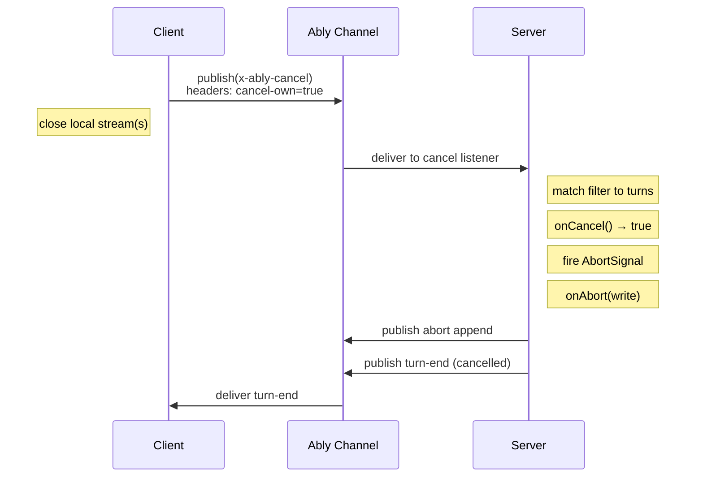

# Cancel

Cancellation in AI Transport is a channel-level operation - the client publishes a cancel signal on the Ably channel, the server receives it and aborts the matching turns.

Without a cancel protocol, stopping a generation requires either dropping the HTTP connection (which the server may not notice) or building custom signaling. AI Transport handles the full cancel chain: client signal, server abort, stream cleanup, and lifecycle notification to all clients.

## Client side

Cancel a specific turn or all matching turns:

```typescript
// Cancel a specific turn (returned by send/regenerate/edit)
const turn = await transport.send(userMessage);
await turn.cancel();

// Cancel all your own active turns
await transport.cancel({ own: true });

// Cancel a specific turn by ID
await transport.cancel({ turnId: 'abc-123' });

// Cancel all turns on the channel (any client's turns)
await transport.cancel({ all: true });
```

The default when no filter is given is `{ own: true }` - cancel all turns started by this client.

| Filter | Effect | Use case |
|---|---|---|
| `{ own: true }` (default) | Cancel all turns started by this client | Stop button |
| `{ turnId: "abc" }` | Cancel one specific turn | Cancel a specific generation |
| `{ clientId: "user-2" }` | Cancel all turns started by a specific client | Admin cancelling another user |
| `{ all: true }` | Cancel every active turn on the channel | Emergency stop |

In React, `useActiveTurns` tells you whether turns are active:

```typescript
import { useActiveTurns } from '@ably/ai-transport/react';

const activeTurns = useActiveTurns(transport);
const isStreaming = activeTurns.size > 0;

// Stop button
<button onClick={() => transport.cancel({ own: true })} disabled={!isStreaming}>
  Stop
</button>
```

## Server side

Each turn has an `AbortSignal` that fires when a matching cancel arrives:

```typescript
const turn = transport.newTurn({
  turnId,
  clientId,
  onCancel: async (request) => {
    // request.filter - the parsed cancel scope
    // request.matchedTurnIds - which turns would be cancelled
    // request.turnOwners - Map<turnId, clientId>
    // Return false to reject the cancel (turn continues)
    return true;
  },
  onAbort: async (write) => {
    // Runs after the abort signal fires, before the stream closes.
    // Use write() to publish final events before the encoder closes, e.g.:
    // await write({ type: 'text-delta', textDelta: '[generation cancelled]' });
  },
});

// Pass the abort signal to the LLM to stop generation
const result = streamText({
  model,
  messages,
  abortSignal: turn.abortSignal,
});
```

The `onCancel` hook authorizes the cancel - return `false` to reject it. Use this to prevent one user from cancelling another user's turn. If `onCancel` is not provided, all cancels are accepted.

The `onAbort` hook runs after the signal fires. The `write` function lets you publish final events (e.g., a partial result summary) before the encoder closes.

## Wire sequence



The client closes its local streams immediately on cancel - it doesn't wait for the server to confirm. The server-side turn ends with `reason: 'cancelled'`, which all clients see via turn lifecycle events.

## Cancel on close

Cancel active turns as part of transport teardown:

```typescript
// Cancel own turns, then close
await transport.close({ cancel: { own: true } });

// Close without cancelling (server keeps streaming)
await transport.close();
```

See [Interruption](interruption.md) for cancel-then-send patterns. See [Error codes](../reference/error-codes.md) for cancel-related error codes. See [React hooks reference](../reference/react-hooks.md) for the `useActiveTurns` API. For the internal cancel routing and filter resolution, see [Cancel routing](../internals/transport-components.md#cancel-routing-server-transport).
