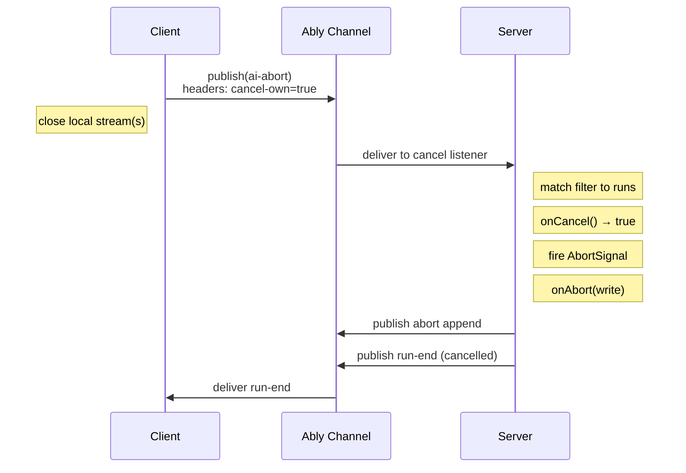

# Cancel

Cancellation in AI Transport is a channel-level operation - the client publishes a cancel signal on the Ably channel, the server receives it and aborts the matching runs.

Without a cancel protocol, stopping a generation requires either dropping the HTTP connection (which the server may not notice) or building custom signaling. AI Transport handles the full cancel chain: client signal, server abort, stream cleanup, and lifecycle notification to all clients.

## Client side

Cancel a specific run or all matching runs:

```typescript
// Cancel a specific run (returned by send/regenerate/edit)
const run = await view.send(userMessage);
await run.cancel();

// Cancel all your own active runs
await session.cancel({ own: true });

// Cancel a specific run by ID
await session.cancel({ runId: 'abc-123' });

// Cancel all runs on the channel (any client's runs)
await session.cancel({ all: true });
```

The default when no filter is given is `{ own: true }` - cancel all runs started by this client.

| Filter                    | Effect                                       | Use case                      |
| ------------------------- | -------------------------------------------- | ----------------------------- |
| `{ own: true }` (default) | Cancel all runs started by this client       | Stop button                   |
| `{ runId: "abc" }`        | Cancel one specific run                      | Cancel a specific generation  |
| `{ clientId: "user-2" }`  | Cancel all runs started by a specific client | Admin cancelling another user |
| `{ all: true }`           | Cancel every active run on the channel       | Emergency stop                |

In React, `useActiveRuns()` tells you whether runs are active:

```typescript
import { useActiveRuns } from '@ably/ai-transport/react';

const activeRuns = useActiveRuns({ session });
const isStreaming = activeRuns.size > 0;

// Stop button
<button onClick={() => session.cancel({ own: true })} disabled={!isStreaming}>
  Stop
</button>
```

## Server side

Each run has an `AbortSignal` that fires when a matching cancel arrives:

```typescript
import { Invocation } from '@ably/ai-transport';

const run = session.createRun(Invocation.fromJSON({ runId, clientId }), {
  onCancel: async (request) => {
    // request.filter - the parsed cancel scope
    // request.matchedRunIds - which runs would be cancelled
    // request.runOwners - Map<runId, clientId>
    // Return false to reject the cancel (run continues)
    return true;
  },
  onAbort: async (write) => {
    // Runs after the abort signal fires, before the stream closes.
    // Use write() to publish final events before the encoder closes, e.g.:
    // await write({ type: 'text-delta', textDelta: '[generation cancelled]' });
  },
});

// Pass the abort signal to the LLM to stop generation
const result = streamText({
  model,
  messages,
  abortSignal: run.abortSignal,
});
```

The `onCancel` hook authorizes the cancel - return `false` to reject it. Use this to prevent one user from cancelling another user's run. If `onCancel` is not provided, all cancels are accepted.

The `onAbort` hook runs after the signal fires. The `write` function lets you publish final events (e.g., a partial result summary) before the encoder closes.

## Wire sequence


```mermaid
sequenceDiagram
    participant C as Client
    participant Ch as Ably Channel
    participant S as Server

    C->>Ch: publish(ai-abort)<br/>headers: cancel-own=true
    Note left of C: close local stream(s)
    Ch->>S: deliver to cancel listener
    Note right of S: match filter to runs
    Note right of S: onCancel() → true
    Note right of S: fire AbortSignal
    Note right of S: onAbort(write)
    S->>Ch: publish abort append
    S->>Ch: publish run-end (cancelled)
    Ch->>C: deliver run-end
```

The client closes its local streams immediately on cancel - it doesn't wait for the server to confirm. The server-side run ends with `reason: 'cancelled'`, which all clients see via run lifecycle events.

## Platform-level cancellation

Ably cancel messages are the primary cancellation path, but the server may also need to abort a run when the platform signals shutdown - the HTTP request is cancelled, or a serverless function hits its execution timeout.

Pass the platform's abort signal to `createRun()` via the `signal` option:

```typescript
const run = session.createRun(
  Invocation.fromJSON({ runId, clientId }),
  { signal: req.signal }, // fires on request cancellation or function timeout
);
```

When the external signal fires, it aborts the run through the same path as an Ably cancel message - `run.abortSignal` fires, `streamText` stops generation, and `pipeStream` closes the stream. The `onCancel` hook is **not** called for platform-level signals (it only fires for Ably cancel messages), but `onAbort` runs normally.

Internally, `AbortSignal.any()` composes the external signal with the run's own abort controller, so either source triggers the same downstream abort.

## Cancel on close

Cancel active runs as part of session teardown:

```typescript
// Cancel own runs, then close
await session.close({ cancel: { own: true } });

// Close without cancelling (server keeps streaming)
await session.close();
```

See [Interruption](interruption.md) for cancel-then-send patterns. See [Error codes](../reference/error-codes.md) for cancel-related error codes. See [React hooks reference](../reference/react-hooks.md) for the `useActiveRuns()` API. For the internal cancel routing and filter resolution, see [Cancel routing](../internals/transport-components.md#cancel-routing-agent-session).
