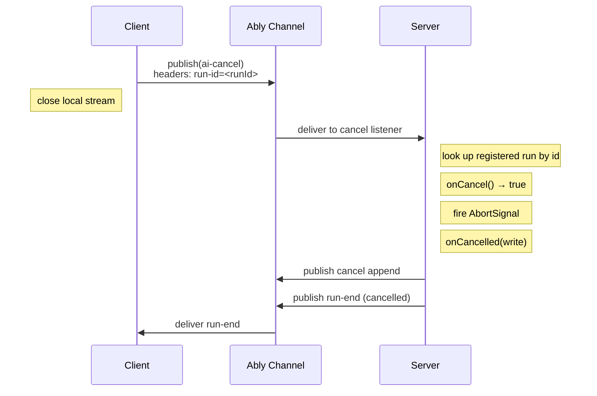

# Cancel

Cancellation in AI Transport is a channel-level operation - the client publishes a cancel signal on the Ably channel, the server receives it and cancels the targeted run.

Without a cancel protocol, stopping a generation requires either dropping the HTTP connection (which the server may not notice) or building custom signaling. AI Transport handles the full cancel chain: client signal, server-side cancellation, stream cleanup, and lifecycle notification to all clients.

## Client side

Cancel a specific run by ID:

```typescript
// Cancel a specific run (returned by send/regenerate/edit)
const run = await view.send(userMessage);
await run.cancel();

// Or cancel by runId from anywhere that holds the id
await session.cancel(run.runId);
```

Each `session.cancel(runId)` call targets exactly one run. To cancel multiple runs, iterate over runIds you hold yourself (handles returned by `send()`, or runIds read off rendered message nodes).

In React, the simplest "stop" button targets the run that produced the message the user is looking at — read `run-id` off the latest visible node:

```typescript
import { useView } from '@ably/ai-transport/react';

const { nodes } = useView({ session });
const latest = nodes.at(-1);
const latestRunId = latest?.headers['run-id'];
const latestStatus = latest?.headers['status'];
const isStreaming = latestRunId !== undefined && latestStatus !== 'complete' && latestStatus !== 'cancelled';

<button
  onClick={() => {
    if (!latestRunId) return;
    void session.cancel(latestRunId);
  }}
  disabled={!isStreaming}
>
  Stop
</button>
```

This is authoritative for the only thing the user can meaningfully stop — the streaming response in front of them — and stays correct even when the session has only hydrated part of the channel history.

## Server side

Each run has an `AbortSignal` that fires when a matching cancel arrives:

```typescript
import { Invocation } from '@ably/ai-transport';

const run = session.createRun(Invocation.fromJSON({ runId, clientId }), {
  onCancel: async (request) => {
    // request.runId - the targeted runId
    // request.message - the raw Ably cancel message (request.message.clientId is the sender)
    // Return false to reject the cancel (run continues)
    return true;
  },
  onCancelled: async (write) => {
    // Runs after the AbortSignal fires, before the stream closes.
    // Use write() to publish final events before the encoder closes, e.g.:
    // await write({ type: 'text-delta', textDelta: '[generation cancelled]' });
  },
});

// Pass the AbortSignal to the LLM to stop generation
const result = streamText({
  model,
  messages,
  abortSignal: run.abortSignal,
});
```

The `onCancel` hook authorizes the cancel - return `false` to reject it. Use this to prevent one user from cancelling another user's run. If `onCancel` is not provided, all cancels are accepted.

The `onCancelled` hook runs after the signal fires. The `write` function lets you publish final events (e.g., a partial result summary) before the encoder closes.

## Wire sequence


```mermaid
sequenceDiagram
    participant C as Client
    participant Ch as Ably Channel
    participant S as Server

    C->>Ch: publish(ai-cancel)<br/>headers: run-id=<runId>
    Note left of C: close local stream
    Ch->>S: deliver to cancel listener
    Note right of S: look up registered run by id
    Note right of S: onCancel() → true
    Note right of S: fire AbortSignal
    Note right of S: onCancelled(write)
    S->>Ch: publish cancel append
    S->>Ch: publish run-end (cancelled)
    Ch->>C: deliver run-end
```

The client closes its local streams immediately on cancel - it doesn't wait for the server to confirm. The server-side run ends with `reason: 'cancelled'`, which all clients see via run lifecycle events.

## Platform-level cancellation

Ably cancel messages are the primary cancellation path, but the server may also need to cancel a run when the platform signals shutdown - the HTTP request is cancelled, or a serverless function hits its execution timeout.

Pass the platform's `AbortSignal` to `createRun()` via the `signal` option:

```typescript
const run = session.createRun(
  Invocation.fromJSON({ runId, clientId }),
  { signal: req.signal }, // fires on request cancellation or function timeout
);
```

When the external signal fires, it cancels the run through the same path as an Ably cancel message - `run.abortSignal` fires, `streamText` stops generation, and `pipeStream` closes the stream. The `onCancel` hook is **not** called for platform-level signals (it only fires for Ably cancel messages), but `onCancelled` runs normally.

Internally, `AbortSignal.any()` composes the external signal with the run's own `AbortController`, so either source triggers the same downstream cancellation.

## Cancel and close

`session.close()` tears down only local state — the server keeps streaming until its runs end on their own. To stop in-progress runs before closing, call `session.cancel(runId)` for each first:

```typescript
// Cancel known runs, then close
await session.cancel(run.runId);
await session.close();
```

If you don't need to stop the server's work, just call `session.close()` on its own.

See [Interruption](interruption.md) for cancel-then-send patterns. See [Error codes](../reference/error-codes.md) for cancel-related error codes. For the internal cancel routing, see [Cancel routing](../internals/transport-components.md#cancel-routing-agent-session).
