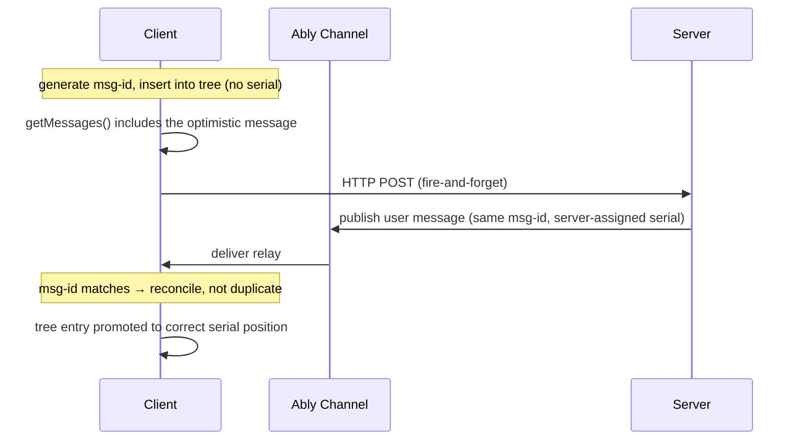

# Optimistic updates

When a user sends a message, it appears in the conversation immediately - before the server acknowledges it. The transport inserts the message into the [conversation tree](../internals/conversation-tree.md) optimistically, then reconciles it with the server-assigned identity when the relay arrives from the channel.

Without optimistic insertion, the user would see a gap between pressing "send" and their message appearing - the round trip to the server plus the relay back through the Ably channel. For a chat UI, that delay feels broken.

## How it works

The client generates a unique message ID (`x-ably-msg-id`) for each user message and inserts it into the conversation tree with no [serial](../internals/glossary.md#serial-ably) (Ably's server-assigned ordering identifier). The message is visible via `getMessages()` immediately. The HTTP POST to the server is [fire-and-forget](../internals/glossary.md#fire-and-forget) - `send()` returns without waiting for the server to respond.

The server receives the user message and relays it onto the Ably channel, preserving the original `x-ably-msg-id`. All clients on the channel - including the sender - receive this relay. The sending client recognises its own message by matching the `x-ably-msg-id` against the set of IDs it optimistically inserted. Instead of creating a duplicate, it updates the existing entry with the server-assigned serial, which moves the message from the end of the list to its correct position in serial order. This process is called [optimistic reconciliation](../internals/glossary.md#optimistic-reconciliation).



## What the developer sees

Optimistic updates are automatic - there is no opt-in or configuration. Every call to `send()`, `edit()`, or `regenerate()` that includes user messages uses the same mechanism.

```typescript
const turn = await transport.send(userMessage);

// The user message is already in getMessages() - no waiting for the server
const messages = transport.getMessages();
// messages includes userMessage at the end of the conversation
```

In React, `useMessages()` re-renders immediately after `send()` because the optimistic insert triggers a `message` event:

```typescript
import { useMessages, useSend } from '@ably/ai-transport/react';

const messages = useMessages(transport);
const send = useSend(transport);

// After send(), messages updates instantly with the new user message
await send([userMessage]);
```

## What happens during reconciliation

When the relay arrives from the channel, two things change on the optimistic entry:

1. **Serial promotion** - the entry gains a server-assigned serial and moves from the end of the sorted list to its correct position in serial order. In a single-client conversation this is usually the same position. In a [multi-client](multi-client.md) conversation where other clients are sending concurrently, the serial determines the canonical ordering.

2. **Message content update** - the server may have modified the message (e.g. the codec could normalise fields). The tree entry is updated with the relayed content.

Both changes happen inside a single `upsert()` call on the conversation tree. A `message` event fires, and `getMessages()` reflects the updated state.

## Server side

No server-side code is needed. The server transport's `turn.addMessages()` preserves the `x-ably-msg-id` from the client's POST body when relaying user messages onto the channel. This is what allows the sending client to match the relay against its optimistic entry. See [Streaming: server](streaming.md#server) for the standard server turn flow.

## Multi-message sends

When `send()` receives an array of messages, each gets its own `x-ably-msg-id` and each is optimistically inserted. The messages are chained - each subsequent message parents off the previous one, forming a linear thread rather than siblings. See [Conversation branching](branching.md) for how parent relationships work.

```typescript
// Both messages appear immediately, chained in order
const turn = await transport.send([questionOne, questionTwo]);
```

## Edge cases

**POST failure** - if the HTTP POST fails (network error or non-2xx response), the optimistic message remains in the tree but the server never relays it. The error is emitted via `transport.on('error')`. The optimistic entry stays with no serial until the transport is reset. In practice, the developer should handle the error event and update the UI accordingly.

**Multi-client ordering** - in a conversation with multiple clients sending concurrently, optimistic messages appear at the end of the local tree until reconciliation. After reconciliation, the serial determines the canonical order, which may differ from the optimistic insertion order. All clients converge on the same order once relays are reconciled.

**Cleanup** - the transport tracks optimistic msg-ids per turn. When a [turn](../concepts/turns.md) ends (via `x-ably-turn-end` on the channel), the tracking state for that turn is cleaned up. This prevents stale msg-ids from matching against unrelated messages in future turns.

For the internal implementation details, see [Client transport: optimistic reconciliation](../internals/client-transport.md#optimistic-reconciliation), [Conversation tree: upsert](../internals/conversation-tree.md#upsert-the-sole-mutation), and [Wire protocol: message identity](../internals/wire-protocol.md#message-identity-x-ably-msg-id).
