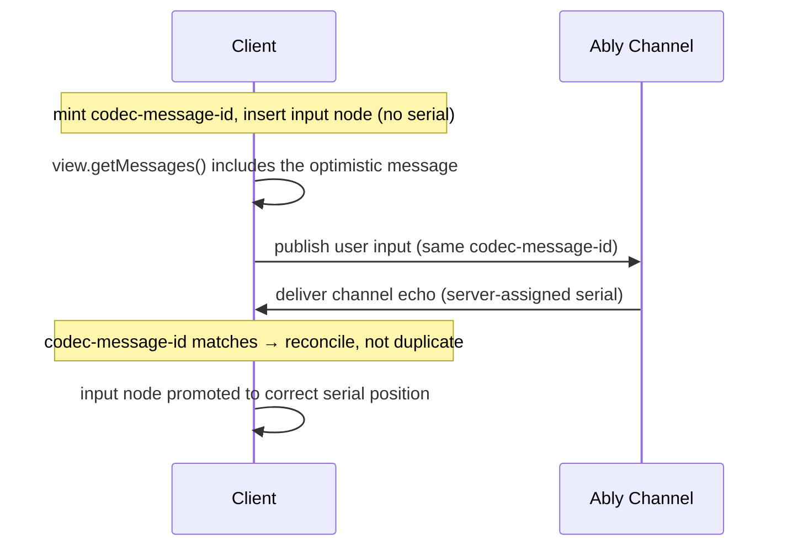

# Optimistic updates

When a user sends a message, it appears in the conversation immediately - before the Ably channel echoes it back. The session inserts the message into the [conversation tree](../internals/conversation-tree.md) optimistically, then reconciles it with the server-assigned serial when the channel echo arrives.

Without optimistic insertion, the user would see a gap between pressing "send" and their message appearing - the publish to Ably plus the echo back down the channel. For a chat UI, that delay feels broken.

## How it works

The session generates a unique `codec-message-id` for each fresh user message and inserts it into the conversation tree as an input node with no [serial](../internals/glossary.md#serial-ably) (Ably's server-assigned ordering identifier). Null-serial nodes tail-sort, so the optimistic message appears at the end of the list. The message is visible via `view.getMessages()` immediately. `send()` returns as soon as the input is published to the channel — the core sends no HTTP and does not wait for the agent.

The client publishes the user input directly to the channel via the shared codec encoder, stamping the `codec-message-id` on the message. All clients on the channel - including the sender - receive this message back as the channel echo. The sending client recognises its own message by matching the `codec-message-id` against the input node it optimistically inserted. Instead of creating a duplicate, it promotes the existing node with the server-assigned serial, which moves the message from the end of the list to its correct position in serial order. This process is called [optimistic reconciliation](../internals/glossary.md#optimistic-reconciliation).


```mermaid
sequenceDiagram
    participant C as Client
    participant Ch as Ably Channel

    Note over C: mint codec-message-id, insert input node (no serial)
    C->>C: view.getMessages() includes the optimistic message
    C->>Ch: publish user input (same codec-message-id)
    Ch->>C: deliver channel echo (server-assigned serial)
    Note over C: codec-message-id matches → reconcile, not duplicate
    C->>C: input node promoted to correct serial position
```

## What the developer sees

Optimistic updates are automatic - there is no opt-in or configuration. `send()` and `edit()` insert fresh user messages optimistically using the same mechanism. `regenerate()` carries no fresh user content (it is a wire-only signal that targets an existing message), so it inserts nothing optimistically — its new reply run appears once the agent's run-start lands.

```typescript
const view = session.view;
const run = await view.send(userMessage);

// The user message is already in the view - no waiting for the server
const messages = view.getMessages();
// messages includes userMessage at the end of the conversation
```

In React, `useView()` re-renders immediately after `send()` because the optimistic insert triggers an `update` event on the view:

```typescript
import { useView } from '@ably/ai-transport/react';

const { messages, send } = useView({ session });

// After send(), messages updates instantly with the new user message
await send([userMessage]);
```

## What happens during reconciliation

When the echo arrives from the channel, the optimistic entry changes in two ways:

1. **Serial promotion** - the input node gains a server-assigned serial and moves from the end of the sorted list to its correct position in serial order. In a single-client conversation this is usually the same position. In a [multi-client](multi-client.md) conversation where other clients are sending concurrently, the serial determines the canonical ordering.

2. **Projection fold** - the echoed input events are folded into the node's projection again, keeping the rendered message consistent with the wire form.

Serial promotion happens inside the conversation tree's apply path: the input node's serial is set and the node is re-sorted. An `update` event fires on the view, and `getMessages()` reflects the updated state.

## Server side

No server-side code is needed for optimistic updates. The user input is published by the client directly to the channel, carrying its own `codec-message-id`; the channel echo redelivers it to the sender for reconciliation. The agent simply locates the triggering input event by its `event-id` and publishes its run lifecycle events and assistant chunks. See [Streaming: server](streaming.md#server) for the standard server run flow.

## One new message per send

A send introduces at most one new message. The fresh user message gets its own `codec-message-id` and is optimistically inserted; passing more than one new message rejects with `InvalidArgument`. The array form is reserved for the wire-only inputs that resolve a single assistant turn (tool results / approval responses), which reference existing messages rather than introducing new ones and so are not optimistically inserted. See [Conversation branching](branching.md) for how parent relationships work.

```typescript
// The user message appears immediately
const run = await view.send(question);
```

## Edge cases

**Publish failure** - if publishing the input to the channel fails (network error or missing publish capability), the optimistic input node is rolled back: the session drops it from the tree, but only when it never received a server-assigned serial (i.e. nothing live observed it). A server-acked node is part of the canonical channel state and is kept. The error is emitted via `session.on('error')`. In practice, the developer should handle the error event and update the UI accordingly.

**Multi-client ordering** - in a conversation with multiple clients sending concurrently, optimistic messages appear at the end of the local tree until reconciliation. After reconciliation, the serial determines the canonical order, which may differ from the optimistic insertion order. All clients converge on the same order once echoes are reconciled.

For the internal implementation details, see [Client session: optimistic reconciliation](../internals/client-session.md#optimistic-reconciliation), [Conversation tree: the two mutation entry points](../internals/conversation-tree.md#apply-the-two-mutation-entry-points), and [Wire protocol: message identity](../internals/wire-protocol.md#message-identity-codec-message-id).
