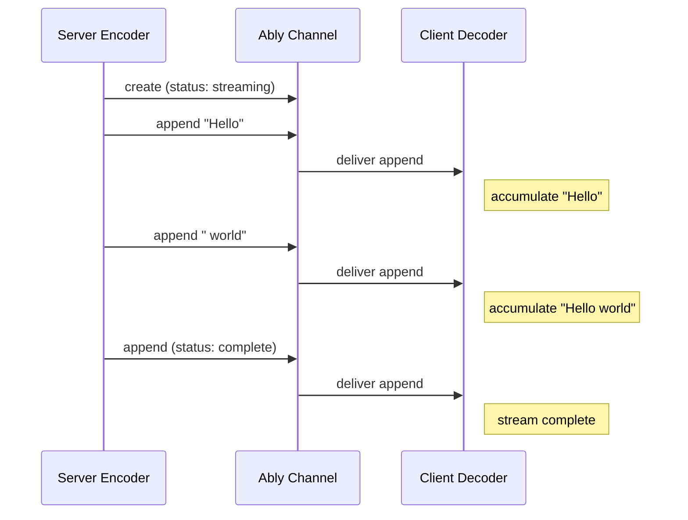

# Token streaming

AI Transport streams LLM tokens over Ably using message appends - each token is appended to a persistent message on the channel, so the response builds up incrementally and survives disconnection.

Without a durable transport, streaming responses are ephemeral: if the connection drops, the partial response is lost. Ably's message appends persist the accumulated text, so a reconnecting or late-joining client sees the full response from channel history.

## How it works

The server encoder creates an Ably message for each content stream (text, reasoning) and appends token deltas as they arrive. The client decoder accumulates these appends into complete messages.


```mermaid
sequenceDiagram
    participant SE as Server Encoder
    participant AC as Ably Channel
    participant CD as Client Decoder

    SE->>AC: create (status: streaming)
    SE->>AC: append "Hello"
    AC->>CD: deliver append
    Note right of CD: accumulate "Hello"
    SE->>AC: append " world"
    AC->>CD: deliver append
    Note right of CD: accumulate "Hello world"
    SE->>AC: append (status: complete)
    AC->>CD: deliver append
    Note right of CD: stream complete
```

Each stream has a lifecycle tracked by the `status` header:

| Status      | Meaning                               |
| ----------- | ------------------------------------- |
| `streaming` | Stream is open, more appends expected |
| `complete`  | Stream completed normally             |
| `cancelled` | Stream was cancelled                  |

## Server

Pipe any `ReadableStream` of codec events through the run's `pipe()`:

```typescript
import { streamText } from 'ai';
import { Invocation } from '@ably/ai-transport';
import type { InvocationData } from '@ably/ai-transport';
import { createAgentSession, vercelRunOutcome } from '@ably/ai-transport/vercel';

const invocation = Invocation.fromJSON((await req.json()) as InvocationData);

const session = createAgentSession({ client: ably, channelName: invocation.sessionName });
await session.connect();
const run = session.createRun(invocation, { signal: req.signal });

// Drain run.view to reconstruct the conversation so far (this also folds in the
// triggering input that start() waits for); run.messages is only this run, not the whole conversation.
while (run.view.hasOlder()) await run.view.loadOlder();
const conversation = run.view.getMessages().map((m) => m.message);
await run.start();

const result = streamText({ model, messages: conversation, abortSignal: run.abortSignal });
const pipeResult = await run.pipe(result.toUIMessageStream());

const outcome = await vercelRunOutcome(pipeResult, result.finishReason);
if (outcome.reason === 'suspend') {
  await run.suspend();
} else {
  await run.end(outcome);
}

session.close();
```

`pipe()` reads events from the stream and routes them through the encoder, resolving to a `StreamResult` (`{ reason, error? }`). Text deltas become message appends; lifecycle events (finish, error) become discrete messages that close the stream.

## Client

On the client, every streaming event is accumulated into the conversation tree as it arrives. The view updates on every event, so the last assistant message grows token by token:

```typescript
const view = session.view;
const run = await view.send(createUIMessageCodec().createUserMessage(userMessage));

// Subscribe to accumulated messages - updates on every token
const unsubscribe = view.on('update', () => {
  const messages = view.getMessages();
  // the last assistant message grows as tokens arrive
});

// Run status transitions arrive separately - a run reaching 'complete' does
// not change the message list, so it fires 'run', not 'update'. Subscribe to
// both to keep a Stop button or a disabled composer in step with the run.
const unsubscribeRun = view.on('run', () => {
  const latestRun = view.runOf(view.getMessages().at(-1)?.codecMessageId ?? '');
  const isStreaming = latestRun?.status === 'active';
});
```

This is the primary consumption path. In React, the `useView()` hook handles both subscriptions automatically.

### The output event

For per-event granularity, subscribe to the tree's `output` event. Every decoded run output — for any run, own or observed — surfaces here carrying the raw `TOutput` events (for the Vercel codec, `UIMessageChunk`s). Each event is routed by `inputCodecMessageId` — the triggering input's `codec-message-id`, which `run.inputCodecMessageId` gives you synchronously (the agent mints the `runId` now, so `event.runId` may not yet be known):

```typescript
// Per-event consumption - most apps use the view instead
const run = await view.send(createUIMessageCodec().createUserMessage(userMessage));
const unsubscribe = session.tree.on('output', (event) => {
  if (event.inputCodecMessageId !== run.inputCodecMessageId) return;
  for (const chunk of event.events) {
    // chunk is a UIMessageChunk (text-delta, finish, etc.)
  }
});
```

The view (and `useView()`) sit on top of this, so most application code never touches it. Framework adapters that need a `ReadableStream` build one from this event: Vercel's `useChat()` expects a `ReadableStream` as its transport contract, and the [chat transport](../internals/chat-transport.md) constructs a per-run stream from the tree's `output` event in the Vercel layer. See [Message lifecycle](../internals/message-lifecycle.md#how-run-outputs-surface) for the full picture.

## Recovery

Appends are pipelined - the encoder fires each append without waiting for acknowledgement, so tokens flow with minimal latency. If an append fails (e.g. during a brief network interruption), the message on the channel is now missing a chunk. Continuing to append deltas would build on incomplete text. The encoder recovers by issuing an `updateMessage` that replaces the entire message content with the full accumulated text it has been tracking locally, then resumes appending from that corrected state.

Late-joining clients receive the final message from channel history, which contains the fully accumulated text irrespective of whether or not individual appends were missed.

## What streams through

The transport streams whatever events the codec produces. For the Vercel AI SDK codec (`createUIMessageCodec()`), these are `UIMessageChunk` events:

| Chunk type        | Ably encoding                                              |
| ----------------- | ---------------------------------------------------------- |
| `text-delta`      | Message append                                             |
| `reasoning-delta` | Message append (separate stream)                           |
| `finish`          | Discrete message (terminal - closes the stream)            |
| `error`           | Discrete message (terminal - closes the stream with error) |

Multiple content streams can be active within a single run (e.g., reasoning + text). Each gets its own message with its own stream ID.

See [Tool calling](tool-calling.md) for how tool input deltas and results are streamed. See [React hooks reference](../reference/react-hooks.md) for the full `useView()` and `useClientSession()` API. See [Cancel](cancel.md) for how streams are cancelled. For the internal mechanics of message encoding, decoding, and recovery, see the [Encoder](../internals/encoder.md), [Decoder](../internals/decoder.md), and [Wire protocol](../internals/wire-protocol.md) internals pages.
