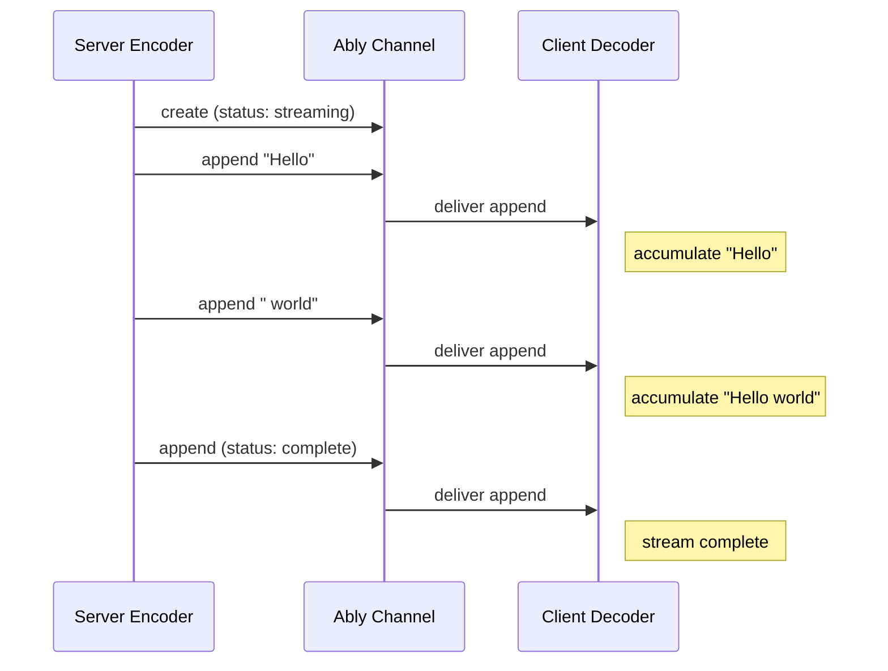

# Token streaming

AI Transport streams LLM tokens over Ably using message appends - each token is appended to a persistent message on the channel, so the response builds up incrementally and survives disconnection.

Without a durable transport, streaming responses are ephemeral: if the connection drops, the partial response is lost. Ably's message appends persist the accumulated text, so a reconnecting or late-joining client sees the full response from channel history.

## How it works

The server encoder creates an Ably message for each content stream (text, reasoning) and appends token deltas as they arrive. The client decoder accumulates these appends into complete messages.


```mermaid
sequenceDiagram
    participant SE as Server Encoder
    participant AC as Ably Channel
    participant CD as Client Decoder

    SE->>AC: create (status: streaming)
    SE->>AC: append "Hello"
    AC->>CD: deliver append
    Note right of CD: accumulate "Hello"
    SE->>AC: append " world"
    AC->>CD: deliver append
    Note right of CD: accumulate "Hello world"
    SE->>AC: append (status: complete)
    AC->>CD: deliver append
    Note right of CD: stream complete
```

Each stream has a lifecycle tracked by the `x-ably-status` header:

| Status      | Meaning                               |
| ----------- | ------------------------------------- |
| `streaming` | Stream is open, more appends expected |
| `complete`  | Stream completed normally             |
| `cancelled` | Stream was cancelled                  |

## Server

Pipe any `ReadableStream` of codec events through the run's `pipe()`:

```typescript
import { streamText } from 'ai';
import { Invocation } from '@ably/ai-transport';
import { createAgentSession } from '@ably/ai-transport/vercel';

const session = createAgentSession({ client: ably, channelName });
await session.connect();
const run = session.createRun(Invocation.fromJSON({ runId, clientId }));

await run.start();

// Publish user messages to the channel so all clients see them and they persist in history
await run.addMessages(userMessages, { clientId });

const result = streamText({ model, messages: conversationHistory, abortSignal: run.abortSignal });
const { reason } = await run.pipe(result.toUIMessageStream());
await run.end(reason);

session.close();
```

`pipe()` reads events from the stream and routes them through the encoder. Text deltas become message appends; lifecycle events (finish, error) become discrete messages that close the stream.

## Client

On the client, every streaming event is accumulated into the conversation tree as it arrives. The view updates on every event, so the last assistant message grows token by token:

```typescript
const view = session.view;
const run = await view.send(userMessage);

// Subscribe to accumulated messages - updates on every token
const unsubscribe = view.on('update', () => {
  const messages = view.getMessages();
  // the last assistant message grows as tokens arrive
});
```

This is the primary consumption path. In React, the `useView()` hook handles the subscription automatically.

### The event stream

`send()` also returns a `ReadableStream<TEvent>` on the `ActiveRun`. This exists as an integration seam for framework adapters - Vercel's `useChat()` expects a `ReadableStream` as its transport contract. Most application code should use the view instead, since the accumulator provides the same per-token granularity.

```typescript
// Framework adapter usage - most apps won't consume this directly
const run = await view.send(userMessage);
const reader = run.stream.getReader();
while (true) {
  const { done, value } = await reader.read();
  if (done) break;
  // value is a UIMessageChunk (text-delta, finish, etc.)
}
```

For runs started by other clients (observer runs), there is no stream - events are accumulated into messages and the tree updates via `tree.on('ably-message')`. See [Message lifecycle](../internals/message-lifecycle.md#own-runs-vs-observer-runs) for the full routing picture.

## Recovery

Appends are pipelined - the encoder fires each append without waiting for acknowledgement, so tokens flow with minimal latency. If an append fails (e.g. during a brief network interruption), the message on the channel is now missing a chunk. Continuing to append deltas would build on incomplete text. The encoder recovers by issuing an `updateMessage` that replaces the entire message content with the full accumulated text it has been tracking locally, then resumes appending from that corrected state.

Late-joining clients receive the final message from channel history, which contains the fully accumulated text irrespective of whether or not individual appends were missed.

## What streams through

The transport streams whatever events the codec produces. For the Vercel AI SDK codec (`UIMessageCodec`), these are `UIMessageChunk` events:

| Chunk type        | Ably encoding                                              |
| ----------------- | ---------------------------------------------------------- |
| `text-delta`      | Message append                                             |
| `reasoning-delta` | Message append (separate stream)                           |
| `finish`          | Discrete message (terminal - closes the stream)            |
| `error`           | Discrete message (terminal - closes the stream with error) |

Multiple content streams can be active within a single run (e.g., reasoning + text). Each gets its own message with its own stream ID.

See [Tool calling](tool-calling.md) for how tool input deltas and results are streamed. See [React hooks reference](../reference/react-hooks.md) for the full `useView()` and `useClientSession()` API. See [Cancel](cancel.md) for how streams are cancelled. For the internal mechanics of message encoding, decoding, and recovery, see the [Encoder](../internals/encoder.md), [Decoder](../internals/decoder.md), and [Wire protocol](../internals/wire-protocol.md) internals pages.
