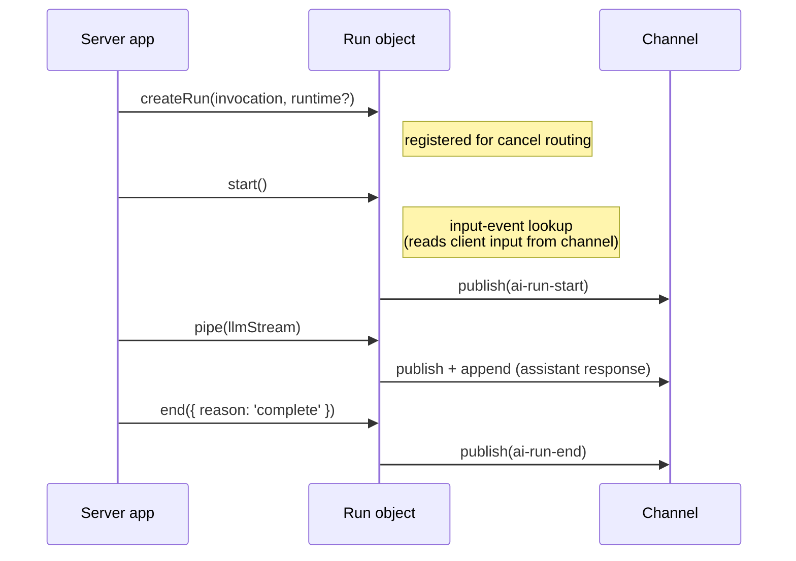

# Agent session

The agent session (`src/core/transport/agent-session.ts`) handles the server-side run lifecycle over an Ably channel. It composes a [RunManager](transport-components.md#runmanager) for run state and lifecycle event publishing, and delegates stream piping to [pipeStream](transport-components.md#pipestream).

The session exposes two run-construction factories that share one common publishable surface (`pipe()`, `createStep()`, `suspend()`, `end()`) built by a single internal run-object builder parameterised by an opening strategy:

- `createRun()` returns an `OpenableRun` whose `start()` **opens** a new run by publishing the opening lifecycle event (`ai-run-start`, or `ai-run-resume` for a continuation).
- `adoptRun()` returns an `AdoptedRun` whose `load()` **adopts** an already-open run for publishing in a fresh process **without** publishing an opening event — the durable cross-process seam (see [Durable cross-process execution](#durable-cross-process-execution)).

The opening verb is factory-specific, so calling `load()` on a created run, or `start()` on an adopted run, is a compile error.

## Construction and connect

`createAgentSession()` is synchronous and does no channel I/O - it constructs the [RunManager](transport-components.md#runmanager) bound to the channel and returns. Callers must `await session.connect()` before `createRun()` / `adoptRun()` or any run-lifecycle method; otherwise those methods throw `InvalidArgument`.

`connect()`:

1. Installs a single **unfiltered** channel subscription (subscribing before attach per [RTL7g](https://sdk.ably.com/builds/ably/specification/main/features/#RTL7g) — subscribe implicitly attaches the channel)
2. The shared listener folds every message into the session's materialisation Tree first (a no-op for already-folded serials), then dispatches `ai-cancel` control messages to registered runs

The subscription is unfiltered so the Tree folds every post-attach message regardless of name — the Tree is the session's single source of hydrated conversation state, and the input-event lookup reads from it (see _Input-event lookup_ below). The method is idempotent - a second call returns the same in-flight promise and does not subscribe twice. `Run.start()` does not install its own channel subscription; its lookup pre-scans the Tree and subscribes to the Tree's `ably-message` event, unsubscribing as soon as a match is found, or when the run is cancelled or the session closes. All message publishing goes through the RunManager and codec encoder.

## Input-event lookup

The client publishes the user prompt directly on the channel; the agent locates it by its `event-id` via `locateInputEvent` (`src/core/transport/input-event-locator.ts`). The locator is a **passive watcher** - it never pages history itself. It is armed at `createRun` (not in `start()`), so the instant the triggering input folds into the Tree the run's [`run.located`](#runlocated) resolves and `run.view` pins to its branch. It resolves with whichever of two sources surfaces the expected `event-id` first:

- a **pre-scan** of the Tree's `event-id` index (`findAblyMessageByEventId`) for a message already folded - a multi-run session where a prior run folded the message hits here synchronously;
- a **live listener** on the Tree's `ably-message` event, for an arrival during the call.

A trigger published before this (per-request) agent attached sits in channel history, not the live window. It is brought in not by the watcher but by the caller **paging `run.view`**: `run.view.loadOlder()` is the single history driver (see [Run view](#run-view)), and every folded page surfaces through the same `ably-message` event, so the live listener catches a trigger as it pages back. A database-backed agent's [`loadUntil`](history.md#client-pagination) walk, or a plain `while (run.view.hasOlder()) await run.view.loadOlder()` drain, is what walks a cold-start trigger in from history.

Inside `Run.start()`:

- If the invocation carries no `inputEventId`, there is nothing to locate - a degenerate run with no client input, and `run.located` resolves immediately. A tool-result or tool-approval continuation is _not_ this case: every send (including amend events such as tool results and approval responses) stamps a per-item `event-id` and sets the invocation's `inputEventId` to the triggering item's id, so a continuation carries an `inputEventId` and the watcher runs.
- Otherwise `start()` awaits the trigger before publishing `ai-run-start`. A send introduces at most one new message, so the trigger is that message (or, for a continuation, the triggering tool-resolution input); any other wire-only inputs published in the same send (the tool resolutions for the turn) are read from the channel later by draining `run.view`, not gated on by the watcher. Redeliveries of the trigger are deduped by Ably `serial` and version, since a history page may surface a message also seen live. There is no separate input-event buffer - the Tree retains every observed message for the session's lifetime.
- The watcher has **no deadline**: it resolves on a match and otherwise rejects only when the run's signal aborts (a cancel) or `close()` rejects it (`SessionClosed`); a decode failure mid-lookup rejects it too, wrapping the decode error as `cause`. A caller that wants to bound the wait races `run.located` against its own timeout. When the watcher rejects, `Run.start()` rejects **without publishing `ai-run-start`** and without publishing any lifecycle event on the channel - a phantom `ai-run-end` would violate the `run-start → run-end` lifecycle invariant for other channel observers who never saw a start. The developer's HTTP handler surfaces the failure as a non-2xx response, which the client's `send()` translates into a rejection via the HTTP-error path.

## Run lifecycle

A run progresses through a fixed sequence:

### createRun

Synchronous - no channel activity. Creates a `Run` object and registers it under a provisional run-id immediately, so `detach()` can abort an in-flight `start()`. A cancel arriving before `start()` resolves the triggering input is buffered (by that input's `codec-message-id`) and fires the run's `AbortSignal` once the input-event lookup completes.

Each run gets its own `AbortController`. If `runtime.signal` is provided (typically `req.signal` from the HTTP request), `AbortSignal.any()` composes it with the controller's signal into a single composite signal. The `abortSignal` property exposes this composite signal so the server app can pass it to LLM calls. Either source - an Ably cancel message or the external signal - triggers the same downstream cancellation.

### start

Publishes the run's opening lifecycle event to the channel via the [RunManager](transport-components.md#runmanager): `ai-run-start` for a fresh run, or `ai-run-resume` when the triggering input carries a `run-id` - the agent reads it off the input wire during the input-event lookup, and a `run-id` there marks a continuation re-entering that run. The public `start()` call is the same either way - the choice is internal. Run identity is resolved here, not from the invocation body (which carries no `run-id`): the agent mints a provisional run-id at `createRun` (`runtime.runId ?? crypto.randomUUID()`), and a continuation adopts the existing `run-id` read off the triggering input, re-keying its registration to that id. It stamps the resolved `run-id` on the lifecycle event. Must be called before `pipe()`.

The lifecycle event carries `input-client-id` — the Ably-level publisher `clientId` of the input event that triggered this invocation, read from the wire by the input-event lookup. On a fresh run this typically matches `run-client-id` (the run owner). On a continuation invocation triggered by an input from a non-owner (e.g. a tool-result publish from a different client), the new `input-client-id` reflects whoever published that input while `run-client-id` stays put. See [Client identity](wire-protocol.md#client-identity).

### pipe

Pipes a `ReadableStream<TOutput>` through the codec encoder to the channel via [pipeStream](transport-components.md#pipestream). The stream carries the assistant's response - text deltas, reasoning, lifecycle events.

Headers are built with `role: 'assistant'`, the assistant message's `codec-message-id` (a fresh `crypto.randomUUID()`), the run's branching metadata (parent, forkOf, regenerates), and `input-client-id` / `input-codec-message-id` propagated from the triggering input event (so every assistant output of this invocation carries the publisher's id). The assistant's parent defaults to an explicit per-stream `options.parent`, else the run's structural-parent fallback computed at `start()` (the triggering user message, or the input wire's own `parent` for regenerate wires). The run's composite `AbortSignal` is passed to pipeStream, so cancel signals propagate through to stream termination.

Returns a `StreamResult` - `{ reason; error? }`, where `reason` is `'complete'`, `'cancelled'`, or `'error'` and `error` carries the original failure when `reason` is `'error'`. A stream error is also wrapped as an `Ably.ErrorInfo` (code `StreamError`) and delivered to the run's `onError`.

Run termination is a transport-tier concern, and `pipe()` never ends its own run - the caller must call `end()` after `pipe()` returns (or rely on `session.end()` at teardown). On a `'cancelled'` result `pipe()` closes only its bracketing step (`ai-step-end{cancelled}`); the run terminal is always the outer layer's. The cancellation path inside [pipeStream](transport-components.md#pipestream) also calls `encoder.cancelStreams()` to close any in-flight streamed messages as `status: cancelled` - pure transport mechanics that emit no codec output. Run termination is signalled separately by the transport `ai-run-end` event, not by any codec-level event.

### end

Publishes `ai-run-end` to the channel and unregisters the run from cancel routing. The lifecycle event carries `input-client-id` matching the value stamped on `ai-run-start` for the same invocation. `end` takes a `RunEndParams` object: when it is `{ reason: 'error', error }`, the error's `code` and `message` are stamped as `error-code` / `error-message` headers on the run-end — the explicit, opt-in surfacing path of `AIT-ST6b4` (nothing is stamped automatically; a bare `{ reason: 'error' }` publishes no detail). Idempotent - calling `end()` twice is safe.

### suspend

Publishes `ai-run-suspend` instead of `ai-run-end`, pausing the run without ending it - call this when the run is awaiting participant input (a client-side tool execution or a server-side tool approval). The run stays live so a later invocation can resume it under the same `runId`. The suspend carries the same per-invocation attribution as `end()` (`invocation-id`, `input-client-id`, `input-codec-message-id`). The run manager drops the run from cancel routing on suspend - the agent process terminates, so a cancel arriving during suspension is a no-op and the resuming invocation re-registers the run. Like `end()`, it is terminal for this Run instance (a fresh Run handles the resume) and is a no-op if the run has already ended or suspended.

## Run view

Each run exposes `run.view` - a read-only [View](glossary.md#view-clientview-and-branchsource) over the session's materialisation Tree, the same read base the client surfaces as `session.view`. The difference is the injected [BranchSource](glossary.md#view-clientview-and-branchsource): the agent's run.view uses a `LeafBranchSource` pinned to this run's branch, walking `parentCodecMessageId` edges back from the triggering input's leaf. Branch choice is implicit-by-parent-walk - there is no sibling-selection map and no write path, so run.view exposes the read surface only (`getMessages`, `runs`, `hasOlder`, `loadOlder`, `loadUntil`).

The agent reads ancestor history by paging run.view back: `while (run.view.hasOlder()) await run.view.loadOlder()`, then `run.view.getMessages()` yields the branch oldest-to-newest. Paging drives the session's shared [history hydrator](history.md) - the single-flight cursor that the input-event lookup also uses - so the channel is walked once even when the lookup and the ancestor drain overlap. `run.view` closes when the run is removed from the session's routing maps.

`getMessages()` layers a prompt-safety filter over that branch: an ancestor run that did not complete - `status` still `active`, `suspended`, `cancelled`, or `error` - is omitted along with the input it replied to, so an unresolved tool call from a broken earlier turn can't invalidate the model prompt. The current run being served is always kept, even mid-flight, and the filter is recomputed on each read, so an ancestor that later completes reappears. Only the materialised message projection is filtered: branch identity and run lookup (`runOf`, sibling selection) resolve against the unfiltered structural branch, so an incomplete reply on the branch is never displaced by a completed sibling.

### run.located

`run.located` is a `Promise<void>` that resolves once the run's triggering input has folded into the Tree - whether it arrives live or is paged in by a `run.view.loadOlder()` walk. It is a **passive** watcher: it observes the fold, it does not drive paging, so a caller that wants the trigger pulled in from history must page `run.view` itself (the drain loop above does). It resolves immediately when the invocation carries no `inputEventId` (a degenerate run with no client input), and rejects only if the run is cancelled or the session closes before the trigger is located. There is no built-in deadline.

### Shared run read-model

`run` exposes the same `BaseRun` [read-model](glossary.md#run-read-model-baserun) the client's run does - `runId`, `status`, `error`, and `messages` (this run's whole contribution: its originating input plus all of its output across every suspend/resume segment) - read live off the Tree via getter accessors rather than snapshotted. The agent run (`AgentRun`) adds `view` and `located` on top; the client run (`ClientRun`) adds the send handle and the `started` promise. Sharing one base keeps the two run surfaces consistent.

## Durable cross-process execution

A run's lifecycle can span several processes under one stable `runId`. One process opens the run with `createRun(...).start()`; a separate process — a step, end, or cancel-cleanup activity of a durable workflow (Vercel Workflow DevKit, Temporal), each retried independently — continues it with `session.adoptRun(identity).load()`, then publishes steps / `suspend` / `end` **without** republishing `ai-run-start`.

The publish methods gate on whether the run is **open** — a flag set by `start()` _or_ an adopting `load()` — rather than on "was `start()` called on this instance", so a fresh process that adopted the run can publish onto it. A publish-time re-check of the run's status backstops a run that went terminal since it opened (e.g. a concurrent cancel cleanup): a publish onto an already-terminal run is rejected (`pipe` / `createStep`) or no-ops (`suspend` / `end`).

`adoptRun(identity, runtime?)` takes an `AdoptIdentity` — `{ runId, invocationId, triggerEventId }` — that the orchestration threads across the process boundary; the run object itself never crosses processes (its read-model is reconstructible from the channel). The identity is **authoritative**: unlike `start()`'s continuation path, `load()` does not re-key the run from the trigger event's `run-id` header (for a delegation trigger that header names the _parent_ run). `load(options?)`:

1. **Waits (bounded by `options.timeoutMs`, default 30 000 ms) for the run's `ai-run-start` to be observed** so its `startSerial` is confirmed on the Tree. The opener's optimistic run-node insert is local to its own process, so a fresh process's Tree is empty until it pages the run-start off channel history. The bound is composed _into_ the single history fold via a timeout-abort signal (not a `Promise.race` around the fold, which would leave it paging and holding the shared single-flight history cursor, starving concurrent runs). On the timeout — or channel exhaustion without the run-start — it rejects with `InputEventNotFound` (retryable: a workflow-ordering error where the open activity's run-start has not yet propagated), carrying any history-fetch failure as `cause`.
2. **Awaits the trigger** (`run.located`) so the watcher has resolved the run's write anchors and pinned `run.view`.
3. **Status-gates** (now `startSerial` is confirmed, so the read sees the hydrated status rather than the unhydrated `'active'` default): an `active` run is adopted; a `suspended` run is rejected (resume it via `createRun().start()` instead); a terminal run is rejected (read-only).
4. **Seeds the run owner** into the run manager from the run-start's `run-client-id`, so this process's output _and_ its terminal stamp the real owner even though it never opened the run.
5. **Opens for publishing** — without publishing any opening event.

`load()` is idempotent (a synchronous re-entrancy latch makes a second overlapping call a no-op rather than a double owner-seed) and may fire the run's `AbortSignal` before returning if a cancel for the run already arrived. The run is registered for cancel routing by its authoritative `runId` the moment `adoptRun()` is called, so a cancel keyed by that `run-id` fires the signal directly — the adopt path needs no deferred-cancel buffering (that buffer exists only for a fresh run, whose `runId` the client cannot know at cancel time).

There is no durable flag. The cross-process retry safety a workflow needs is a usage pattern, not a run option:

- **A stable `stepId` per step.** A fresh-process step retry re-emits its `ai-step-start` under the same `StepOptions.stepId` (a new channel serial), so the latest-serial attempt is canonical and the dead attempt's output is gated out. Supplying a stable `stepId` is how cross-process supersession works; the process-local default id would mint a different id per process and double-output, so a durable step must pass one (the deferred durable helper supplies it by construction).
- **`session.detach()` vs `session.end()` at teardown.** `pipe` never auto-ends its run, so a cancel mid-step closes only the step bracket. An in-flight activity hands the still-open run off with `session.detach()` (detach only, no terminal), and a separate cleanup activity is the sole publisher of `ai-run-end{cancelled}` via an explicit `run.end({ reason: 'cancelled' })`. A publish-time status re-check backstops the window where the in-flight arm and the cleanup arm are both live: a publish onto a run whose terminal has already folded is rejected (`pipe` / `createStep`) or no-ops (`suspend` / `end`).

## Cancel routing

The agent session handles cancel messages directly - no separate cancel manager. See [Transport components: cancel routing](transport-components.md#cancel-routing-agent-session) for the lookup and handler-isolation rules.

Key behaviors:

- Each `ai-cancel` targets exactly one run, identified by its `run-id` header (a continuation, whose run-id the client already knows) and/or its `input-codec-message-id` header (a fresh send, before the agent minted the run-id). Cancels carrying neither header are dropped with a warn-level log.
- Runs are registered for cancel routing on `createRun()` under a provisional run-id, before `start()`. A cancel matched by `run-id` fires the run's `AbortSignal` directly. A fresh-send cancel arrives keyed only by `input-codec-message-id` — the `input-codec-message-id → run-id` linkage doesn't exist until `start()`'s input-event lookup resolves the triggering input, so such a cancel is buffered in `_deferredCancels` and pulled (and honoured) once `start()` resolves that input.
- The `onCancel` hook (per-run) can return `false` to reject a cancel request.
- A throwing `onCancel` handler is wrapped into an `Ably.ErrorInfo` and surfaced via the run's `onError` (falling back to the session-level `onError`). The throw does not propagate out of the listener.

## Channel continuity

The agent session monitors the channel for continuity loss after the initial attach. Continuity is lost when the channel enters FAILED, SUSPENDED, or DETACHED, or re-attaches with `resumed: false`. On loss, the session emits `ChannelContinuityLost` (104006) via its session-level `on('error')` event. Transitions to these states _before_ the first attach are not continuity loss: no messages had yet been received, so there was nothing to lose.

Unlike the [client session's handling](client-session.md#delivery-guarantee), the agent does not cancel in-flight runs or fan out to per-run `onError`. The agent only consumes cancel messages from the channel, so losing one is survivable; the signal is observability so developers can choose whether to terminate in-flight work themselves (e.g. by aborting their external signals). Per-run `onError` remains scoped to that run's own operations.

## End

`end()` is the graceful teardown — the onion one layer up from `run.end()`, so `session.end -> run.end -> step.end`. For every still-**open** run the session owns it publishes `ai-run-end{cancelled}`, closing that run's open step first (via `run.end`'s existing auto-close, so the `ai-step-end` precedes the `ai-run-end` on the wire). It then does everything `detach()` does (detach + abort). An open run ends `{cancelled}` — not `complete` (would falsely mark an unfinished turn done), not `suspend` (hangs observers with no resumer — preserve-for-resume is `close()`'s job), not `error`. This is the normal teardown for a non-durable agent: it also backstops a forgotten `run.end()` (a fire-and-forget turn) so no observer is left stuck `streaming` — `pipe` does not itself end the run, so the run terminal is always the caller's (`run.end()`, or this `end()`). Each run's terminal is best-effort — one run's publish failure is surfaced via the session `onError` and does not block the others or the detach. A run already ended explicitly is gone from the registry, so `end()` does not re-terminate it; an unopened run (created/adopted but never started/loaded) has nothing on the wire to terminate, so its hook no-ops while the detach still aborts it. Idempotent.

## Detach

`detach()` is the detach-only teardown. It unsubscribes the channel listener, stops listening for channel state changes, aborts all registered runs (via their `AbortController`s), clears the routing maps (registered runs, the `input-codec-message-id → run-id` index, and deferred cancels), and closes the RunManager. It publishes **no run terminal** — an open run is left as-is on the channel, to be resumed or cleaned up by another process; this is the escape hatch a durable in-flight activity uses to hand a run off mid-sequence (for graceful teardown that closes open runs, use `end()`). It then detaches the channel the session attached — best-effort and only when the session had connected (a detach failure is swallowed and logged at debug) — and returns a promise that resolves once the detach completes, so an agent can `await session.detach()` before its serverless function returns. It does **not** close the injected Ably client — the caller owns its lifecycle. It is idempotent. After close, existing Run objects can still call `end()` (to publish run-end), since publishing is independent of the subscription.

## Error handling

Errors fall into two categories:

| Scope         | Delivery                   | Examples                                                                                           |
| ------------- | -------------------------- | -------------------------------------------------------------------------------------------------- |
| Session-level | `options.onError` callback | Cancel subscription failure, channel attach error, channel continuity loss (FAILED/SUSPENDED/etc.) |
| Run-level     | `runtime.onError` callback | Stream encoding error (also returned on `StreamResult.error`), `onCancel` handler failure          |

Publish failures in `start()`, `suspend()`, and `end()` are **not** delivered via `onError` — those methods reject their returned promise with an `Ably.ErrorInfo`, and the caller handles it at the await site. Run-level errors that do route through `onError` fall back to the session-level `onError` if no per-run handler is provided. Channel-wide events (e.g. continuity loss) always go to the session-level `onError` and are not replicated to per-run handlers.

### Surfacing errors on the channel

There is no dedicated transport-level error event. Failures reach observers (and the originating client) through one of two paths, depending on whether `ai-run-start` was published:

| Failure point                                                                                                                      | Wire surface                                                                                                                                                                                                                                                                                                                                                                                                             |
| ---------------------------------------------------------------------------------------------------------------------------------- | ------------------------------------------------------------------------------------------------------------------------------------------------------------------------------------------------------------------------------------------------------------------------------------------------------------------------------------------------------------------------------------------------------------------------ |
| **Before `ai-run-start`** (the trigger was never located - the run was cancelled or the session closed first, or a decode failure) | No channel publish. `Run.start()` rejects; the developer's HTTP handler surfaces the failure as a non-2xx response, which the client's `send()` translates into a rejection. Publishing a phantom `ai-run-end` would break the `run-start → run-end` lifecycle invariant.                                                                                                                                                |
| **Mid-run** (after `ai-run-start`)                                                                                                 | `ai-run-end` published with `run-reason: error`. When the agent passes an error to `end('error', error)`, its `code` / `message` are stamped as `error-code` / `error-message` headers (opt-in; see [end](#end)). The client reifies an `Ably.ErrorInfo` from whatever headers are present (defaulting the message to `agent reported an error` when absent), errors the active stream, and emits `session.on('error')`. |

See [Transport components](transport-components.md) for the RunManager, pipeStream, and cancel routing internals. See [Client session](client-session.md) for the client-side counterpart. See [Wire protocol](wire-protocol.md) for the header and event specification.
