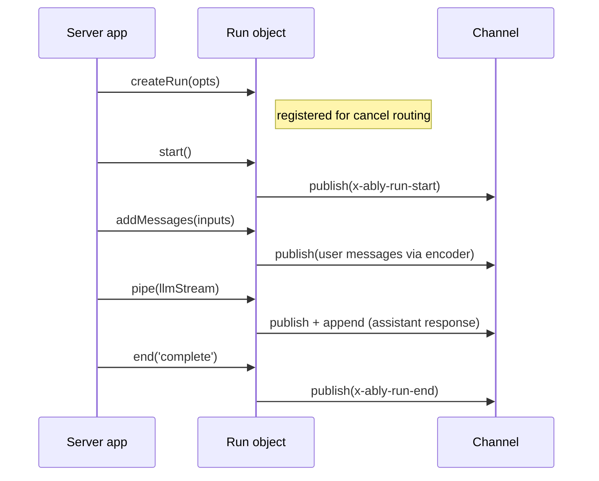

# Agent session

The agent session (`src/core/transport/agent-session.ts`) handles the server-side run lifecycle over an Ably channel. It composes a [RunManager](transport-components.md#runmanager) for run state and lifecycle event publishing, and delegates stream piping to [pipeStream](transport-components.md#pipestream).

The session exposes a single factory method - `createRun()` - which returns a `Run` object with explicit lifecycle methods: `start()`, `addMessages()`, `pipe()`, and `end()`.

## Construction and connect

`createAgentSession()` is synchronous and does no channel I/O - it constructs the [RunManager](transport-components.md#runmanager) bound to the channel and returns. Callers must `await session.connect()` before `createRun()` or any run-lifecycle method; otherwise those methods throw `InvalidArgument`.

`connect()`:

1. Subscribes to `x-ably-cancel` events on the channel (subscribing before attach per [RTL7g](https://sdk.ably.com/builds/ably/specification/main/features/#RTL7g))
2. Starts routing cancel messages to registered runs

The method is idempotent - a second call returns the same in-flight promise and does not subscribe twice. The cancel subscription is the session's only channel subscription. All message publishing goes through the RunManager and codec encoder - the session doesn't subscribe to its own output.

## Run lifecycle

A run progresses through a fixed sequence:

### createRun

Synchronous - no channel activity. Creates a `Run` object and registers it for cancel routing immediately, so early cancels (arriving before `start()`) fire the abort signal.

Each run gets its own `AbortController`. If `opts.signal` is provided (typically `req.signal` from the HTTP request), `AbortSignal.any()` composes it with the controller's signal into a single composite signal. The `abortSignal` property exposes this composite signal so the server app can pass it to LLM calls. Either source - an Ably cancel message or the external signal - triggers the same downstream abort.

### start

Publishes `x-ably-run-start` to the channel via the [RunManager](transport-components.md#runmanager). Must be called before `addMessages()` or `pipe()`.

### addMessages

Publishes user messages to the channel through the codec encoder. Each message gets:

- A generated `x-ably-msg-id`
- [Transport headers](wire-protocol.md#transport-headers-x-ably) via [buildTransportHeaders](transport-components.md#buildtransportheaders) (role, run IDs, parent, forkOf)
- Per-message headers from the client override transport-generated defaults - this lets `x-ably-msg-id` from the client's optimistic insert pass through for [reconciliation](glossary.md#optimistic-reconciliation)

Returns the effective message IDs of all published messages.

### pipe

Pipes a `ReadableStream<TEvent>` through the codec encoder to the channel via [pipeStream](transport-components.md#pipestream). The stream carries the assistant's response - text deltas, reasoning, lifecycle events.

Headers are built with `role: 'assistant'` and the run's branching metadata (parent, forkOf). The abort signal from the RunManager is passed to pipeStream, so cancel signals propagate through to stream termination.

Returns `{ reason }` - `'complete'`, `'cancelled'`, or `'error'`. Does **not** call `end()` - the caller must do that after `pipe()` returns.

### end

Publishes `x-ably-run-end` to the channel and unregisters the run from cancel routing. Idempotent - calling `end()` twice is safe.

## Cancel routing

The agent session handles cancel messages directly - no separate cancel manager. See [Transport components: cancel routing](transport-components.md#cancel-routing-agent-session) for the full filter resolution and handler isolation.

Key behaviors:

- Runs are registered for cancel routing on `createRun()`, before `start()`. Early cancels fire the abort signal.
- The `onCancel` hook (per-run) can return `false` to reject a cancel request.
- A throwing `onCancel` handler doesn't prevent other matched runs from being cancelled - each is isolated.
- Cancel resolution uses the sender's `clientId` from the Ably message for `own` filter matching.

## Channel continuity

The agent session monitors the channel for continuity loss after the initial attach. Continuity is lost when the channel enters FAILED, SUSPENDED, or DETACHED, or re-attaches with `resumed: false`. On loss, the session invokes the session-level `onError` callback with `ChannelContinuityLost` (104006).

Unlike the [client session's handling](client-session.md#stream-delivery-guarantee), the agent does not abort in-flight runs or fan out to per-run `onError`. The agent only consumes cancel messages from the channel, so losing one is survivable; the signal is observability so developers can choose whether to terminate in-flight work themselves (e.g. by aborting their external signals). Per-run `onError` remains scoped to that run's own operations.

## Close

`close()` unsubscribes from cancel messages, stops listening for channel state changes, aborts all active runs (via their AbortControllers), and clears the registration map. It is idempotent. After close, existing Run objects can still call `end()` (to publish run-end) but new runs cannot be created.

## Error handling

Errors fall into two categories:

| Scope         | Delivery                      | Examples                                                                                           |
| ------------- | ----------------------------- | -------------------------------------------------------------------------------------------------- |
| Session-level | `options.onError` callback    | Cancel subscription failure, channel attach error, channel continuity loss (FAILED/SUSPENDED/etc.) |
| Run-level     | `runOptions.onError` callback | Run-start publish failure, stream encoding error                                                   |

Run-level errors fall back to the session-level `onError` if no per-run handler is provided. Channel-wide events (e.g. continuity loss) always go to the session-level `onError` and are not replicated to per-run handlers.

See [Transport components](transport-components.md) for the RunManager, pipeStream, and cancel routing internals. See [Client session](client-session.md) for the client-side counterpart. See [Wire protocol](wire-protocol.md) for the header and event specification.
