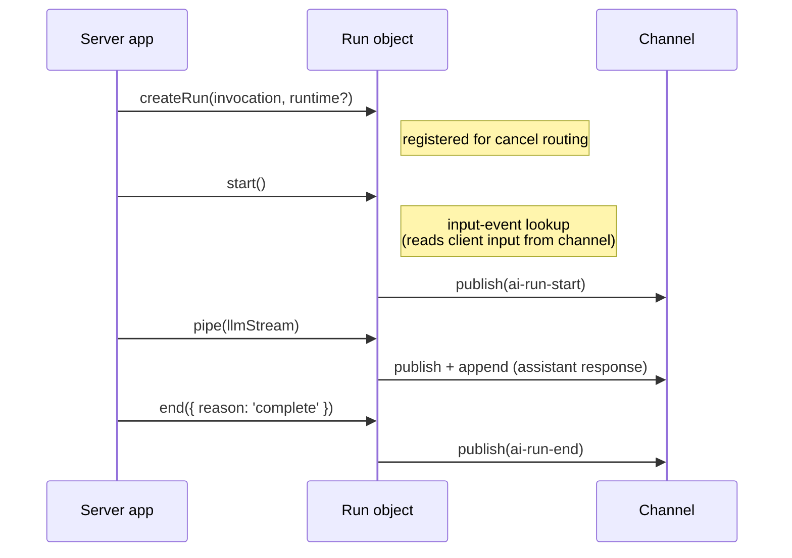

# Agent session

The agent session (`src/core/transport/agent-session.ts`) handles the server-side run lifecycle over an Ably channel. It composes a [RunManager](transport-components.md#runmanager) for run state and lifecycle event publishing, and delegates stream piping to [pipeStream](transport-components.md#pipestream).

The session exposes a single factory method - `createRun()` - which returns a `Run` object with explicit lifecycle methods: `start()`, `pipe()`, `suspend()`, and `end()`.

## Construction and connect

`createAgentSession()` is synchronous and does no channel I/O - it constructs the [RunManager](transport-components.md#runmanager) bound to the channel and returns. Callers must `await session.connect()` before `createRun()` or any run-lifecycle method; otherwise those methods throw `InvalidArgument`.

`connect()`:

1. Installs a single **unfiltered** channel subscription (subscribing before attach per [RTL7g](https://sdk.ably.com/builds/ably/specification/main/features/#RTL7g) — subscribe implicitly attaches the channel)
2. The shared listener folds every message into the session's materialisation Tree first (a no-op for already-folded serials), then dispatches `ai-cancel` control messages to registered runs

The subscription is unfiltered so the Tree folds every post-attach message regardless of name — the Tree is the session's single source of hydrated conversation state, and the input-event lookup reads from it (see _Input-event lookup_ below). The method is idempotent - a second call returns the same in-flight promise and does not subscribe twice. `Run.start()` does not install its own channel subscription; its lookup pre-scans the Tree and subscribes to the Tree's `ably-message` event, unsubscribing as soon as a match is found or the deadline lapses. All message publishing goes through the RunManager and codec encoder.

## Input-event lookup

The client publishes the user prompt directly on the channel; the agent locates it by its `event-id` via `locateInputEvent` (`src/core/transport/input-event-locator.ts`). Messages published before the agent attached are found by driving the session's shared [history hydrator](history.md) with `untilAttach: true` (gapless with the live subscription by serial boundary). The scan pages backward only until the trigger is found — there is no "how far back" window; it is bounded instead by the lookup deadline (`AgentSessionOptions.inputEventLookupTimeoutMs`) and the channel's `untilAttach` exhaustion.

Inside `Run.start()`:

- If the invocation carries no `inputEventId`, the lookup is skipped — a degenerate run with no client input. Note that a tool-result or tool-approval continuation is _not_ this case: every send (including amend events such as tool results and approval responses) stamps a per-item `event-id` and sets the invocation's `inputEventId` to the triggering item's id, so a continuation carries an `inputEventId` and the lookup runs (waiting for the tool-result wire to arrive).
- If `inputEventLookupTimeoutMs` is `0` (tests and in-process drivers that don't round-trip through the channel), the lookup is skipped.
- Otherwise the lookup waits for the single triggering `inputEventId` to arrive, matched against `event-id`. A send introduces at most one new message, so the trigger is that message (or, for a continuation, the triggering tool-resolution input); any other wire-only inputs published in the same send (the tool resolutions for the turn) are read from the channel later by draining the run projection (`run.view`), not gated on by this lookup. Redeliveries of the trigger are deduped by Ably `serial` and version, since the history scan may surface a message also seen live. The lookup is bounded by the `AgentSessionOptions.inputEventLookupTimeoutMs` budget (default 30 000 ms).
- The lookup races three sources: a pre-scan of the Tree's `event-id` index (`findAblyMessageByEventId`) for messages already folded — multi-run sessions where a prior run folded the message hit here synchronously; a listener on the Tree's `ably-message` event for live arrivals during the call; and the bounded history scan, whose pages fold into the Tree and reach the listener through the same event. There is no separate input-event buffer — the Tree retains every observed message for the session's lifetime.
- If the trigger does not arrive before the timeout the lookup rejects with `InputEventNotFound` (its message names the missing event, e.g. `"input event <id> for invocation <id> not found within <ms>ms"`); a decode failure mid-lookup rejects it too, wrapping the decode error as `cause`. In both cases `Run.start()` rejects without publishing `ai-run-start` **and without publishing any lifecycle event on the channel** — a phantom `ai-run-end` would violate the `run-start → run-end` lifecycle invariant for other channel observers who never saw a start. The developer's HTTP handler surfaces the failure as a non-2xx response, which the client's `send()` translates into a rejection via the HTTP-error path.

## Run lifecycle

A run progresses through a fixed sequence:

### createRun

Synchronous - no channel activity. Creates a `Run` object and registers it under a provisional run-id immediately, so `close()` can abort an in-flight `start()`. A cancel arriving before `start()` resolves the triggering input is buffered (by that input's `codec-message-id`) and fires the run's `AbortSignal` once the input-event lookup completes.

Each run gets its own `AbortController`. If `runtime.signal` is provided (typically `req.signal` from the HTTP request), `AbortSignal.any()` composes it with the controller's signal into a single composite signal. The `abortSignal` property exposes this composite signal so the server app can pass it to LLM calls. Either source - an Ably cancel message or the external signal - triggers the same downstream cancellation.

### start

Publishes the run's opening lifecycle event to the channel via the [RunManager](transport-components.md#runmanager): `ai-run-start` for a fresh run, or `ai-run-resume` when the triggering input carries a `run-id` - the agent reads it off the input wire during the input-event lookup, and a `run-id` there marks a continuation re-entering that run. The public `start()` call is the same either way - the choice is internal. Run identity is resolved here, not from the invocation body (which carries no `run-id`): the agent mints a provisional run-id at `createRun` (`runtime.runId ?? crypto.randomUUID()`), and a continuation adopts the existing `run-id` read off the triggering input, re-keying its registration to that id. It stamps the resolved `run-id` on the lifecycle event. Must be called before `pipe()`.

The lifecycle event carries `input-client-id` — the Ably-level publisher `clientId` of the input event that triggered this invocation, read from the wire by the input-event lookup. On a fresh run this typically matches `run-client-id` (the run owner). On a continuation invocation triggered by an input from a non-owner (e.g. a tool-result publish from a different client), the new `input-client-id` reflects whoever published that input while `run-client-id` stays put. See [Client identity](wire-protocol.md#client-identity).

### pipe

Pipes a `ReadableStream<TOutput>` through the codec encoder to the channel via [pipeStream](transport-components.md#pipestream). The stream carries the assistant's response - text deltas, reasoning, lifecycle events.

Headers are built with `role: 'assistant'`, the assistant message's `codec-message-id` (a fresh `crypto.randomUUID()`), the run's branching metadata (parent, forkOf, regenerates), and `input-client-id` / `input-codec-message-id` propagated from the triggering input event (so every assistant output of this invocation carries the publisher's id). The assistant's parent defaults to an explicit per-stream `options.parent`, else the run's structural-parent fallback computed at `start()` (the triggering user message, or the input wire's own `parent` for regenerate wires). The run's composite `AbortSignal` is passed to pipeStream, so cancel signals propagate through to stream termination.

Returns a `StreamResult` - `{ reason; error? }`, where `reason` is `'complete'`, `'cancelled'`, or `'error'` and `error` carries the original failure when `reason` is `'error'`. A stream error is also wrapped as an `Ably.ErrorInfo` (code `StreamError`) and delivered to the run's `onError`.

Run termination is a transport-tier concern. On a normal completion or error, `pipe()` does **not** call `end()` - the caller must do that after `pipe()` returns. On a `'cancelled'` result, however, `pipe()` calls `run.end({ reason: 'cancelled' })` itself (best-effort) so that every observer's stream closes through the transport `ai-run-end` event even if the caller's handler omits `run.end()`; a later caller `run.end()` is a no-op via the ENDED guard. The cancellation path inside [pipeStream](transport-components.md#pipestream) also calls `encoder.cancelStreams()` to close any in-flight streamed messages as `status: cancelled` - pure transport mechanics that emit no codec output. Run termination is signalled separately by the transport `ai-run-end` event, not by any codec-level event.

### end

Publishes `ai-run-end` to the channel and unregisters the run from cancel routing. The lifecycle event carries `input-client-id` matching the value stamped on `ai-run-start` for the same invocation. `end` takes a `RunEndParams` object: when it is `{ reason: 'error', error }`, the error's `code` and `message` are stamped as `error-code` / `error-message` headers on the run-end — the explicit, opt-in surfacing path of `AIT-ST6b4` (nothing is stamped automatically; a bare `{ reason: 'error' }` publishes no detail). Idempotent - calling `end()` twice is safe.

### suspend

Publishes `ai-run-suspend` instead of `ai-run-end`, pausing the run without ending it - call this when the run is awaiting participant input (a client-side tool execution or a server-side tool approval). The run stays live so a later invocation can resume it under the same `runId`. The suspend carries the same per-invocation attribution as `end()` (`invocation-id`, `input-client-id`, `input-codec-message-id`). The run manager drops the run from cancel routing on suspend - the agent process terminates, so a cancel arriving during suspension is a no-op and the resuming invocation re-registers the run. Like `end()`, it is terminal for this Run instance (a fresh Run handles the resume) and is a no-op if the run has already ended or suspended.

## Run view

Each run exposes `run.view` - a read-only [View](glossary.md#view-clientview-and-branchsource) over the session's materialisation Tree, the same read base the client surfaces as `session.view`. The difference is the injected [BranchSource](glossary.md#view-clientview-and-branchsource): the agent's run.view uses a `LeafBranchSource` pinned to this run's branch, walking `parentCodecMessageId` edges back from the triggering input's leaf. Branch choice is implicit-by-parent-walk - there is no sibling-selection map and no write path, so run.view exposes the read surface only (`getMessages`, `runs`, `hasOlder`, `loadOlder`, `loadUntil`).

The agent reads ancestor history by paging run.view back: `while (run.view.hasOlder()) await run.view.loadOlder()`, then `run.view.getMessages()` yields the full branch oldest-to-newest. Paging drives the session's shared [history hydrator](history.md) - the single-flight cursor that the input-event lookup also uses - so the channel is walked once even when the lookup and the ancestor drain overlap. `run.view` closes when the run is removed from the session's routing maps.

## Cancel routing

The agent session handles cancel messages directly - no separate cancel manager. See [Transport components: cancel routing](transport-components.md#cancel-routing-agent-session) for the lookup and handler-isolation rules.

Key behaviors:

- Each `ai-cancel` targets exactly one run, identified by its `run-id` header (a continuation, whose run-id the client already knows) and/or its `input-codec-message-id` header (a fresh send, before the agent minted the run-id). Cancels carrying neither header are dropped with a warn-level log.
- Runs are registered for cancel routing on `createRun()` under a provisional run-id, before `start()`. A cancel matched by `run-id` fires the run's `AbortSignal` directly. A fresh-send cancel arrives keyed only by `input-codec-message-id` — the `input-codec-message-id → run-id` linkage doesn't exist until `start()`'s input-event lookup resolves the triggering input, so such a cancel is buffered in `_deferredCancels` and pulled (and honoured) once `start()` resolves that input.
- The `onCancel` hook (per-run) can return `false` to reject a cancel request.
- A throwing `onCancel` handler is wrapped into an `Ably.ErrorInfo` and surfaced via the run's `onError` (falling back to the session-level `onError`). The throw does not propagate out of the listener.

## Channel continuity

The agent session monitors the channel for continuity loss after the initial attach. Continuity is lost when the channel enters FAILED, SUSPENDED, or DETACHED, or re-attaches with `resumed: false`. On loss, the session invokes the session-level `onError` callback with `ChannelContinuityLost` (104006).

Unlike the [client session's handling](client-session.md#delivery-guarantee), the agent does not cancel in-flight runs or fan out to per-run `onError`. The agent only consumes cancel messages from the channel, so losing one is survivable; the signal is observability so developers can choose whether to terminate in-flight work themselves (e.g. by aborting their external signals). Per-run `onError` remains scoped to that run's own operations.

## Close

`close()` unsubscribes the channel listener, stops listening for channel state changes, aborts all registered runs (via their `AbortController`s), clears the routing maps (registered runs, the `input-codec-message-id → run-id` index, and deferred cancels), and closes the RunManager. It then detaches the channel the session attached — best-effort and only when the session had connected (a detach failure is swallowed and logged at debug) — and returns a promise that resolves once the detach completes, so a serverless agent can `await session.close()` for a graceful teardown before the function returns. It does **not** close the injected Ably client — the caller owns its lifecycle. It is idempotent. After close, existing Run objects can still call `end()` (to publish run-end), since publishing is independent of the subscription.

## Error handling

Errors fall into two categories:

| Scope         | Delivery                   | Examples                                                                                           |
| ------------- | -------------------------- | -------------------------------------------------------------------------------------------------- |
| Session-level | `options.onError` callback | Cancel subscription failure, channel attach error, channel continuity loss (FAILED/SUSPENDED/etc.) |
| Run-level     | `runtime.onError` callback | Stream encoding error (also returned on `StreamResult.error`), `onCancel` handler failure          |

Publish failures in `start()`, `suspend()`, and `end()` are **not** delivered via `onError` — those methods reject their returned promise with an `Ably.ErrorInfo`, and the caller handles it at the await site. Run-level errors that do route through `onError` fall back to the session-level `onError` if no per-run handler is provided. Channel-wide events (e.g. continuity loss) always go to the session-level `onError` and are not replicated to per-run handlers.

### Surfacing errors on the channel

There is no dedicated transport-level error event. Failures reach observers (and the originating client) through one of two paths, depending on whether `ai-run-start` was published:

| Failure point                                         | Wire surface                                                                                                                                                                                                                                                                                                                                                                                                             |
| ----------------------------------------------------- | ------------------------------------------------------------------------------------------------------------------------------------------------------------------------------------------------------------------------------------------------------------------------------------------------------------------------------------------------------------------------------------------------------------------------ |
| **Before `ai-run-start`** (e.g. `InputEventNotFound`) | No channel publish. `Run.start()` rejects; the developer's HTTP handler surfaces the failure as a non-2xx response, which the client's `send()` translates into a rejection. Publishing a phantom `ai-run-end` would break the `run-start → run-end` lifecycle invariant.                                                                                                                                                |
| **Mid-run** (after `ai-run-start`)                    | `ai-run-end` published with `run-reason: error`. When the agent passes an error to `end('error', error)`, its `code` / `message` are stamped as `error-code` / `error-message` headers (opt-in; see [end](#end)). The client reifies an `Ably.ErrorInfo` from whatever headers are present (defaulting the message to `agent reported an error` when absent), errors the active stream, and emits `session.on('error')`. |

See [Transport components](transport-components.md) for the RunManager, pipeStream, and cancel routing internals. See [Client session](client-session.md) for the client-side counterpart. See [Wire protocol](wire-protocol.md) for the header and event specification.
