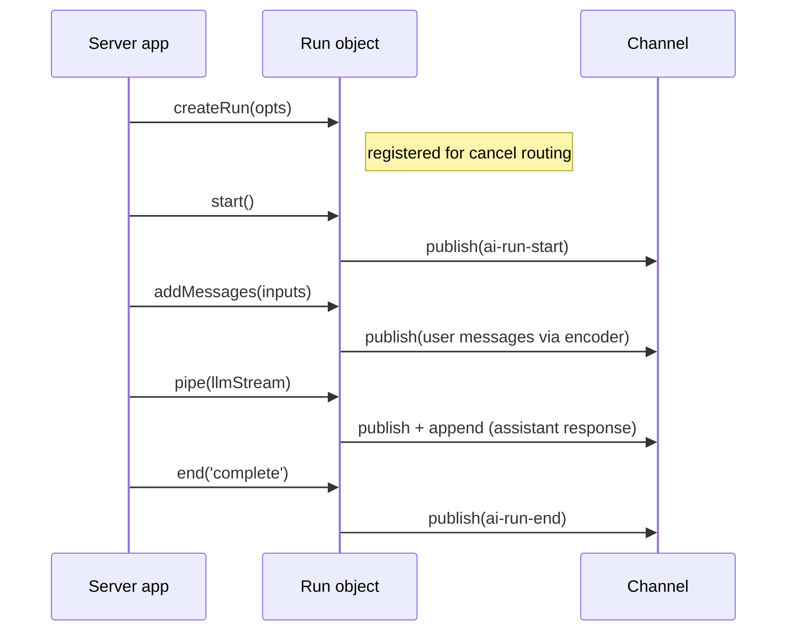

# Agent session

The agent session (`src/core/transport/agent-session.ts`) handles the server-side run lifecycle over an Ably channel. It composes a [RunManager](transport-components.md#runmanager) for run state and lifecycle event publishing, and delegates stream piping to [pipeStream](transport-components.md#pipestream).

The session exposes a single factory method - `createRun()` - which returns a `Run` object with explicit lifecycle methods: `start()`, `addMessages()`, `pipe()`, and `end()`.

## Construction and connect

`createAgentSession()` is synchronous and does no channel I/O - it constructs the [RunManager](transport-components.md#runmanager) bound to the channel and returns. Callers must `await session.connect()` before `createRun()` or any run-lifecycle method; otherwise those methods throw `InvalidArgument`.

`connect()`:

1. Subscribes to `ai-cancel` events on the channel (subscribing before attach per [RTL7g](https://sdk.ably.com/builds/ably/specification/main/features/#RTL7g))
2. Starts routing cancel messages to registered runs

The method is idempotent - a second call returns the same in-flight promise and does not subscribe twice. The cancel subscription is the session's primary subscription. `Run.start()` may install a transient unfiltered subscription for the duration of the user-prompt lookup (see _Prompt lookup_ below); it unsubscribes as soon as a match is found or the deadline lapses. All other message publishing goes through the RunManager and codec encoder.

## Prompt lookup

The client publishes the user prompt(s) directly on the channel; the agent locates them by `x-ably-invocation-id`. The session attaches with a channel rewind (default 2 minutes, tunable via `AgentSessionOptions.promptRewindWindow`) so messages published before the agent attached are replayed through the session's unfiltered listener. A longer window improves the chances of finding a user prompt for an agent with a slow cold start but increases the message volume replayed on attach (and therefore the pressure on `promptBufferLimit`).

Inside `Run.start()`:

- If `invocation.messages` is non-empty (legacy / test path), it is used directly and no lookup runs.
- If `invocation.userMessageCount === 0` (continuation send after a tool result, where the events array carries the work and no new user prompt was published), the lookup is skipped.
- Otherwise the lookup waits for exactly `userMessageCount` distinct user-prompt Ably messages tagged with the run's invocation-id. Multi-message `send([m1, m2, …])` publishes each message as its own Ably message under one invocation-id, so all `userMessageCount` arrivals must be collected before the run starts. Dedupe by Ably `serial` (rewind may redeliver a message also seen live); sort the collected messages by `serial` ascending before appending them to `run.view.messages`. The whole collection is bounded by a single `AgentSessionOptions.promptLookupTimeoutMs` budget (default 30 000 ms). Setting `promptLookupTimeoutMs` to `0` skips the lookup entirely.
- Messages may arrive before `Run.start()` runs (rewind replay on attach). The session buffers user-prompt Ably messages by invocation-id (`Map<string, InboundMessage[]>`) so a later `_registerPromptListener` call drains them on registration. The listener stays registered after the drain to also receive live arrivals until the lookup completes.
- The buffer is bounded by `AgentSessionOptions.promptBufferLimit` (default 200) — counted by distinct invocation-id entries, not by individual messages. When the limit is exceeded the oldest invocation entry (and all its buffered messages) is FIFO-evicted and a warn is logged with the evicted invocation-id and the limit. The client whose prompt was evicted will fail its lookup with `PromptNotFound`, so the warn is the only operator-visible signal that capacity was the cause.
- On partial collection at timeout the lookup rejects with `PromptNotFound` and an error message including the count (e.g. `"received 1 of 2"`); a decode failure mid-collection rejects the entire lookup, wrapping the decode error as `cause`. In both cases `Run.start()` rejects without publishing `ai-run-start` **and without publishing any lifecycle event on the channel** — a phantom `ai-run-end` would violate the `run-start → run-end` lifecycle invariant for other channel observers who never saw a start. The developer's HTTP handler surfaces the failure as a non-2xx response, which the client's `send()` translates into a rejection via the HTTP-error path.
- After a lookup resolves successfully the invocation-id is recorded in a bounded FIFO set (`_completedLookupInvocationIds`). A subsequent user-prompt arrival for an invocation in that set is treated as an over-arrival (client published more than `userMessageCount`); the message is buffered as normal and the agent logs a warn at `over-arrival user-prompt after lookup completed`. The run is not cancelled.

## Run lifecycle

A run progresses through a fixed sequence:

### createRun

Synchronous - no channel activity. Creates a `Run` object and registers it for cancel routing immediately, so early cancels (arriving before `start()`) fire the run's `AbortSignal`.

Each run gets its own `AbortController`. If `opts.signal` is provided (typically `req.signal` from the HTTP request), `AbortSignal.any()` composes it with the controller's signal into a single composite signal. The `abortSignal` property exposes this composite signal so the server app can pass it to LLM calls. Either source - an Ably cancel message or the external signal - triggers the same downstream cancellation.

### start

Publishes `ai-run-start` to the channel via the [RunManager](transport-components.md#runmanager). Must be called before `addMessages()` or `pipe()`.

The lifecycle event carries `x-ably-input-client-id` — the Ably-level publisher `clientId` of the input event that triggered this invocation, read from the wire by the prompt-lookup. On a fresh run this typically matches `x-ably-run-client-id` (the run owner). On a continuation invocation triggered by an input from a non-owner (e.g. a tool-result publish from a different client), the new `x-ably-input-client-id` reflects whoever published that input while `x-ably-run-client-id` stays put. See [Client identity](wire-protocol.md#client-identity).

### addMessages

Publishes user messages to the channel through the codec encoder. Each message gets:

- A generated `x-ably-codec-message-id`
- [Transport headers](wire-protocol.md#transport-headers-x-ably) via [buildTransportHeaders](transport-components.md#buildtransportheaders) (role, run IDs, parent, forkOf, plus `x-ably-input-client-id` propagated from the triggering input event)
- Per-message headers from the client override transport-generated defaults - this lets `x-ably-codec-message-id` from the client's optimistic insert pass through for [reconciliation](glossary.md#optimistic-reconciliation)

Returns the effective codec-message-ids of all published messages.

### pipe

Pipes a `ReadableStream<TOutput>` through the codec encoder to the channel via [pipeStream](transport-components.md#pipestream). The stream carries the assistant's response - text deltas, reasoning, lifecycle events.

Headers are built with `role: 'assistant'`, the run's branching metadata (parent, forkOf), and `x-ably-input-client-id` propagated from the triggering input event (so every assistant output of this invocation carries the publisher's id). The `AbortSignal` from the RunManager is passed to pipeStream, so cancel signals propagate through to stream termination.

Returns `{ reason }` - `'complete'`, `'cancelled'`, or `'error'`. Does **not** call `end()` - the caller must do that after `pipe()` returns.

### end

Publishes `ai-run-end` to the channel and unregisters the run from cancel routing. The lifecycle event carries `x-ably-input-client-id` matching the value stamped on `ai-run-start` for the same invocation. Idempotent - calling `end()` twice is safe.

## Cancel routing

The agent session handles cancel messages directly - no separate cancel manager. See [Transport components: cancel routing](transport-components.md#cancel-routing-agent-session) for the lookup and handler-isolation rules.

Key behaviors:

- Each `ai-cancel` targets exactly one run via the `x-ably-run-id` header. Cancels missing that header are dropped with a warn-level log.
- Runs are registered for cancel routing on `createRun()`, before `start()`. Early cancels fire the run's `AbortSignal`.
- The `onCancel` hook (per-run) can return `false` to reject a cancel request.
- A throwing `onCancel` handler is wrapped into an `Ably.ErrorInfo` and surfaced via the run's `onError` (falling back to the session-level `onError`). The throw does not propagate out of the listener.

## Channel continuity

The agent session monitors the channel for continuity loss after the initial attach. Continuity is lost when the channel enters FAILED, SUSPENDED, or DETACHED, or re-attaches with `resumed: false`. On loss, the session invokes the session-level `onError` callback with `ChannelContinuityLost` (104006).

Unlike the [client session's handling](client-session.md#stream-delivery-guarantee), the agent does not cancel in-flight runs or fan out to per-run `onError`. The agent only consumes cancel messages from the channel, so losing one is survivable; the signal is observability so developers can choose whether to terminate in-flight work themselves (e.g. by aborting their external signals). Per-run `onError` remains scoped to that run's own operations.

## Close

`close()` unsubscribes from cancel messages, stops listening for channel state changes, cancels all active runs (via their `AbortController`s), and clears the registration map. It is idempotent. After close, existing Run objects can still call `end()` (to publish run-end) but new runs cannot be created.

## Error handling

Errors fall into two categories:

| Scope         | Delivery                      | Examples                                                                                           |
| ------------- | ----------------------------- | -------------------------------------------------------------------------------------------------- |
| Session-level | `options.onError` callback    | Cancel subscription failure, channel attach error, channel continuity loss (FAILED/SUSPENDED/etc.) |
| Run-level     | `runOptions.onError` callback | Run-start publish failure, stream encoding error                                                   |

Run-level errors fall back to the session-level `onError` if no per-run handler is provided. Channel-wide events (e.g. continuity loss) always go to the session-level `onError` and are not replicated to per-run handlers.

### Surfacing errors on the channel

There is no dedicated transport-level error event. Failures reach observers (and the originating client) through one of two paths, depending on whether `ai-run-start` was published:

| Failure point                                     | Wire surface                                                                                                                                                                                                                                                              |
| ------------------------------------------------- | ------------------------------------------------------------------------------------------------------------------------------------------------------------------------------------------------------------------------------------------------------------------------- |
| **Before `ai-run-start`** (e.g. `PromptNotFound`) | No channel publish. `Run.start()` rejects; the developer's HTTP handler surfaces the failure as a non-2xx response, which the client's `send()` translates into a rejection. Publishing a phantom `ai-run-end` would break the `run-start → run-end` lifecycle invariant. |
| **Mid-run** (after `ai-run-start`)                | `ai-run-end` published with `x-ably-run-reason: error` and the `x-ably-error-code` / `x-ably-error-message` headers. The client reifies an `Ably.ErrorInfo` from the headers, errors the active stream, and emits `session.on('error')`.                                  |

See [Transport components](transport-components.md) for the RunManager, pipeStream, and cancel routing internals. See [Client session](client-session.md) for the client-side counterpart. See [Wire protocol](wire-protocol.md) for the header and event specification.
