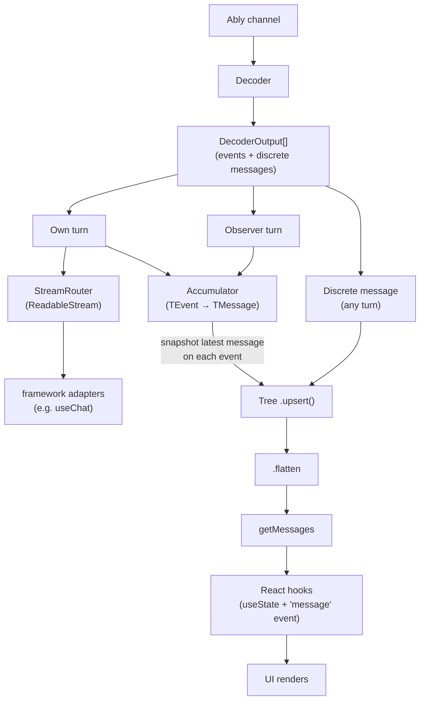

# Message lifecycle

How a message travels from the Ably channel to the UI. This doc ties together the [decoder](decoder.md), [accumulator](codec-interface.md#accumulator), [conversation tree](conversation-tree.md), and React hooks into one narrative.

## TEvent and TMessage

The entire generic layer is parameterized by two types: `TEvent` and `TMessage`.

**`TEvent`** is a streaming fragment — an individually meaningless piece of a message. For the Vercel codec, this is `UIMessageChunk`: a text delta, a tool-input start signal, a finish event. Events are the unit of real-time streaming. The [stream router](stream-router.md) delivers them one-by-one to own-turn consumers; the [accumulator](codec-interface.md#accumulator) assembles them into complete messages.

**`TMessage`** is a complete domain message — a fully-formed object with all its parts, metadata, and role. For the Vercel codec, this is `UIMessage`. Messages are the unit of state: what the [conversation tree](conversation-tree.md) stores, what `getMessages()` returns, what React hooks render.

The codec defines how these types map to and from the wire:

- **Encoding**: the encoder turns `TMessage` into discrete Ably publishes (e.g. user messages) and `TEvent` into streamed Ably operations (create, append, close).
- **Decoding**: the decoder turns inbound Ably messages back into `DecoderOutput` — either `{ kind: 'event', event: TEvent }` or `{ kind: 'message', message: TMessage }`.
- **Accumulation**: the accumulator bridges `TEvent → TMessage`. It consumes decoder event outputs and assembles them into complete `TMessage` instances.

This is why both type parameters exist: events are the streaming unit (what flows in real time), messages are the state unit (what gets stored and rendered).

## Data flow overview



## Own turns vs observer turns

When the client transport receives messages from the channel, it routes them based on who started the turn:

- **Own turn** — a turn this client initiated (via `send()`, `regenerate()`, `edit()`). Decoded events go to **both** the [stream router](stream-router.md) and a per-turn [accumulator](codec-interface.md#accumulator). The stream router enqueues events on a `ReadableStream` that framework adapters can consume (see [why the stream exists](#why-own-turns-have-a-stream)). The accumulator simultaneously builds complete `TMessage` objects and upserts them into the tree on every event — so `getMessages()` always reflects the latest partial state, even while streaming.
- **Observer turn** — a turn started by another client. Decoded events go to the accumulator only. There is no stream because no caller initiated the turn on this client — there is nobody holding a stream handle.

Both paths use the same `_accumulateAndEmit()` method. The only difference is that own turns additionally route through the stream router.

Discrete message outputs (`kind: 'message'`) from the decoder bypass both paths and go directly to the conversation tree via `upsert()`.

## How messages reach the tree

### Observer turns: accumulator → tree

For each observer turn, the transport creates a dedicated accumulator. As decoded events arrive:

1. The event is fed to the accumulator via `processOutputs()`
2. The transport reads `accumulator.messages` to get the latest in-progress message
3. It takes a snapshot (via `structuredClone`) and upserts it into the tree

This happens on **every event** — the tree always has the latest partial state. The accumulator is a working buffer; the [conversation tree](conversation-tree.md) is the source of truth.

### Own turns: stream + accumulator → tree

For own turns, events flow to **both** the stream router and the accumulator. The stream router enqueues each event on the turn's `ReadableStream<TEvent>`. Simultaneously, the same event is fed to the accumulator, which builds the in-progress `TMessage` and upserts it into the tree — identical to the observer path. This means `getMessages()` updates on every event regardless of who started the turn.

Discrete messages (e.g. user messages published by `send()`) are inserted into the tree directly.

### Why own turns have a stream

The `ReadableStream<TEvent>` returned from `send()` exists primarily as an **integration seam for framework adapters**. Vercel's `useChat`, for example, expects a `ReadableStream` as its transport contract — the stream is how AI Transport plugs into the Vercel AI SDK's rendering pipeline.

For most application code, the accumulated messages via `getMessages()` / `on('message')` are the right consumption path. The accumulator updates the tree on every event, so it provides the same granularity as the stream — you see each partial message as tokens arrive. The stream offers no timing advantage.

Cases where direct stream consumption adds value are narrow: non-rendering side effects that need per-event granularity (e.g. playing a sound per token, logging individual event types), or custom accumulation logic that differs from the codec's accumulator.

Observer turns have no stream because there is no caller holding a handle — nobody on this client called `send()` for that turn. If observer-side event streaming were needed, it would require a separate API surface (e.g. `transport.observeTurn(turnId)`).

### Discrete messages: direct insert

When the decoder produces a `{ kind: 'message' }` output (e.g. a user message decoded from a `writeMessage` publish), the transport upserts it into the tree immediately, regardless of turn ownership.

## How messages reach the UI

The [conversation tree's](conversation-tree.md#flatten-producing-the-linear-path) `flatten()` method is the sole path from tree state to a message array. It walks the sorted node list, checks parent reachability and sibling selection, and returns the linear `TMessage[]` for the currently selected conversation path.

`ClientTransport.getMessages()` calls `flatten()` and filters out any messages withheld by the history pagination buffer. This is the public API that all downstream consumers call.

React hooks follow an identical pattern:

```typescript
const [messages, setMessages] = useState(() => transport.getMessages());
useEffect(() => {
  const update = () => setMessages(transport.getMessages());
  transport.on('message', update);
  return () => transport.off('message', update);
}, [transport]);
```

Every `'message'` event triggers a full `getMessages()` call, which rebuilds the array from the tree. The hooks that follow this pattern: `useMessages()`, `useConversationTree()`, `useMessageSync()`.

## History hydration path

[History hydration](history.md) uses a separate decode pipeline — it does not share the live decoder or accumulator:

1. Raw Ably messages are fetched from channel history (newest-first)
2. They are reversed to chronological order and decoded through a fresh decoder
3. Decoded outputs are grouped by [`x-ably-turn-id`](wire-protocol.md#transport-headers-x-ably) — each turn gets its own accumulator
4. `completedMessages` (not `messages`) is read from each accumulator — only fully terminated messages appear in history results
5. The resulting `PaginatedMessages` are returned to the transport, which upserts each message into the tree via `_processHistoryPage()`

Each turn needs its own accumulator because events from interleaved concurrent turns would corrupt each other's message assembly — a text-delta from turn A would be accumulated into turn B's message.

## Why no cached message list

The tree is a DAG with branch selection state. The "current conversation" depends on which sibling is selected at each fork point. There is no single cached `TMessage[]` — every call to `flatten()` rebuilds from scratch.

This is a deliberate tradeoff: no cache invalidation complexity, at the cost of repeated traversals. Since message counts are conversation-sized (tens to low hundreds), this is cheap.

All consumers go through `getMessages()` → `flatten()`:

| Consumer                                  | When it calls `getMessages()`                     |
| ----------------------------------------- | ------------------------------------------------- |
| `useMessages()` / `useConversationTree()` | On mount and every `'message'` event              |
| `useMessageSync()` (Vercel)               | On every `'message'` event                        |
| `send()` / `regenerate()`                 | To build the HTTP POST body's message history     |
| `history()`                               | To snapshot the current tree state for pagination |

See [Conversation tree](conversation-tree.md) for how `flatten()` works. See [Codec interface](codec-interface.md#accumulator) for the accumulator's role. See [History hydration](history.md) for the history decode pipeline.
