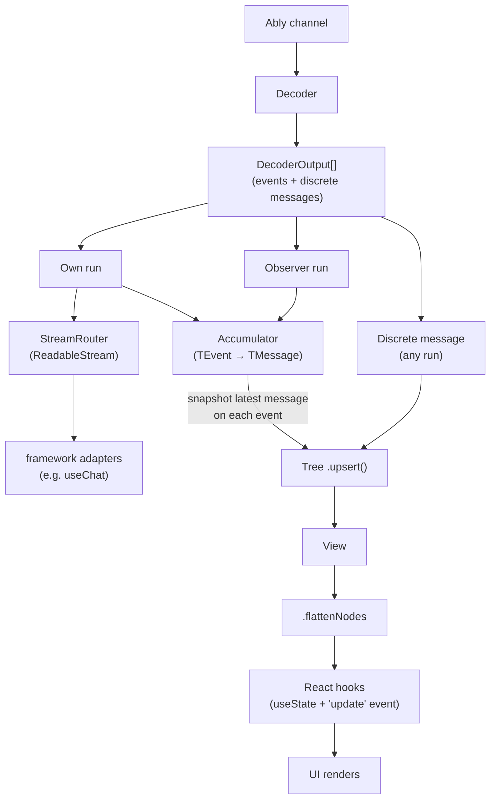

# Message lifecycle

How a message travels from the Ably channel to the UI. This doc ties together the [decoder](decoder.md), [accumulator](codec-interface.md#accumulator), [conversation tree](conversation-tree.md), and React hooks into one narrative.

## TEvent and TMessage

The entire generic layer is parameterized by two types: `TEvent` and `TMessage`.

**`TEvent`** is a streaming fragment - an individually meaningless piece of a message. For the Vercel codec, this is `UIMessageChunk`: a text delta, a reasoning delta, a finish event. Events are the unit of real-time streaming. The [stream router](transport-components.md) delivers them one-by-one to own-run consumers; the [accumulator](codec-interface.md#accumulator) assembles them into complete messages.

**`TMessage`** is a complete domain message - a fully-formed object with all its parts, metadata, and role. For the Vercel codec, this is `UIMessage`. Messages are the unit of state: what the [conversation tree](conversation-tree.md) stores, what the view's `flattenNodes()` returns, what React hooks render.

The codec defines how these types map to and from the wire:

- **Encoding**: the encoder runs `TMessage` into discrete Ably publishes (e.g. user messages) and `TEvent` into streamed Ably operations (create, append, close).
- **Decoding**: the decoder runs inbound Ably messages back into `DecoderOutput` - either `{ kind: 'event', event: TEvent }` or `{ kind: 'message', message: TMessage }`.
- **Accumulation**: the accumulator bridges `TEvent → TMessage`. It consumes decoder event outputs and assembles them into complete `TMessage` instances.

This is why both type parameters exist: events are the streaming unit (what flows in real time), messages are the state unit (what gets stored and rendered).

## Data flow overview


```mermaid
flowchart TD
    Channel[Ably channel] --> Decoder
    Decoder --> Outputs["DecoderOutput[]<br/>(events + discrete messages)"]

    Outputs --> Own[Own run]
    Outputs --> Observer[Observer run]
    Outputs --> Discrete["Discrete message<br/>(any run)"]

    Own --> StreamRouter["StreamRouter<br/>(ReadableStream)"]
    Own --> Accumulator["Accumulator<br/>(TEvent → TMessage)"]
    Observer --> Accumulator

    Accumulator -- "snapshot latest message<br/>on each event" --> Tree["Tree .upsert()"]
    Discrete --> Tree

    Tree --> View[View]
    View --> Flatten[.flattenNodes]
    Flatten --> Hooks["React hooks<br/>(useState + 'update' event)"]
    Hooks --> UI[UI renders]
    StreamRouter --> Adapters["framework adapters<br/>(e.g. useChat)"]
```

## Own runs vs observer runs

When the client session receives messages from the channel, it routes them based on who started the run:

- **Own run** - a run this client initiated (via `view.send()`, `view.regenerate()`, `view.edit()`). Decoded events go to **both** the [stream router](transport-components.md) and a per-run [accumulator](codec-interface.md#accumulator). The stream router enqueues events on a `ReadableStream` that framework adapters can consume (see [why the stream exists](#why-own-runs-have-a-stream)). The accumulator simultaneously builds complete `TMessage` objects and upserts them into the tree on every event - so the view always reflects the latest partial state, even while streaming.
- **Observer run** - a run started by another client. Decoded events go to the accumulator only. There is no stream because no caller initiated the run on this client - there is nobody holding a stream handle.

Both paths use the same `_accumulateAndEmit()` method. The only difference is that own runs additionally route through the stream router.

Discrete message outputs (`kind: 'message'`) from the decoder bypass both paths and go directly to the conversation tree via `upsert()`.

## How messages reach the tree

### Observer runs: accumulator → tree

For each observer run, the transport creates a dedicated accumulator. As decoded events arrive:

1. The event is fed to the accumulator via `processOutputs()`
2. The transport reads `accumulator.messages` to get the latest in-progress message
3. It takes a snapshot (via `structuredClone`) and upserts it into the tree

This happens on **every event** - the tree always has the latest partial state. The accumulator is a working buffer; the [conversation tree](conversation-tree.md) is the source of truth.

### Own runs: stream + accumulator → tree

For own runs, events flow to **both** the stream router and the accumulator. The stream router enqueues each event on the run's `ReadableStream<TEvent>`. Simultaneously, the same event is fed to the accumulator, which builds the in-progress `TMessage` and upserts it into the tree - identical to the observer path. This means the view updates on every event regardless of who started the run.

Discrete messages (e.g. user messages published by `send()`) are inserted into the tree directly.

### Why own runs have a stream

The `ReadableStream<TEvent>` returned from `view.send()` exists primarily as an **integration seam for framework adapters**. Vercel's `useChat()`, for example, expects a `ReadableStream` as its transport contract - the stream is how AI Transport plugs into the Vercel AI SDK's rendering pipeline.

For most application code, the accumulated messages via `view.flattenNodes()` / `view.on('update')` are the right consumption path. The accumulator updates the tree on every event, so it provides the same granularity as the stream - you see each partial message as tokens arrive. The stream offers no timing advantage.

Cases where direct stream consumption adds value are narrow: non-rendering side effects that need per-event granularity (e.g. playing a sound per token, logging individual event types), or custom accumulation logic that differs from the codec's accumulator.

Observer runs have no stream because there is no caller holding a handle - nobody on this client called `view.send()` for that run. If observer-side event streaming were needed, it would require a separate API surface (e.g. `transport.observeRun(runId)`).

### Discrete messages: direct insert

When the decoder produces a `{ kind: 'message' }` output (e.g. a user message decoded from a `writeMessages()` publish), the transport upserts it into the tree immediately, regardless of run ownership.

## How messages reach the UI

The [conversation tree's](conversation-tree.md#flatten-producing-the-linear-path) `flattenNodes()` method is the sole path from tree state to a message array. It walks the sorted node list, checks parent reachability and sibling selection, and returns `MessageNode<TMessage>[]` for the currently selected conversation path.

The `View` wraps the tree and provides an `'update'` event plus `flattenNodes()` that accounts for history pagination (withholding older messages until released by `loadOlder()`). This is the public API that all downstream consumers use.

React hooks follow an identical pattern:

```typescript
const view = session.view;
const [nodes, setNodes] = useState(() => view.flattenNodes());
useEffect(() => {
  const update = () => setNodes(view.flattenNodes());
  view.on('update', update);
  return () => view.off('update', update);
}, [view]);
```

Every `'update'` event triggers a full `flattenNodes()` call, which rebuilds the array from the tree. The hooks that follow this pattern: `useView()`, `useMessageSync()`.

## History hydration path

[History hydration](history.md) uses a separate decode pipeline - it does not share the live decoder or accumulator:

1. Raw Ably messages are fetched from channel history (newest-first)
2. They are reversed to chronological order and decoded through a fresh decoder
3. Decoded outputs are grouped by [`run-id`](wire-protocol.md#transport-headers) - each run gets its own accumulator
4. `completedMessages` (not `messages`) is read from each accumulator - only fully terminated messages appear in history results
5. The resulting messages are returned to the view, which upserts each message into the tree

Each run needs its own accumulator because events from interleaved concurrent runs would corrupt each other's message assembly - a text-delta from run A would be accumulated into run B's message.

## Cached message list

The View caches the result of `flattenNodes()` in a `_cachedNodes` field. The public `flattenNodes()` method returns this cache in O(1). The cache is refreshed by `_computeFlatNodes()` - a private method that performs the actual tree walk - whenever the visible output may have changed:

| Trigger                                                       | What refreshes the cache                              |
| ------------------------------------------------------------- | ----------------------------------------------------- |
| Tree structural change (new node, deletion, serial promotion) | `_onTreeUpdate()` calls `_computeFlatNodes()`         |
| Content-only update (streaming token)                         | `_onTreeOutput()` recomputes the visible message list |
| Branch selection change                                       | `select()` calls `_computeFlatNodes()`                |
| Fork auto-selection after `send()`                            | `send()` auto-select path calls `_computeFlatNodes()` |
| History page revealed                                         | `_releaseWithheld()` calls `_computeFlatNodes()`      |

### Content-only fast path

The tree exposes a [`structuralVersion`](conversation-tree.md#structural-version) counter that increments on insert, delete, and serial promotion - but not on content-only message updates. Streaming tokens therefore don't flow through the structural `update` event; they arrive on the tree's [`output`](conversation-tree.md) event. `_onTreeOutput()` handles it: when the output's `runId` is on the visible chain it recomputes the visible message list and emits `'update'`. The reducer is free to mutate a message in place, so the View can't short-circuit on reference equality — it re-emits and lets React's state setters dedup by array reference. Meanwhile `_onTreeUpdate()` skips the full tree walk whenever `structuralVersion` is unchanged, so a structural `update` with no real structure change is cheap. Together this keeps the streaming hot path at O(visible_count).

All consumers go through the cached `view.flattenNodes()`:

| Consumer                    | When it calls `flattenNodes()`                    |
| --------------------------- | ------------------------------------------------- |
| `useView()`                 | On mount and every `'update'` event               |
| `useMessageSync()` (Vercel) | On every `'update'` event                         |
| `send()` / `regenerate()`   | To build the HTTP POST body's message history     |
| `view.loadOlder()`          | To snapshot the current tree state for pagination |

Because all consumers read the cache, a structural tree update triggers one tree walk (inside the View), not one per consumer. Content-only updates (streaming tokens) trigger zero tree walks - only a reference comparison over visible messages. React hooks calling `flattenNodes()` after an `'update'` event get the pre-computed result without a redundant traversal.

See [Conversation tree](conversation-tree.md) for how `flattenNodes()` works. See [Codec interface](codec-interface.md#accumulator) for the accumulator's role. See [History hydration](history.md) for the history decode pipeline.
