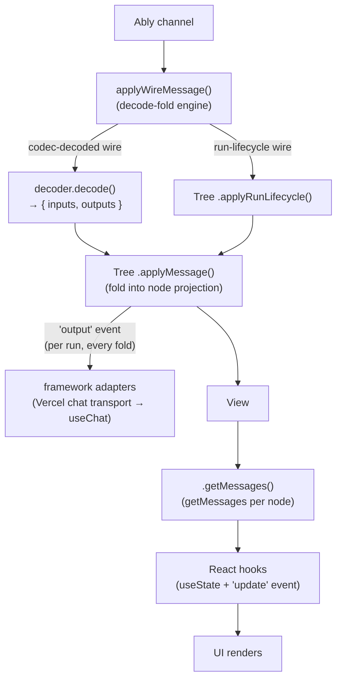

# Message lifecycle

How a message travels from the Ably channel to the UI. This doc ties together the [decoder](decoder.md), [reducer](codec-interface.md#reducer-and-projection), [conversation tree](conversation-tree.md), and React hooks into one narrative.

## TInput, TOutput, TProjection and TMessage

The entire generic layer is parameterized by four types: `TInput`, `TOutput`, `TProjection`, and `TMessage`.

**`TInput`** and **`TOutput`** are streaming fragments - individually meaningless pieces of a message, split by wire direction. `TInput` events are client-published (`ai-input`: a user-message part, a tool-result, a regenerate signal); `TOutput` events are agent-published (`ai-output`: a text delta, a reasoning delta, a finish event). For the Vercel codec `TOutput` is `UIMessageChunk`. Events are the unit of real-time streaming. The [conversation tree](conversation-tree.md) surfaces decoded outputs on its `output` event; the codec's [reducer](codec-interface.md#reducer-and-projection) folds them into a projection.

**`TProjection`** is the opaque per-node accumulation state. The codec folds each decoded event into it via `fold()` and exposes the assembled messages via `getMessages()`.

**`TMessage`** is a complete domain message - a fully-formed object with all its parts, metadata, and role. For the Vercel codec, this is `UIMessage`. Messages are the unit of state: what each node's projection yields via `getMessages()`, what the view's `getMessages()` returns, what React hooks render.

The codec defines how these types map to and from the wire:

- **Encoding**: the encoder publishes input/output events as discrete Ably publishes (e.g. user messages via `publishDiscreteBatch`) or as streamed Ably operations (`startStream` / `appendStream` / `closeStream`).
- **Decoding**: the decoder runs inbound Ably messages back into a `DecodedMessage` - `{ inputs: TInput[]; outputs: TOutput[] }`, a flat split of decoded events by wire direction.
- **Reduction**: the codec's `fold(state, event, meta)` bridges events → projection; `getMessages(projection)` assembles complete `TMessage` instances out of it.

This is why the type parameters exist: input/output events are the streaming unit (what flows in real time), the projection is the accumulation state, and messages are the state unit (what gets stored and rendered).

## Data flow overview


```mermaid
flowchart TD
    Channel[Ably channel] --> Apply["applyWireMessage()<br/>(decode-fold engine)"]
    Apply -- "run-lifecycle wire" --> Lifecycle["Tree .applyRunLifecycle()"]
    Apply -- "codec-decoded wire" --> Decode["decoder.decode()<br/>→ { inputs, outputs }"]
    Decode --> Tree["Tree .applyMessage()<br/>(fold into node projection)"]
    Lifecycle --> Tree

    Tree -- "'output' event<br/>(per run, every fold)" --> Adapters["framework adapters<br/>(Vercel chat transport → useChat)"]
    Tree --> View[View]
    View --> GetMessages[".getMessages()<br/>(getMessages per node)"]
    GetMessages --> Hooks["React hooks<br/>(useState + 'update' event)"]
    Hooks --> UI[UI renders]
```

## How run outputs surface

When the client session receives a message from the channel, it decodes it and folds the result into the owning run's projection in the [conversation tree](conversation-tree.md) — regardless of who started the run. There is no separate path for runs this client initiated versus runs it merely observes; the [own vs observer](glossary.md#own-run-vs-observer-run) distinction matters for cancel scoping and UI affordances, not for delivery.

Every fold emits the tree's `output` event — `{ runId?, inputCodecMessageId?, codecMessageId?, serial?, events }` — carrying that message's decoded output events (empty for inputs-only folds). An input fold carries `inputCodecMessageId` and no `runId` (the agent mints run-ids, so an input node has none). This is the single fan-out point for streaming outputs. Two consumers subscribe to it:

- The **View** consumes it and, when the run is on the visible branch, recomputes its message list and emits an `update` event — the signal hooks render from. (The View does not re-expose `output`; it surfaces only `update`.)
- The Vercel [chat transport](chat-transport.md) builds a per-run `ReadableStream<UIMessageChunk>` from it (via `createRunOutputStream`), which is what `useChat` consumes. Streaming is a useChat-integration concern owned by the Vercel layer — the generic core exposes only the `output` event, not a stream.

For most application code, the accumulated messages via `view.getMessages()` / `view.on('update')` are the right consumption path — the tree updates on every event, so the view always reflects the latest partial state while streaming. Subscribing to `tree.on('output')` directly is for the narrow cases that need raw per-event granularity: non-rendering side effects (e.g. playing a sound per token) or custom projection logic that differs from the codec's.

### Discrete messages: folded in place

Discrete messages (e.g. a user message decoded from a `publishDiscreteBatch()` publish) take the same path as streamed outputs: `applyMessage({ inputs, outputs }, headers, serial)` folds the decoded events into the owning node's projection. The decoder returns `inputs`/`outputs` arrays uniformly — there is no separate `{ kind: 'message' }` insert path; an input message folds into a user input node, a streamed output folds into its reply run.

## How messages reach the UI

The [conversation tree's](conversation-tree.md#visible-nodes-producing-the-visible-chain) `visibleNodes()` walk is the source of the visible node chain. It walks the sorted node list, applies parent reachability and sibling selection, and yields the nodes for the currently selected conversation path; the `View` then layers its pagination window on top and concatenates each node's `codec.getMessages(node.projection)` to produce the flat `TMessage[]`.

The `View` wraps the tree and provides an `'update'` event plus `getMessages()` that accounts for history pagination (withholding older messages until released by `loadOlder()`). This is the public API that all downstream consumers use.

React hooks follow an identical pattern:

```typescript
const view = session.view;
const [messages, setMessages] = useState(() => view.getMessages());
useEffect(() => {
  const update = () => setMessages(view.getMessages());
  const off = view.on('update', update);
  return off;
}, [view]);
```

Every `'update'` event reads the View's pre-computed visible message snapshot via `getMessages()`. The hooks that follow this pattern: `useView()`, `useMessageSync()`.

## History hydration path

[History hydration](history.md) replays raw channel history through the **same** decode-and-apply engine the live loop uses (`applyWireMessage` in `decode-fold.ts`), so the two paths can never drift:

1. `loadHistory` fetches raw Ably wire messages from channel history (newest-first), returning them as a paginated `HistoryPage` of `rawMessages` — it does not decode.
2. The View's `_processHistoryPage` reverses each page to chronological order and feeds every raw message through `applyWireMessage(tree, decoder, rawMsg)` — the identical classification used live: run-lifecycle wires apply via `applyRunLifecycle`, everything else decodes and folds via `applyMessage`.
3. The messages land in the same `Tree`, folded into each node's projection. There is no separate accumulator and no separate result array — history and live state share one tree.
4. The View paginates by **Runs**: `loadOlder(limit)` (default 100) loops history pages until at least `limit` new Runs are revealed, withholding any excess for the next call.

A single shared decoder instance is reused across a page's messages so a stream's accumulation state spans the wires of a run. Because the live loop and history replay run through the same engine, concurrent runs are kept separate exactly as they are live — by folding into the run's own node projection, keyed by [`run-id`](wire-protocol.md#transport-headers).

## Cached message list

The View caches the visible node chain in a `_cachedNodes` field and the derived flat message snapshot in `_lastVisibleMessages`. The public `getMessages()` returns that snapshot in O(1). The cache is refreshed by `_computeFlatNodes()` - a private method that performs the actual tree walk and pagination filter - whenever the visible output may have changed:

| Trigger                                                       | What refreshes the cache                                  |
| ------------------------------------------------------------- | --------------------------------------------------------- |
| Tree structural change (new node, deletion, serial promotion) | `_onTreeUpdate()` calls `_recomputeAndEmitIfChanged()`    |
| Content-only update (streaming token)                         | `_onTreeOutput()` recomputes the visible message snapshot |
| Branch selection change                                       | `selectSibling()` calls `_recomputeAndEmit()`             |
| Fork / regenerate auto-selection after a write                | `_applyForkAutoSelect()` / `_applyRegenerateAutoSelect()` |
| History page revealed                                         | `_releaseWithheld()` calls `_recomputeAndEmit()`          |

### Content-only fast path

The tree exposes a [`structuralVersion`](conversation-tree.md#structural-version) counter that increments on insert, delete, and serial promotion - but not on content-only message updates. Streaming tokens therefore don't flow through the structural `update` event; they arrive on the tree's [`output`](conversation-tree.md) event. `_onTreeOutput()` handles it: when the output's `runId` (or `inputCodecMessageId` for an input fold) is on the visible chain it recomputes the visible message snapshot and emits `'update'`. The reducer is free to mutate a message in place, so the View can't short-circuit on reference equality — it re-emits and lets React's state setters dedup by array reference. Meanwhile the tree emits `update` only when `structuralVersion` actually changes, so `_onTreeUpdate()` fires only on genuine structural changes — a streaming token never reaches it. Together this keeps the streaming hot path at O(visible_count).

All consumers go through the cached `view.getMessages()`:

| Consumer                    | When it reads `getMessages()`                 |
| --------------------------- | --------------------------------------------- |
| `useView()`                 | On mount and every `'update'` event           |
| `useMessageSync()` (Vercel) | On every `'update'` event                     |
| `send()` / `regenerate()`   | To build the HTTP POST body's message history |

Because all consumers read the cache, a structural tree update triggers one tree walk (inside the View), not one per consumer. Content-only updates (streaming tokens) recompute only the visible message snapshot, not the node chain. React hooks calling `getMessages()` after an `'update'` event get the pre-computed result without a redundant traversal.

See [Conversation tree](conversation-tree.md) for how the flatten walk works. See [Codec interface](codec-interface.md#reducer-and-projection) for the reducer's role. See [History hydration](history.md) for the history replay pipeline.
