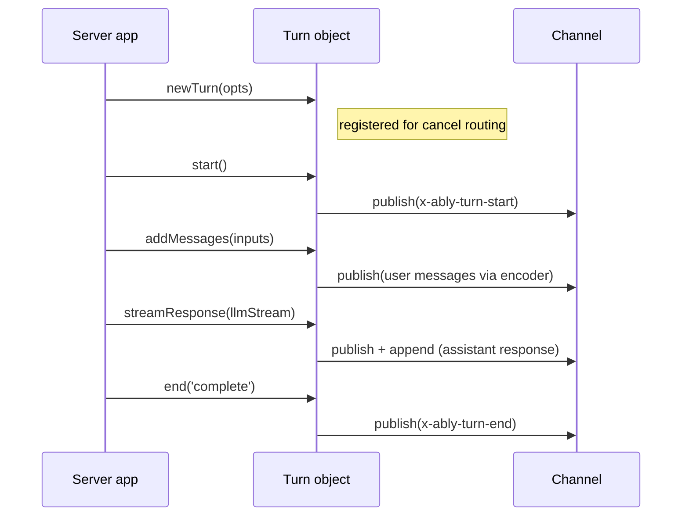

# Server transport

The server transport (`src/core/transport/server-transport.ts`) handles the server-side turn lifecycle over an Ably channel. It composes a [TurnManager](transport-components.md#turnmanager) for turn state and lifecycle event publishing, and delegates stream piping to [pipeStream](transport-components.md#pipestream).

The transport exposes a single factory method — `newTurn()` — which returns a `Turn` object with explicit lifecycle methods: `start()`, `addMessages()`, `streamResponse()`, and `end()`.

## Construction

On creation, the server transport:

1. Creates a [TurnManager](transport-components.md#turnmanager) bound to the channel
2. Subscribes to `x-ably-cancel` events on the channel (before attach per [RTL7g](https://sdk.ably.com/builds/ably/specification/main/features/#RTL7g))
3. Starts routing cancel messages to registered turns

The cancel subscription is the transport's only channel subscription. All message publishing goes through the TurnManager and codec encoder — the transport doesn't subscribe to its own output.

## Turn lifecycle

A turn progresses through a fixed sequence:

### newTurn

Synchronous — no channel activity. Creates a `Turn` object and registers it for cancel routing immediately, so early cancels (arriving before `start()`) fire the abort signal.

Each turn gets its own `AbortController`. The `abortSignal` property exposes it so the server app can pass it to LLM calls.

### start

Publishes `x-ably-turn-start` to the channel via the [TurnManager](transport-components.md#turnmanager). Must be called before `addMessages()` or `streamResponse()`.

### addMessages

Publishes user messages to the channel through the codec encoder. Each message gets:

- A generated `x-ably-msg-id`
- [Transport headers](wire-protocol.md#transport-headers-x-ably) via [buildTransportHeaders](transport-components.md#buildtransportheaders) (role, turn ID, parent, forkOf)
- Per-message headers from the client override transport-generated defaults — this lets `x-ably-msg-id` from the client's optimistic insert pass through for [reconciliation](glossary.md#optimistic-reconciliation)

Returns the effective msg-ids of all published messages.

### streamResponse

Pipes a `ReadableStream<TEvent>` through the codec encoder to the channel via [pipeStream](transport-components.md#pipestream). The stream carries the assistant's response — text deltas, tool calls, lifecycle events.

Headers are built with `role: 'assistant'` and the turn's branching metadata (parent, forkOf). The abort signal from the TurnManager is passed to pipeStream, so cancel signals propagate through to stream termination.

Returns `{ reason }` — `'complete'`, `'cancelled'`, or `'error'`. Does **not** call `end()` — the caller must do that after `streamResponse` returns.

### end

Publishes `x-ably-turn-end` to the channel and unregisters the turn from cancel routing. Idempotent — calling `end()` twice is safe.

## Cancel routing

The server transport handles cancel messages directly — no separate cancel manager. See [Transport components: cancel routing](transport-components.md#cancel-routing-server-transport) for the full filter resolution and handler isolation.

Key behaviors:

- Turns are registered for cancel routing on `newTurn()`, before `start()`. Early cancels fire the abort signal.
- The `onCancel` hook (per-turn) can return `false` to reject a cancel request.
- A throwing `onCancel` handler doesn't prevent other matched turns from being cancelled — each is isolated.
- Cancel resolution uses the sender's `clientId` from the Ably message for `own` filter matching.

## Close

`close()` unsubscribes from cancel messages, aborts all active turns (via their AbortControllers), and clears the registration map. After close, existing Turn objects can still call `end()` (to publish turn-end) but new turns cannot be created.

## Error handling

Errors fall into two categories:

| Scope | Delivery | Examples |
|---|---|---|
| Transport-level | `options.onError` callback | Cancel subscription failure, channel attach error |
| Turn-level | `turnOptions.onError` callback | Turn-start publish failure, stream encoding error |

Turn-level errors fall back to the transport-level `onError` if no per-turn handler is provided.

See [Transport components](transport-components.md) for the TurnManager, pipeStream, and cancel routing internals. See [Client transport](client-transport.md) for the client-side counterpart. See [Wire protocol](wire-protocol.md) for the header and event specification.
