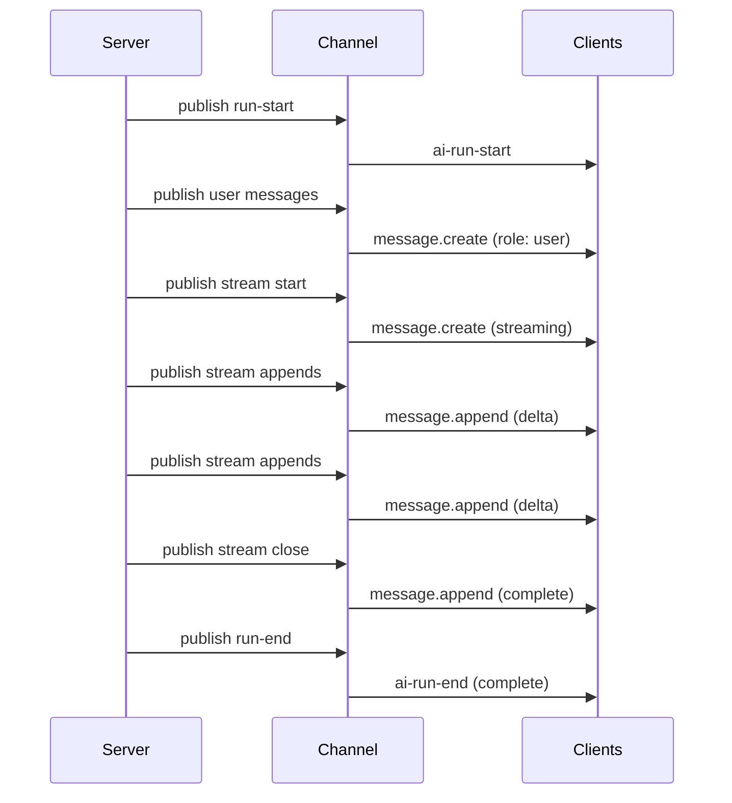
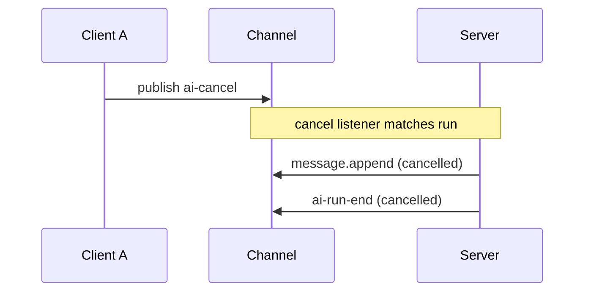

# Wire protocol

The AI Transport wire protocol defines what gets published on an Ably channel during a conversation. Every message carries headers in [`extras.headers`](glossary.md#extrasheaders-ably) that encode transport-level metadata (identity, lifecycle, branching) alongside domain-specific data from the codec.

The protocol has two header namespaces and two message types: [transport headers](#transport-headers-x-ably) (`x-ably-*`) vs [domain headers](#domain-headers-x-domain) (`x-domain-*`), and [lifecycle events](#lifecycle-events) vs [content messages](#content-messages). See the [glossary](glossary.md) for Ably-specific terms used throughout.

## Header namespaces

### Transport headers (`x-ably-*`)

Transport headers are set by the generic transport layer. They handle run correlation, stream lifecycle, cancellation, and branching. The codec layer never reads or writes these - the transport layer owns them.

| Header                    | Values                                                   | Purpose                                                                                                                                                                                                                                                                                                                                                                                                                                                                                   |
| ------------------------- | -------------------------------------------------------- | ----------------------------------------------------------------------------------------------------------------------------------------------------------------------------------------------------------------------------------------------------------------------------------------------------------------------------------------------------------------------------------------------------------------------------------------------------------------------------------------- |
| `x-ably-stream`           | `"true"` / `"false"`                                     | Whether this message uses the message append lifecycle                                                                                                                                                                                                                                                                                                                                                                                                                                    |
| `x-ably-status`           | `"streaming"` / `"complete"` / `"cancelled"`             | Current lifecycle state of a streamed message                                                                                                                                                                                                                                                                                                                                                                                                                                             |
| `x-ably-stream-id`        | string                                                   | Identity of the streamed message (correlates create → appends → close)                                                                                                                                                                                                                                                                                                                                                                                                                    |
| `x-ably-run-id`           | string                                                   | [Run](glossary.md#run-id-vs-message-id) correlation ID. Every message in a run carries this                                                                                                                                                                                                                                                                                                                                                                                               |
| `x-ably-codec-message-id` | string                                                   | [Message identity](#message-identity-x-ably-codec-message-id). One per domain message (user or assistant). Used for [optimistic reconciliation](#optimistic-reconciliation)                                                                                                                                                                                                                                                                                                               |
| `x-ably-run-client-id`    | string                                                   | ClientId that owns the run — the client whose initiating `ai-input` started the run. Constant for the run's lifetime. See [Client identity](#client-identity)                                                                                                                                                                                                                                                                                                                             |
| `x-ably-role`             | `"user"` / `"assistant"`                                 | Message role                                                                                                                                                                                                                                                                                                                                                                                                                                                                              |
| `x-ably-parent`           | message ID                                               | Preceding message in the branch. See [Branching headers](#branching-headers) for the rendering rules                                                                                                                                                                                                                                                                                                                                                                                      |
| `x-ably-fork-of`          | message ID                                               | Message being replaced (creates a sibling in the conversation tree). See [Branching headers](#branching-headers)                                                                                                                                                                                                                                                                                                                                                                          |
| `x-ably-invocation-id`    | string                                                   | Per-invocation correlator. Stamped on every client-published event in a send (user-message AND amend events) and echoed on `run-start` / `run-end` so the client can match lifecycle events to its pending send                                                                                                                                                                                                                                                                           |
| `x-ably-input-client-id`  | string                                                   | ClientId of the input event (the `ai-input`) that drove the current invocation. The agent reads the publisher's Ably-level `clientId` off the triggering input event and re-stamps it on its own publishes (run lifecycle + outputs). May differ from `x-ably-run-client-id` on continuation invocations driven by an input from a non-owner. Not stamped on `ai-input` events themselves — the wire publisher's `clientId` already conveys that. See [Client identity](#client-identity) |
| `x-ably-event-id`         | string                                                   | Per-event identifier on each client-published event in a send. The invocation body lists every eventId; the agent's prompt lookup waits for all of them on the channel before starting LLM work                                                                                                                                                                                                                                                                                           |
| `x-ably-run-continue`     | `"true"`                                                 | Marks a `run-start` as a continuation of an already-started run rather than the first start of that `runId`                                                                                                                                                                                                                                                                                                                                                                               |
| `x-ably-run-reason`       | `"complete"` / `"cancelled"` / `"error"` / `"suspended"` | Why a run ended (on run-end events). `suspended` signals the run is paused awaiting a continuation invocation (e.g. tool approval)                                                                                                                                                                                                                                                                                                                                                        |
| `x-ably-error-code`       | numeric string                                           | Set on `ai-run-end` when `x-ably-run-reason: error`. Numeric `Ably.ErrorInfo` code. The client derives `statusCode` from this — `Math.floor(code / 100)` for codes in `10000–59999`, else `500`                                                                                                                                                                                                                                                                                           |
| `x-ably-error-message`    | string                                                   | Set on `ai-run-end` when `x-ably-run-reason: error`. Human-readable error message                                                                                                                                                                                                                                                                                                                                                                                                         |

### Domain headers (`x-domain-*`)

Domain headers are set by the codec layer. They carry framework-specific metadata - field IDs, provider metadata. The transport layer passes them through without interpreting them.

For the Vercel `UIMessageCodec`, domain headers include:

| Header                      | Purpose                                           |
| --------------------------- | ------------------------------------------------- |
| `x-domain-id`               | Chunk/message ID                                  |
| `x-domain-providerMetadata` | JSON-serialized provider metadata                 |
| `x-domain-finishReason`     | Why the LLM stopped generating                    |
| `x-domain-error`            | Error message                                     |
| `x-domain-data`             | JSON-serialized data payload (for `data-*` parts) |

The `x-domain-` prefix is defined in `constants.ts` as `DOMAIN_HEADER_PREFIX`. Codecs use `headerWriter()` and `headerReader()` utilities that automatically apply the prefix.

## Client identity

The protocol attributes events to clients at two concentric scopes. Both fields carry an Ably `clientId`; they answer different questions:

| Field                    | Scope          | Set at                | Constancy                                                                                                                             | Answers                                       |
| ------------------------ | -------------- | --------------------- | ------------------------------------------------------------------------------------------------------------------------------------- | --------------------------------------------- |
| `x-ably-run-client-id`   | Run            | `ai-run-start`        | Constant for the lifetime of the run.                                                                                                 | "Whose run is this?"                          |
| `x-ably-input-client-id` | Per invocation | every published event | Constant within one invocation; updates on a continuation `ai-run-start` if a different client published the input that triggered it. | "Whose input is driving the agent right now?" |

The agent reads the triggering `ai-input` event off the channel (matched by `x-ably-event-id`) and takes the publisher's Ably-level `clientId` directly off that wire message. It then re-stamps that value as `x-ably-input-client-id` on every event it publishes for the invocation — `ai-run-start`, `ai-run-end`, every assistant output, every `addMessages`/`addEvents` publish. The run owner's `clientId` is stamped as `x-ably-run-client-id` on the same events. For a fresh run the two are equal; on a continuation invocation triggered by an input event from a non-owner (e.g. a tool-result publish from a different client), `x-ably-input-client-id` reflects that other client while `x-ably-run-client-id` stays put.

The `x-ably-input-client-id` header is **not** stamped on client-published `ai-input` events themselves — the Ably channel-level `clientId` on the message already conveys the publisher. The agent's re-stamping is what propagates that identity onto subsequent server-published events that share an invocation with the input.

The Ably channel-level `clientId` on each message is a third, orthogonal identity field: the publisher of that particular event, set by Ably's auth at publish time.

### Invocation body

The HTTP POST body the client sends to the agent endpoint carries only what the agent needs out-of-band before the channel is observable — identifiers and a pointer to the input event the agent should look up:

```ts
interface InvocationData {
  runId: string;
  invocationId: string;
  sessionName: string;
  // …history, eventIds, etc.
}
```

The body does **not** carry a `clientId` field. The agent reads the input event off the channel (matched via `eventIds`) and takes its `clientId` from the publisher's Ably-level `clientId` on the wire message.

## Lifecycle events

Lifecycle events are published by the transport layer to coordinate run state. They use Ably message `name` as the event type and carry metadata in headers. They have no `data` payload.

| Event name     | Direction        | Required headers                                             | Optional headers                                                                                                                 | Purpose                              |
| -------------- | ---------------- | ------------------------------------------------------------ | -------------------------------------------------------------------------------------------------------------------------------- | ------------------------------------ |
| `ai-run-start` | Server → Channel | `x-ably-run-id`, `x-ably-run-client-id`                      | `x-ably-parent`, `x-ably-fork-of`, `x-ably-invocation-id`, `x-ably-input-client-id`, `x-ably-run-continue`                       | Signal that a run has started        |
| `ai-run-end`   | Server → Channel | `x-ably-run-id`, `x-ably-run-client-id`, `x-ably-run-reason` | `x-ably-invocation-id`, `x-ably-input-client-id`, `x-ably-error-code` + `x-ably-error-message` (when `x-ably-run-reason: error`) | Signal that a run has ended          |
| `ai-cancel`    | Client → Channel | `x-ably-run-id`                                              | -                                                                                                                                | Request cancellation of a single run |

## Content messages

Content messages carry domain data - user messages, assistant text. They are published through Ably's message primitives and decoded by the codec layer.

### Discrete messages

A discrete message is a single, immutable Ably publish. It carries `x-ably-stream: "false"` and appears as a `message.create` action on the subscriber.

Used for: user messages, data parts, lifecycle events (start, finish).

```
Ably message:
  action: message.create
  name: "user-message"        (codec-defined message name)
  data: { ... }               (codec-defined payload)
  extras.headers:
    x-ably-stream: "false"
    x-ably-run-id: "run-1"
    x-ably-codec-message-id: "msg-1"
    x-ably-role: "user"
    x-domain-id: "ui-msg-1"   (codec-specific)
```

### Streamed messages

A streamed message uses Ably's [message actions](glossary.md#message-actions-ably) - a single Ably message that evolves over time through create, append, and close actions. It carries `x-ably-stream: "true"`.

The lifecycle has three states:

| Status      | Meaning                              |
| ----------- | ------------------------------------ |
| `streaming` | Stream is active, more data expected |
| `complete`  | Stream completed normally            |
| `cancelled` | Stream was cancelled                 |

A streamed message progresses through these Ably message actions:

```
1. message.create    x-ably-status: "streaming"     (open the stream)
2. message.append    (no status change)              (delta data)
   message.append    (no status change)              (delta data)
   ...
3. message.append    x-ably-status: "complete"       (close the stream)
```

On cancel:

```
3. message.append    x-ably-status: "cancelled"      (cancel the stream)
```

The `data` field on the create is the initial content (often empty string). Each append carries a delta. The [decoder](decoder.md) accumulates deltas via string concatenation and uses [prefix-matching](decoder.md#known-serial-prefix-match) to detect whether an update is an incremental delta or a full replacement.

### Recovery via message.update

If an append fails (network issue, rate limit), the [encoder](encoder.md#recovery-mechanism) falls back to `message.update` with the full accumulated content. The [decoder](decoder.md#first-contact) handles this through first-contact detection - when it sees an update for an unknown serial, it treats it as if the stream just started (synthesizing start + delta + optional end events).

## Run lifecycle over the wire

A complete run produces this sequence on the channel:



With cancellation:



## Message identity (`x-ably-codec-message-id`)

Every domain message - user or assistant - gets a unique `x-ably-codec-message-id` (a `crypto.randomUUID()`). This is the primary identity for a message throughout the system: the [conversation tree](conversation-tree.md) is indexed by it, the [accumulator](codec-interface.md#accumulator) routes streaming events by it, and [optimistic reconciliation](#optimistic-reconciliation) matches on it.

### Who generates it

| Scenario                    | Generator                                       | Location                                                                                                                              |
| --------------------------- | ----------------------------------------------- | ------------------------------------------------------------------------------------------------------------------------------------- |
| User message (optimistic)   | Client session `send()`                         | One UUID per message in the batch                                                                                                     |
| User message (server relay) | Agent session `Run.addMessages()`               | One UUID per input; if the input already carries an `x-ably-codec-message-id` header (from the POST body), the existing value is kept |
| Assistant response          | Agent session `Run.pipeStream()` / `Run.pipe()` | One UUID for the entire streamed response                                                                                             |

### How it's stamped

The message ID flows through the header pipeline:

1. The transport calls `buildTransportHeaders({ codecMessageId, ... })` which sets `headers['x-ably-codec-message-id'] = codecMessageId`.
2. For **discrete messages** (user messages, lifecycle events), these headers are passed to the encoder via `WriteOptions.messageId`. The [encoder core's](encoder.md#header-merging) `_buildHeaders()` stamps it into the Ably message's `extras.headers`.
3. For **streamed messages** (assistant text, reasoning), the codec-message-id is included in the persistent headers captured at `startStream()`. Every append - including the closing append - carries the same `x-ably-codec-message-id`, so the entire message append lifecycle shares one identity.

### How it's consumed

| Consumer                                                  | What it does with the message ID                                                                                                                                                               |
| --------------------------------------------------------- | ---------------------------------------------------------------------------------------------------------------------------------------------------------------------------------------------- |
| [Decoder core](decoder.md#message-id-tagging)             | Reads `x-ably-codec-message-id` from inbound message headers and tags every emitted `DecoderOutput` event with it                                                                              |
| [Accumulator](codec-interface.md#accumulator)             | Uses `output.messageId` to route decoded events to the correct in-progress domain message (e.g. the `UIMessage` being built). The message ID becomes the `UIMessage.id` for assistant messages |
| [Conversation tree](conversation-tree.md#data-structures) | Uses the message ID as the primary key (`_nodeIndex`). Branching headers (`x-ably-parent`, `x-ably-fork-of`) reference other messages by their message ID                                      |
| [Optimistic reconciliation](#optimistic-reconciliation)   | Matches relayed messages to optimistic inserts (see below)                                                                                                                                     |
| `regenerate()` / `edit()`                                 | Look up the target message in the tree by message ID to compute `forkOf`, `parent`, and truncated history                                                                                      |

### Optimistic reconciliation

When a client calls `send()`, it inserts an optimistic message into the conversation tree (with no serial) and records the codec-message-id in an internal set. The server then relays that message onto the channel. When the client receives the relayed message, it matches by `x-ably-codec-message-id` and reconciles the optimistic entry with the server-assigned serial - [serial promotion](conversation-tree.md#upsert-the-sole-mutation) - rather than creating a duplicate.

## Branching headers

Branching uses two headers:

- `x-ably-parent` - points to the preceding message in the conversation. Establishes linear order at branch points.
- `x-ably-fork-of` - points to the message being replaced. Creates a sibling group in the conversation tree.

When a user calls `regenerate(messageId)`, the new assistant message carries `x-ably-fork-of: messageId`. When a user calls `edit(messageId, newMessages)`, the new user message carries `x-ably-fork-of: messageId`. The [conversation tree](conversation-tree.md#sibling-groups-and-fork-chains) uses these to build sibling groups - alternative responses at the same point in the conversation.

In linear sequences (no branching), `x-ably-parent` establishes ordering. Serial-based ordering handles the common case; parent headers are only structurally meaningful at branch points.

### How `x-ably-parent` is resolved

Each wire message can carry `x-ably-parent`. The value comes from different sources depending on which side of the protocol produces the message:

| Wire message            | Who sets it                   | Source of the parent value                                                                                                                                                                                                                                                    |
| ----------------------- | ----------------------------- | ----------------------------------------------------------------------------------------------------------------------------------------------------------------------------------------------------------------------------------------------------------------------------- |
| User-prompt message     | Client                        | `autoParent` - the last visible codec-message-id before the new prompt in the sender's view, or `sendOptions.parent` when the caller overrides                                                                                                                                |
| `run-start`             | Agent (`RunManager.startRun`) | `invocation.parent` from the POST body (= the client's `autoParent`). On continuations the chat-transport adapter sets this to the suspended assistant's codec-message-id, so `run-start` carries a "resume anchor" rather than a tree-shaping parent                         |
| Assistant message       | Agent (`Run.pipe`)            | Priority: explicit `streamOpts.parent` → the most recent user-prompt codec-message-id in `run.view.messages` (populated by the channel-rewind prompt lookup) → `runParent` (= `invocation.parent`). Keeps user → assistant chains explicit without the route having to opt in |
| Continuation amendments | Codec / `Run.pipe`            | Tool outputs and approval responses fold back onto the original assistant message via `x-ably-codec-message-id` routing - they don't reshape parent edges                                                                                                                     |

Agent routes do not normally need to pass `{ parent: ... }` to `Run.pipe`. The default chains the assistant under the user prompt that triggered it, which is what the conversation tree needs to keep edit-then-regenerate sibling resolution correct - see [What renders](conversation-tree.md#what-renders).

## Header persistence on appends

Ably replaces the entire `extras` object on each append. The encoder must repeat all persistent headers (transport + domain) on every append, including the closing append. This is handled internally by the [encoder core](encoder.md), which captures headers from `startStream()` and replays them on every subsequent append and close.

See [Encoder](encoder.md) and [Decoder](decoder.md) for how the message append lifecycle is implemented. See [Codec interface](codec-interface.md) for how domain headers are mapped by framework-specific codecs. See [Conversation tree](conversation-tree.md) for how branching headers are used to build the message tree.
