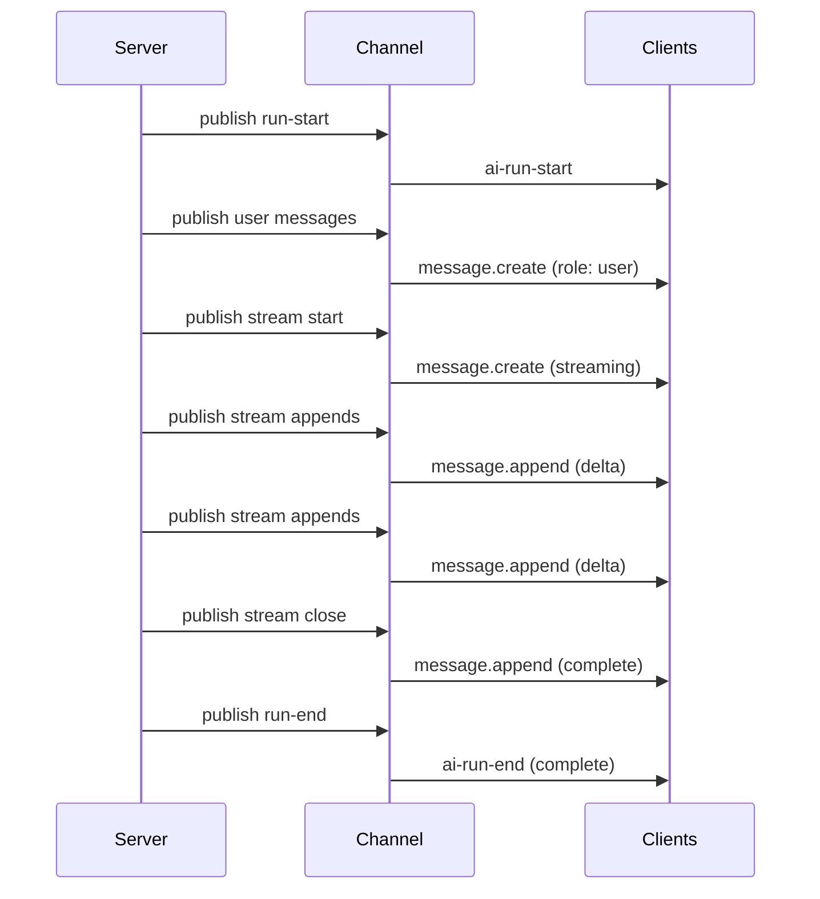
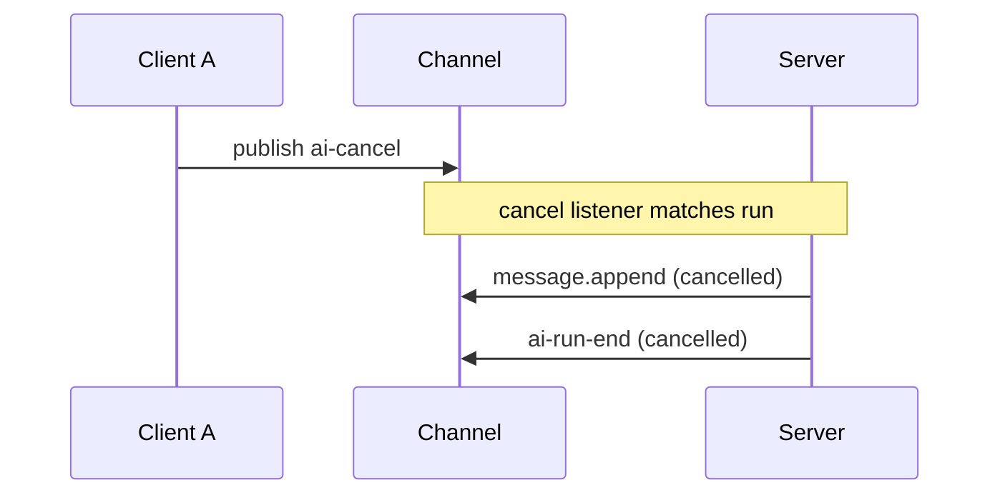

# Wire protocol

The AI Transport wire protocol defines what gets published on an Ably channel during a conversation. Every message carries headers in [`extras.ai`](glossary.md#extrasai-ably) — the SDK's reserved namespace — that encode transport-level metadata (identity, lifecycle, branching) alongside domain-specific data from the codec. The separate `extras.headers` field is left untouched for application use.

`extras.ai` is split into two tiers: [transport headers](#transport-headers) under `extras.ai.transport` and [codec headers](#codec-headers) under `extras.ai.codec`. The two message types are [lifecycle events](#lifecycle-events) vs [content messages](#content-messages). See the [glossary](glossary.md) for Ably-specific terms used throughout.

## Header namespaces

### Transport headers

Transport headers are set by the generic transport layer and live under `extras.ai.transport`. They handle run correlation, stream lifecycle, cancellation, and branching. The codec layer never reads or writes these - the transport layer owns them. The tier already isolates them, so they carry no prefix.

| Header                   | Values                                       | Purpose                                                                                                                                                                                                                                                                                                                                                                                                                                                                                                                                                                                                                                                                                                                                                                                        |
| ------------------------ | -------------------------------------------- | ---------------------------------------------------------------------------------------------------------------------------------------------------------------------------------------------------------------------------------------------------------------------------------------------------------------------------------------------------------------------------------------------------------------------------------------------------------------------------------------------------------------------------------------------------------------------------------------------------------------------------------------------------------------------------------------------------------------------------------------------------------------------------------------------- |
| `stream`                 | `"true"` / `"false"`                         | Whether this message uses the message append lifecycle                                                                                                                                                                                                                                                                                                                                                                                                                                                                                                                                                                                                                                                                                                                                         |
| `status`                 | `"streaming"` / `"complete"` / `"cancelled"` | Current lifecycle state of a streamed message                                                                                                                                                                                                                                                                                                                                                                                                                                                                                                                                                                                                                                                                                                                                                  |
| `stream-id`              | string                                       | Identity of the streamed message (correlates create → appends → close)                                                                                                                                                                                                                                                                                                                                                                                                                                                                                                                                                                                                                                                                                                                         |
| `discrete`               | `"true"`                                     | Marks a discrete message part (from a batch `publishDiscreteBatch` publish). Distinguishes content message parts from lifecycle events, which are also `stream: "false"`. Only set on discrete message parts                                                                                                                                                                                                                                                                                                                                                                                                                                                                                                                                                                                   |
| `run-id`                 | string                                       | [Run](glossary.md#run-id-vs-invocation-id-vs-message-id) correlation ID. Every agent-published event in a run carries this. Client `ai-input` events that OPEN or FORK a run omit it — the agent mints the run-id on `ai-run-start`. A client-provided `run-id` is only ever a **re-entry**: a **continuation** re-enters an existing run the agent resumes with `ai-run-resume` (a genuine agent self-resume, or a non-tool-result continuation such as an approval response). A client tool-result **fork** carries NO `run-id` — it is published run-less and the agent mints the fork's run-id; the tree reconciles the client's optimistic reply run onto it by [`input-codec-message-id`](#message-identity-codec-message-id). See [Run-id on a continuation](#run-id-on-a-continuation) |
| `codec-message-id`       | string                                       | [Message identity](#message-identity-codec-message-id). One per domain message (user or assistant). Used for [optimistic reconciliation](#optimistic-reconciliation)                                                                                                                                                                                                                                                                                                                                                                                                                                                                                                                                                                                                                           |
| `run-client-id`          | string                                       | ClientId that owns the run — the client whose initiating `ai-input` started the run. Constant for the run's lifetime. See [Client identity](#client-identity)                                                                                                                                                                                                                                                                                                                                                                                                                                                                                                                                                                                                                                  |
| `role`                   | `"user"` / `"assistant"`                     | Message role                                                                                                                                                                                                                                                                                                                                                                                                                                                                                                                                                                                                                                                                                                                                                                                   |
| `parent`                 | message ID                                   | Preceding message in the branch. See [Branching headers](#branching-headers) for the rendering rules                                                                                                                                                                                                                                                                                                                                                                                                                                                                                                                                                                                                                                                                                           |
| `fork-of`                | message ID                                   | Message being replaced (creates a sibling in the conversation tree). See [Branching headers](#branching-headers)                                                                                                                                                                                                                                                                                                                                                                                                                                                                                                                                                                                                                                                                               |
| `msg-regenerate`         | message ID                                   | Assistant message this run regenerates. Stamped on a regenerate's `ai-input` and echoed on its `ai-run-start`. Distinct from `fork-of`: a regenerate parents at the **same** input node as the message it regenerates (a same-parent sibling, no fork). See [Branching headers](#branching-headers)                                                                                                                                                                                                                                                                                                                                                                                                                                                                                            |
| `invocation-id`          | string                                       | Per-invocation correlator, **minted by the agent** — one per HTTP request that invokes it. Returned on the HTTP response and stamped on every event the agent publishes for the invocation (`run-start` / `run-suspend` / `run-resume` / `run-end` and assistant outputs). **Not** stamped on client-published `ai-input` events — the client no longer mints it. Surfaced on the run's `RunNode` and message metadata, observed from the wire; it is **not** the handle the client uses to match a `run-start` to its pending send — see `input-codec-message-id`                                                                                                                                                                                                                             |
| `input-client-id`        | string                                       | ClientId of the input event (the `ai-input`) that drove the current invocation. The agent reads the publisher's Ably-level `clientId` off the triggering input event and re-stamps it on its own publishes (run lifecycle + outputs). May differ from `run-client-id` on continuation invocations driven by an input from a non-owner. Not stamped on `ai-input` events themselves — the wire publisher's `clientId` already conveys that. See [Client identity](#client-identity)                                                                                                                                                                                                                                                                                                             |
| `input-codec-message-id` | string                                       | The `codec-message-id` of the input event that triggered the current invocation (the one whose `event-id` matched the invocation's `inputEventId`). The agent re-stamps it on every event it publishes for the invocation (run lifecycle + outputs), mirroring `input-client-id`. The client correlates a `run-start` to its pending send — and resolves the [`ClientRun.started`](client-session.md) promise — by this id, since it is the only identity the client owns at send time once `run-id`s become agent-minted. On a client tool-result **fork** it additionally RECONCILES the client's optimistic reply run — which the tree keyed by this same codec-message-id — onto the agent-minted `run-id` at `ai-run-start`.                                                              |
| `event-id`               | string                                       | Per-event identifier on each client-published event in a send. The invocation body names the single triggering `inputEventId` (the last input of the send); the agent's input-event lookup waits for that one on the channel before starting LLM work                                                                                                                                                                                                                                                                                                                                                                                                                                                                                                                                          |
| `run-reason`             | `"complete"` / `"cancelled"` / `"error"`     | Why a run ended (on `ai-run-end` events). `ai-run-end` is terminal; a run that pauses awaiting input publishes `ai-run-suspend` instead                                                                                                                                                                                                                                                                                                                                                                                                                                                                                                                                                                                                                                                        |
| `error-code`             | numeric string                               | Set on `ai-run-end` when `run-reason: error` and the agent supplied a terminal error (`end({ reason: 'error', error })`). Numeric `Ably.ErrorInfo` code. The client derives `statusCode` from this — `Math.floor(code / 100)` for codes in `10000–59999`, else `500`                                                                                                                                                                                                                                                                                                                                                                                                                                                                                                                           |
| `error-message`          | string                                       | Set on `ai-run-end` when `run-reason: error` and the agent supplied a terminal error. Human-readable error message                                                                                                                                                                                                                                                                                                                                                                                                                                                                                                                                                                                                                                                                             |

### Codec headers

Codec headers are set by the codec layer and live under `extras.ai.codec`. They carry framework-specific metadata - field IDs, provider metadata. The transport layer passes them through without interpreting them.

Every codec message carries one SDK-controlled header — `kind` — that the decoder dispatches on. It is set by the descriptor drivers (not the codec author directly) and is shared by both layers; the remaining codec headers are codec-defined field bindings.

| Header             | Purpose                                                                                                                                                                                                         |
| ------------------ | --------------------------------------------------------------------------------------------------------------------------------------------------------------------------------------------------------------- |
| `kind`             | SDK-controlled dispatch discriminator (`KIND_HEADER`). Selects which descriptor decodes a discrete message; for a streamed message it is the stream-family id. The decoder routes on it, never on message shape |
| `id`               | Chunk/message ID                                                                                                                                                                                                |
| `providerMetadata` | JSON-serialized provider metadata                                                                                                                                                                               |
| `finishReason`     | Why the LLM stopped generating (on `finish`)                                                                                                                                                                    |

For the Vercel codec, `kind` carries the codec event's domain discriminator: a discrete output stamps its chunk `type` (e.g. `start`, `finish`, `tool-output-available`, the `data-*` wildcard); a streamed output stamps its family id (`text`, `reasoning`, `tool-input`); an input stamps its `kind` (`user-message`, `tool-result`, `tool-result-error`, `tool-approval-response`, `regenerate`). The set of valid `kind` values is codec-defined — each descriptor's literal becomes one — not a fixed SDK enum.

Error text and `data-*` payloads ride in the message `data`, not in a header.

Codec headers carry no prefix — the `extras.ai.codec` tier isolates them. Codecs declare each header as a typed [`HeaderField`](codec-interface.md) binding (`strField`, `boolField`, `jsonField`, `enumField`); the descriptor drivers read and write the tier through those bindings.

## Client identity

The protocol attributes events to clients at two concentric scopes. Both fields carry an Ably `clientId`; they answer different questions:

| Field             | Scope          | Set at                | Constancy                                                                                                                              | Answers                                       |
| ----------------- | -------------- | --------------------- | -------------------------------------------------------------------------------------------------------------------------------------- | --------------------------------------------- |
| `run-client-id`   | Run            | `ai-run-start`        | Constant for the lifetime of the run.                                                                                                  | "Whose run is this?"                          |
| `input-client-id` | Per invocation | every published event | Constant within one invocation; updates on a continuation `ai-run-resume` if a different client published the input that triggered it. | "Whose input is driving the agent right now?" |

The agent reads the triggering `ai-input` event off the channel (matched by `event-id`) and takes the publisher's Ably-level `clientId` directly off that wire message. It then re-stamps that value as `input-client-id` on every event it publishes for the invocation — `ai-run-start` (or `ai-run-resume` on a continuation), `ai-run-suspend`, `ai-run-end`, every assistant output. By the same mechanism it stamps `input-codec-message-id` (the triggering input's `codec-message-id`) on those same events, giving the client a reconciliation handle it owns at send time — see [Optimistic reconciliation](#optimistic-reconciliation). The run owner's `clientId` is stamped as `run-client-id` on the same events. For a fresh run the two are equal; on a continuation invocation triggered by an input event from a non-owner (e.g. an approval response published by a different client), `input-client-id` reflects that other client while `run-client-id` stays put.

The `input-client-id` header is **not** stamped on client-published `ai-input` events themselves — the Ably channel-level `clientId` on the message already conveys the publisher. The agent's re-stamping is what propagates that identity onto subsequent server-published events that share an invocation with the input.

The Ably channel-level `clientId` on each message is a third, orthogonal identity field: the publisher of that particular event, set by Ably's auth at publish time.

### Invocation body

The HTTP POST body the client sends to the agent endpoint carries only what the agent needs out-of-band before the channel is observable — identifiers and a pointer to the input event the agent should look up:

```ts
interface InvocationData {
  inputEventId: string;
  sessionName: string;
}
```

The body does **not** carry a `runId` — run identity is resolved from the channel. The agent looks up the triggering input event (matched via `inputEventId`) and reads its `run-id` header: present for a continuation, absent for a fresh send (the agent mints the run-id on `ai-run-start`). The body also does **not** carry an `invocationId` — the agent mints that itself (one per HTTP request) and returns it on the HTTP response. Nor does it carry a `clientId` field: the agent reads the input event off the channel and takes its `clientId` from the publisher's Ably-level `clientId` on the wire message.

## Lifecycle events

Lifecycle events are published by the transport layer to coordinate run state. They use Ably message `name` as the event type and carry metadata in headers. They have no `data` payload.

| Event name       | Direction        | Required headers                                                    | Optional headers                                                                                                        | Purpose                                                                                                                                                                                                                                                                                                                                                                                 |
| ---------------- | ---------------- | ------------------------------------------------------------------- | ----------------------------------------------------------------------------------------------------------------------- | --------------------------------------------------------------------------------------------------------------------------------------------------------------------------------------------------------------------------------------------------------------------------------------------------------------------------------------------------------------------------------------- |
| `ai-run-start`   | Server → Channel | `run-id`, `run-client-id`                                           | `parent`, `fork-of`, `msg-regenerate`, `invocation-id`, `input-client-id`, `input-codec-message-id`                     | Signal that a run has started (its first invocation). The agent MINTS the `run-id` — a fresh send AND a client tool-result **fork** are both published run-less; for a fork it stamps `parent` (the suspended run's input node) and echoes `input-codec-message-id`, opening a same-parent sibling of the suspended run that the tree reconciles the client's optimistic reply run onto |
| `ai-run-suspend` | Server → Channel | `run-id`, `run-client-id`                                           | `invocation-id`, `input-client-id`, `input-codec-message-id`                                                            | Signal that a run has suspended — paused awaiting input (e.g. a tool result or approval), staying live for a continuation                                                                                                                                                                                                                                                               |
| `ai-run-resume`  | Server → Channel | `run-id`, `run-client-id`                                           | `invocation-id`, `input-client-id`, `input-codec-message-id`                                                            | Signal that a subsequent invocation re-entered an existing run (a continuation) — an agent self-resume (durable suspend/resume) or a non-tool-result continuation such as an approval response; carries no `parent` / `fork-of`. A client tool-result continuation instead **forks** a new run via `ai-run-start`                                                                       |
| `ai-run-end`     | Server → Channel | `run-id`, `run-client-id`, `run-reason`                             | `invocation-id`, `input-client-id`, `input-codec-message-id`, `error-code` + `error-message` (when `run-reason: error`) | Signal that a run has ended (terminal)                                                                                                                                                                                                                                                                                                                                                  |
| `ai-cancel`      | Client → Channel | `event-id`, and at least one of `run-id` / `input-codec-message-id` | -                                                                                                                       | Request cancellation of a single run. Targets the run by `run-id` (a continuation, whose run-id the client knows) or by `input-codec-message-id` (a fresh send, before the agent mints the run-id at run-start). The `event-id` lets channel rewind redeliver it to an agent that attaches after the cancel was published                                                               |

## Content messages

Content messages carry domain data - user messages, assistant text. They are published through Ably's message primitives and decoded by the codec layer.

### Discrete messages

A discrete message is a single, immutable Ably publish. It carries `stream: "false"` and appears as a `message.create` action on the subscriber.

Used for: user messages, data parts, lifecycle events (start, finish).

Content message parts (from a batch `publishDiscreteBatch` publish) additionally carry `discrete: "true"`. Lifecycle events are also `stream: "false"`, so this marker is what lets the decoder tell a discrete content part apart from a lifecycle event.

```
Ably message:
  action: message.create
  name: "ai-input"            (client publishes use ai-input; agent publishes use ai-output)
  data: { ... }               (codec-defined payload)
  extras.ai.transport:
    stream: "false"
    discrete: "true"            (marks a content message part, not a lifecycle event)
    codec-message-id: "msg-1"   (no run-id on a fresh client input — the agent mints it)
    role: "user"
    event-id: "evt-1"
  extras.ai.codec:
    kind: "user-message"   (SDK-controlled dispatch discriminator)
    partType: "text"       (codec-specific batch sub-discriminator)
    messageId: "ui-msg-1"  (codec-specific)
```

Every publish rides one of two wire names: `ai-input` for client-published events (user-message parts, tool results, approval responses, regenerate signals) and `ai-output` for agent-published events (text, reasoning, tool calls, lifecycle, etc.). This name fixes the message's **direction** — a message is one direction, never both — and is the authoritative direction signal, never the event's in-memory shape. The codec event's own discriminator is carried in the `kind` header rather than on the Ably message `name`; the decoder dispatches first on `name` (direction) then on `kind`.

Input events decode into an envelope `{ kind, codecMessageId, payload }` — the event-specific fields always live nested under `payload`, never spread onto the top-level event. `regenerate` is the exception: it is wire-only (only the `kind` header is stamped, no payload), and its `parent` / `target` ride transport headers. When the JSON-parsed `data` of a tool input or output is read back, the typed envelope fields are validated by runtime guards (`wire-data.ts` — e.g. `isToolOutputAvailableWireData`, `isClientToolResultErrorWireData`, `isToolInputErrorWireData`, `isAgentToolOutputErrorWireData`) at this trust boundary; on rejection the decoder falls back to field defaults. The tool-defined `output` / `input` values themselves stay unconstrained.

### Streamed messages

A streamed message uses Ably's [message actions](glossary.md#message-actions-ably) - a single Ably message that evolves over time through create, append, and close actions. It carries `stream: "true"`.

The lifecycle has three states:

| Status      | Meaning                              |
| ----------- | ------------------------------------ |
| `streaming` | Stream is active, more data expected |
| `complete`  | Stream completed normally            |
| `cancelled` | Stream was cancelled                 |

A streamed message progresses through these Ably message actions:

```
1. message.create    status: "streaming"     (open the stream)
2. message.append    (no status change)              (delta data)
   message.append    (no status change)              (delta data)
   ...
3. message.append    status: "complete"       (close the stream)
```

On cancel:

```
3. message.append    status: "cancelled"      (cancel the stream)
```

The `data` field on the create is the initial content (often empty string). Each append carries a delta. The [decoder](decoder.md) accumulates deltas via string concatenation and uses [prefix-matching](decoder.md#known-serial-prefix-match) to detect whether an update is an incremental delta or a full replacement.

### Recovery via message.update

If an append fails (network issue, rate limit), the [encoder](encoder.md#recovery-mechanism) falls back to `message.update` with the full accumulated content. The [decoder](decoder.md#first-contact) handles this through first-contact detection - when it sees an update for an unknown serial, it treats it as if the stream just started (synthesizing start + delta + optional end events).

## Run lifecycle over the wire

A complete run produces this sequence on the channel:



With cancellation:



### Run-id on a continuation

A fresh send carries no `run-id` — the agent mints one on `ai-run-start`. A client tool-result **fork** is likewise published run-less (like a fresh send); a client-provided `run-id` marks a plain **re-entry**. The `parent` header on a run-less input is what shapes a fork into a sibling run:

- **Fork (a client tool-result)** — the input carries NO `run-id` but DOES carry a `parent` pointing at the suspended run's own input node (no `fork-of`). It is published run-less: the client owns only the tool-result's `codec-message-id` (the reconstructed tool-call assistant) plus the `parent`. The tree treats this run-less, non-`user` input as a client-owned **optimistic reply run** keyed by that codec-message-id — a same-parent sibling of the suspended run, the same shape as a [regenerate](#branching-headers). The agent takes the fresh-run path and **mints** the fork's `run-id`, opening it with **`ai-run-start`** (stamping `parent` and echoing `input-codec-message-id`); the tree then **reconciles** the optimistic reply run onto that minted id by `input-codec-message-id`, so the fork's result and the agent's follow-up share one run. Because every client tool-result forks this way, concurrent results for one tool call land on separate sibling runs instead of colliding on one. Keeping the run-id agent-minted preserves the ownership split — the client owns codec-message-ids, the agent owns run-ids.
- **Re-entry (a resume)** — the input carries a `run-id` (and no `parent`). The agent re-enters that existing run with **`ai-run-resume`**. This covers a genuine agent self-resume (durable suspend/resume within one agent process) and non-tool-result continuations such as an approval response, which fold back onto the suspended run's assistant rather than forking.

The tool-result payload additionally carries a `forkSeed` in its message `data` (alongside the tool `output`) — a self-contained copy of the suspended run's full message list (each under a fresh codec-message-id) — so the fork run's [reducer](codec-interface.md#reducer-and-projection) can reconstruct that whole run carrying **this** client's result, even though the suspended run's projection lives on a different node. Seeding the entire run (not just the current tool-call assistant) keeps context across sequential client tool calls. See [Tool calling](../features/tool-calling.md#client-executed-tools) and [Conversation tree](conversation-tree.md#sibling-groups-and-fork-chains) for the tree shape.

## Message identity (`codec-message-id`)

Every domain message - user or assistant - gets a unique `codec-message-id` (a `crypto.randomUUID()`). This is the primary identity for a message throughout the system: the [conversation tree](conversation-tree.md) indexes input nodes by it, the [codec reducer](codec-interface.md#reducer-and-projection) routes decoded events into the right message by it, and [optimistic reconciliation](#optimistic-reconciliation) matches on it.

### Who generates it

| Scenario                  | Generator                  | Location                                                                                                                    |
| ------------------------- | -------------------------- | --------------------------------------------------------------------------------------------------------------------------- |
| User message (optimistic) | Client session `send()`    | One UUID per message in the batch, unless the input already carries an explicit `codec-message-id` (e.g. a tool resolution) |
| Assistant response        | Agent session `Run.pipe()` | One UUID per streamed assistant message                                                                                     |

### How it's stamped

The message ID flows through the header pipeline:

1. The transport calls `buildTransportHeaders({ codecMessageId, ... })` which sets `headers['codec-message-id'] = codecMessageId`.
2. For **discrete messages** (user messages, lifecycle events), these headers are passed to the encoder via `WriteOptions.messageId`. The [encoder core's](encoder.md#header-merging) `_buildTransport()` stamps it into the Ably message's `extras.ai`.
3. For **streamed messages** (assistant text, reasoning), the codec-message-id is included in the persistent headers captured at `startStream()`. Every append - including the closing append - carries the same `codec-message-id`, so the entire message append lifecycle shares one identity.

### How it's consumed

| Consumer                                                          | What it does with the message ID                                                                                                                                                                                                                                                                                                                                 |
| ----------------------------------------------------------------- | ---------------------------------------------------------------------------------------------------------------------------------------------------------------------------------------------------------------------------------------------------------------------------------------------------------------------------------------------------------------- |
| [Decoder core](decoder.md)                                        | The SDK reads `codec-message-id` from inbound message headers and surfaces it on the decode loop's [`ReducerMeta`](codec-interface.md#reducermeta--transport-derived-metadata), which carries per-message routing data alongside the flat `TEvent[]` the decoder hooks return                                                                                    |
| [Reducer / projection](codec-interface.md#reducer-and-projection) | Uses the `codec-message-id` from `ReducerMeta` to fold decoded events into the correct domain message (e.g. the `UIMessage` being built). The domain `UIMessage.id` is independent — it is preserved from the source (an assistant id from the stream's `start` chunk `messageId`, a user id from the caller) and is never overwritten with the codec-message-id |
| [Conversation tree](conversation-tree.md#data-structures)         | Indexes input nodes by `codec-message-id`. A node's primary key is a reply run's `runId` or an input node's `codec-message-id`. Branching headers (`parent`, `fork-of`) reference other messages by their `codec-message-id`                                                                                                                                     |
| [Optimistic reconciliation](#optimistic-reconciliation)           | Matches echoed messages to optimistic inserts (see below)                                                                                                                                                                                                                                                                                                        |
| `regenerate()` / `edit()`                                         | Look up the target message in the tree by `codec-message-id` to compute branch routing: `regenerate()` resolves `target` (→ `msg-regenerate`) and `parent`; `edit()` resolves `fork-of` and `parent`. Neither sends history — the agent assembles it from the channel by draining `run.view`                                                                     |

### Optimistic reconciliation

When a client calls `send()`, it inserts an optimistic node into the conversation tree (with no serial) and publishes the input on the channel. The same message comes back on the client's own subscription carrying the server-assigned serial. When the client receives that echo it matches by `codec-message-id` — via the tree's `codec-message-id → node-key` index — and reconciles the optimistic entry with the serial ([serial promotion](glossary.md#serial-promotion)) rather than creating a duplicate. The match keys on `codec-message-id`, **not** the `run-id`: a user input is a run-less node, and the agent now mints the reply run's `run-id`, so keying on the client-owned `codec-message-id` is what keeps reconciliation correct.

## Branching headers

Branching uses three headers:

- `parent` - points to the preceding message in the conversation. Establishes linear order at branch points.
- `fork-of` - points to the message being replaced. Creates a sibling group in the conversation tree.
- `msg-regenerate` - points to the assistant message a run regenerates. Distinguishes a regenerate sibling from an edit fork.

When a user calls `edit(messageId, newMessages)`, the new user input carries `fork-of: messageId` — it replaces the target message, creating a fork sibling. When a user calls `regenerate(messageId)`, the regenerate `ai-input` does **not** carry `fork-of`; instead it carries `msg-regenerate: messageId` (echoed on the run's `ai-run-start`), and the run parents at the **same** input node as the message it regenerates, joining that input's reply runs as a same-parent sibling. The [conversation tree](conversation-tree.md#sibling-groups-and-fork-chains) uses these to build sibling groups - alternative responses at the same point in the conversation.

In linear sequences (no branching), `parent` establishes ordering. Serial-based ordering handles the common case; parent headers are only structurally meaningful at branch points.

### How `parent` is resolved

Each wire message can carry `parent`. The value comes from different sources depending on which side of the protocol produces the message:

| Wire message            | Who sets it                   | Source of the parent value                                                                                                                                                                                                                                                                                                                                                                                                                                                                                                                                                                              |
| ----------------------- | ----------------------------- | ------------------------------------------------------------------------------------------------------------------------------------------------------------------------------------------------------------------------------------------------------------------------------------------------------------------------------------------------------------------------------------------------------------------------------------------------------------------------------------------------------------------------------------------------------------------------------------------------------- |
| User-prompt message     | Client                        | `autoParent` - the last visible codec-message-id before the new prompt in the sender's view, or `sendOptions.parent` when the caller overrides                                                                                                                                                                                                                                                                                                                                                                                                                                                          |
| `run-start`             | Agent (`RunManager.startRun`) | Opening a fresh run, its `parent` is the same value the agent resolves for that run's assistant output (next row). A **fork** (a client tool-result continuation) also opens with `ai-run-start`, but its `parent` is the suspended run's input node, read from the triggering input's `parent` header. A plain (non-fork) continuation instead re-enters via `ai-run-resume`, which carries no `parent`                                                                                                                                                                                                |
| Assistant message       | Agent (`Run.pipe`)            | The triggering input event's own `codec-message-id` when that message is already in the Tree, else that input message's own `parent` header (for regenerate carriers, which are wire-only signals with no input event)                                                                                                                                                                                                                                                                                                                                                                                  |
| Continuation amendments | Client / Codec reducer        | A client **tool-result** forks: the client sets `parent` to the suspended run's input node, so the resolution opens a fresh reply run — a same-parent sibling of the suspended run (no `fork-of`) — carrying a `forkSeed` the reducer uses to reconstruct the suspended run's messages with this result on the fork branch. An **approval response** (and other non-tool-result continuations) instead folds back onto the original assistant message — the reducer attributes it by tool call (`toolCallId`) or by the `codec-message-id` the resolution addresses — and does not reshape parent edges |

The agent resolves this itself, chaining the assistant under the user prompt that triggered it, which is what the conversation tree needs to keep edit-then-regenerate sibling resolution correct - see [What renders](conversation-tree.md#what-renders).

## Header persistence on appends

Ably replaces the entire `extras` object on each append. The encoder must repeat all persistent headers (transport + domain) on every append, including the closing append. This is handled internally by the [encoder core](encoder.md), which captures headers from `startStream()` and replays them on every subsequent append and close.

See [Encoder](encoder.md) and [Decoder](decoder.md) for how the message append lifecycle is implemented. See [Codec interface](codec-interface.md) for how domain headers are mapped by framework-specific codecs. See [Conversation tree](conversation-tree.md) for how branching headers are used to build the message tree.
